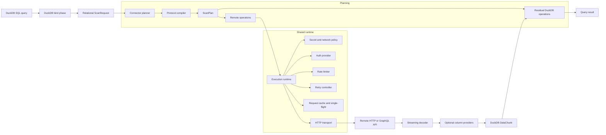
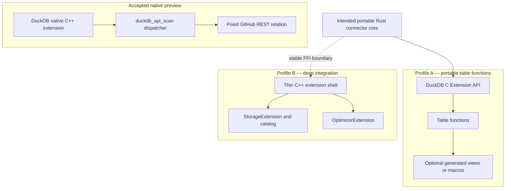
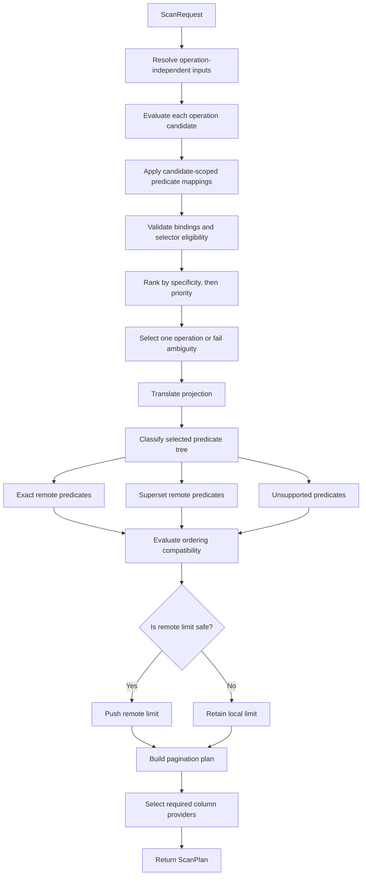
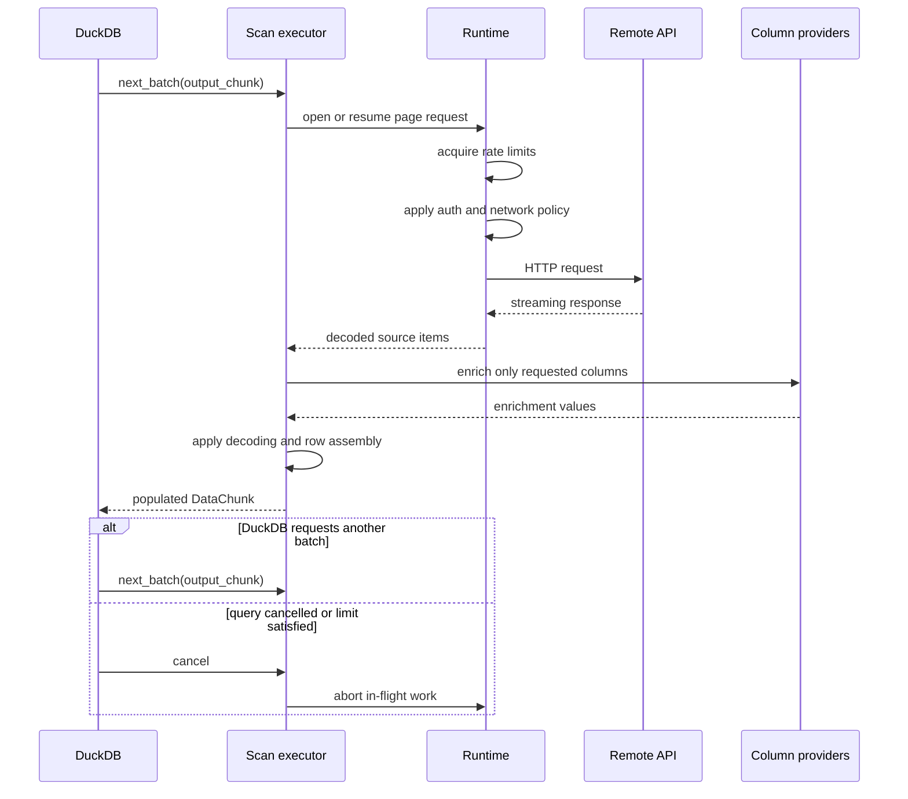
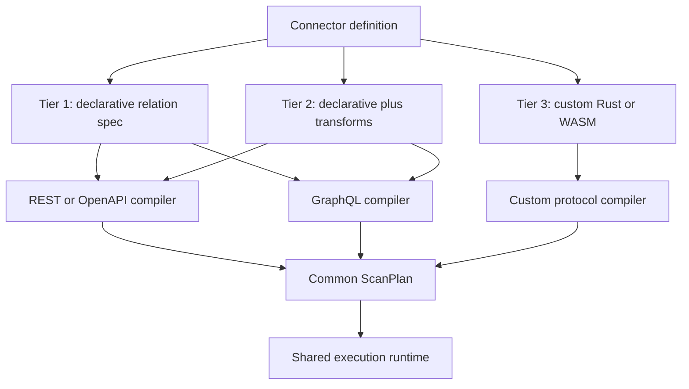
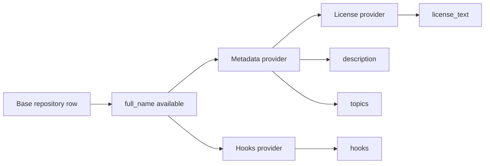

# DuckDB “Any API” Connector — Architecture

> Query well-structured HTTP APIs as relational data in DuckDB, with explicit
> semantic pushdown, bounded streaming execution, pagination, enrichment,
> shared auth and transport infrastructure, and an escape hatch for custom code.

**Status:** Design proposal, revision 0.4; the live `0.3.0` native preview
profile is accepted by RFC 0005 and the distribution policy is accepted by
RFC 0004

**Integration profiles:** A source-built native C++ preview, portable C
Extension API table functions, and an optional deep DuckDB catalog/optimizer
shell over the same semantic core

---

## 1. Executive Summary

This project adds a DuckDB-native relational adapter layer for HTTP APIs. A user
should be able to query API-backed relations alongside local DuckDB tables,
Parquet, CSV, and other attached data sources:

```sql
SELECT
    r.full_name,
    r.stars,
    c.mrr
FROM github_repository(full_name := 'duckdb/duckdb') AS r
LEFT JOIN stripe_customer() AS c
    ON c.metadata_repo = r.full_name;
```

The central abstraction is not “make an HTTP request.” It is:

> A connector translates a relational scan request into a remote request plan,
> states exactly which relational semantics the remote source preserves, and
> yields bounded columnar batches back to DuckDB.

The design deliberately separates:

1. **DuckDB integration** — bind, plan, scan, cancellation, and result vectors.
2. **Relational planning** — projection, predicates, ordering, limits, and
   residual local work.
3. **Protocol compilation** — REST/OpenAPI, GraphQL, OData, or custom adapters.
4. **Transport infrastructure** — auth, HTTP, rate limits, retries, caching,
   security policy, and observability.
5. **Connector authoring** — declarative specifications for common APIs and
   trusted Rust or sandboxed WASM for exceptional cases.

The accepted `0.3.0` preview uses a native C++ table function to query one
fixed live HTTPS relation on one exact DuckDB and platform-dependency cell.
The intended portable profile uses a Rust table-function extension. A custom
attached catalog and logical-plan optimizer are an optional integration
profile, not a requirement of the connector contract.

---

## 2. Product Contract

### 2.1 Intended capabilities

- **Relational access to well-structured HTTP APIs.** API resources appear as
  typed relations that can be filtered, projected, limited, and joined.
- **Embedded execution.** No mandatory server, daemon, subprocess, or external
  metadata catalog.
- **Correct pushdown.** Remote execution is an optimization; the connector must
  state what was pushed, what remains local, and whether the remote semantics
  are exact.
- **Bounded streaming.** Responses are converted incrementally into DuckDB data
  chunks with cancellation and backpressure.
- **Shared operational infrastructure.** Auth, pagination, rate limiting,
  retries, caching, and security controls are implemented once.
- **Tiered connector authoring.** The common case is declarative. Complex cases
  can supply protocol-specific code without changing the DuckDB-facing layer.
- **DuckDB interoperability.** API data can be joined with local tables and
  files, copied into DuckDB, or exported to formats such as Parquet.
- **Safe defaults.** Secrets are host-scoped; redirects, private IP access,
  response size, decompression, concurrency, and retries are bounded.

### 2.2 Explicit exclusions

- `INSERT`, `UPDATE`, or `DELETE` against remote APIs.
- Cross-API transactions or snapshot consistency guarantees.
- WebSocket, SSE, Kafka, or other continuous streams.
- A universal adapter for arbitrary web pages or undocumented endpoints.
- Automatic relational modeling of every GraphQL schema.
- Requiring a custom DuckDB storage catalog.
- A general-purpose workflow engine.
- PostgreSQL FDW protocol or API compatibility. The project is FDW-like in
  purpose but DuckDB-native in implementation and semantics.

### 2.3 Product claim

The product should not promise “every API with no code.” The defensible claim is:

> A declarative relational adapter for well-structured HTTP APIs, with
> protocol-specific compilers and a custom-code escape hatch.

---

## 3. Design Principles

1. **Plan before execution.** A connector must produce an inspectable scan plan
   before network work begins.
2. **Correctness is local by default.** Unsupported or approximate predicates
   remain as DuckDB residual filters.
3. **Pushdown has semantics, not just capability flags.** Every accepted
   predicate, ordering, and limit records its accuracy.
4. **Pull at the DuckDB boundary.** DuckDB asks for the next batch; internal
   async workers may prefetch only within bounded queues.
5. **Separate input parameters from output columns.** Endpoint arguments are
   not necessarily relation columns.
6. **Protocol compilers share a runtime, not a request language.** REST and
   GraphQL have different planning models.
7. **Sequential by default, parallel by proof.** Pagination and enrichment become
   parallel only when the source declares that execution is independent and
   stable.
8. **Secrets are capabilities.** A credential is authorized for specific hosts,
   headers, and scopes, not handed unrestrictedly to connector code.
9. **Schema is versioned.** Static schemas change with connector versions;
   dynamic schemas refresh explicitly.
10. **Deep DuckDB integration is optional.** The connector model must remain
    useful through ordinary table functions.

---

## 4. High-Level System



The important boundary is `ScanPlan`. DuckDB-facing code does not need to know
whether a relation is backed by REST, GraphQL, OData, or custom code. The
protocol compiler does not need to know how DuckDB vectors are allocated. The
execution runtime does not decide relational correctness.

---

## 5. DuckDB Integration Strategy

The architecture has one accepted preview profile and two intended integration
levels. They should not be conflated.



### 5.0 Accepted native C++ preview

RFC 0005 defines the current deliberately narrow native profile. It is a
source-built DuckDB C++ extension named `duckdb_api`, version `0.3.0`, with
exactly one project-defined SQL function and one compiled-in relation:

```sql
SELECT id, login, site_admin
FROM duckdb_api_scan(
    connector := 'github',
    relation := 'duckdb_login_search_page'
);
```

The relation's complete base-row domain is the zero-to-three `items` in one
fixed response from
`https://api.github.com/search/users?q=duckdb+in%3Alogin&per_page=3`; it is not
the domain of all GitHub users or all matching search results. The fixed `q`
and `per_page` fields define the source and are not DuckDB predicate or limit
pushdown. Required `id`, `login`, and `site_admin` values decode strictly as
`BIGINT`, `VARCHAR`, and `BOOLEAN`; this extraction requirement does not claim
DuckDB-visible `NOT NULL` metadata.

The implementation is native C++ end to end and introduces neither Rust nor a
cross-language FFI. Connector Experience supplies immutable compiled native
metadata with a typed `{scheme, host, port}` origin and structural request
fields. Query Experience supplies a conservative, protocol-neutral
`ScanRequest`. Relational Semantics validates those values without I/O and
returns the only constructible immutable `ScanPlan`, whose typed executable
operation is separate from its safe explanation snapshot. Remote Runtime
consumes the executable plan facts through `ScanExecutor`; it may reject an
unsupported capability but does not rebuild the plan or reinterpret relational
ownership. Query remains the only DuckDB-aware layer and translates batches
and structured errors at the adapter edge.

The native capability profile exposes no projection, filter, ordering, limit,
offset, progress, or secret-manager delegation. Its adapter therefore requests
the full three-column projection, records `TRUE` as both remote and residual
predicate relative to the bounded response-page domain, leaves ordering and
bounds undelegated, and assigns every filter, ordering, limit, and offset to
DuckDB. The plan grants no remote or runtime limit. Connector record ceilings
may narrow below three but cannot widen past the fixed domain even though the
host decoder has a larger general ceiling. Ordinary bind, `DESCRIBE`, prepare,
and planning read only immutable metadata and acquire no network authority.

Execution opens one synchronous pull stream and one wire attempt for the exact
unauthenticated HTTPS authority `api.github.com:443`. Remote Runtime enforces
post-DNS destination policy, TLS verification, strict JSON extraction, one
five-second wall-time budget across execution, response/header/decompressed
byte ceilings, three decoded records, 256 bytes per extracted string, bounded
decode memory and nesting, two rows per output batch, and one concurrent
transfer. DuckDB interruption reaches transfer and decoding. Stream cancel,
close, and destruction are idempotent and non-throwing; connection close is
bounded by the hard execution deadline but is not promised to cancel promptly.

The installed composition contains only the fixed public HTTPS connector and
runtime service. Deterministic correctness evidence uses a separate private,
non-installable composition whose compiled connector selects a controlled
loopback service; it traverses the same registration, bind/copy, planning,
executor, stream, error-translation, and `DataChunk` path. Artifact inventory
and negative canaries prove that loopback metadata and authority-selection
seams are absent from the installed artifact. The public GitHub execution is
upstream compatibility evidence only; changing live row identity or order
cannot invalidate the controlled relational oracle.

The profile adds no caller-selected URL, credentials, proxy, redirect,
pagination, retry, cache, provider, GraphQL, connector-package loader, YAML
compiler, runtime file path, or public native ABI. It intentionally replaces
the historical `example.items` fixture relation rather than shipping a second
product relation. The `0.1.0`/`0.2.0` fixture behavior remains historical
release evidence, not a fallback: a live failure returns a bounded diagnostic
and never fixture rows.

The supported compatibility cell is DuckDB 1.5.4 at commit `08e34c447b` with
platform `osx_arm64`, macOS 26.5.1 on Apple Silicon arm64, Apple clang 17 in
C++11 mode, CMake 4.1.2, and Ninja 1.13.0. Installation is a clean source build
and unsigned direct local load. No public binary distribution or broader
native ABI compatibility follows from this profile.

#### 5.0.1 Accepted distribution and support policy

RFC 0004 selects DuckDB Community Extensions as the ordinary-user distribution
and trust channel. Source build remains the contributor path. A verified
unsigned artifact may be used only for controlled preview and diagnostic work;
it is not ordinary-user guidance because enabling unsigned extensions weakens
signature policy for the whole DuckDB process.

For `0.2.0`, the supported compatibility matrix contains only the latest stable
DuckDB release at release time and the exact Community CI platform rows that
pass the complete clean-install, restart, load-by-name, version, and accepted
query oracle. Release evidence records the DuckDB commit and every claimed row.
Failed, excluded, untested, older, nightly, non-Community, or absent rows remain
unclaimed even when they happen to work.

Project versions, Git tags, and descriptor source refs are immutable; a fix
uses a new SemVer. Before `1.0`, the project makes no backport commitment.
DuckDB governs the Community endpoint, signing pipeline, served artifacts, and
local-cache behavior, so `0.2.0` guarantees neither Community rollback,
historical-version selection, nor continued upstream availability. Project
support is best-effort through GitHub Issues with no service-level commitment.
These are policy boundaries, not evidence that `0.2.0` has shipped; ordinary
installation guidance requires the RFC's delivery gates to pass.

### 5.1 Profile A: portable Rust table-function extension

Responsibilities:

- Register table functions through DuckDB’s C Extension API.
- Bind a relation schema and named input parameters.
- Receive requested column IDs and any additional scan metadata exposed by the
  active DuckDB API capability profile.
- Produce data chunks through a pull-oriented scan callback.
- Support cancellation, cardinality hints, and progress where exposed.
- Generate optional schemas, views, or macros for friendlier SQL.

Example SQL:

```sql
INSTALL api;
LOAD api;

CREATE SECRET github_default (
    TYPE api,
    PROVIDER github,
    TOKEN getenv('GITHUB_TOKEN')
);

SELECT full_name, stars
FROM github_repository(
    full_name := 'duckdb/duckdb',
    secret := 'github_default'
);
```

An ergonomic layer may generate schemas or table macros without changing the
underlying contract:

```sql
SELECT full_name, stars
FROM api.github_repository(full_name := 'duckdb/duckdb');
```

That syntax is convenience, not a requirement of the connector contract.

### 5.2 Profile B: catalog and optimizer integration

A thin C++ shell may expose capabilities that are not available through the
portable table-function surface:

- `ATTACH ... (TYPE httpapi, ...)`.
- A custom catalog containing schemas and tables.
- Planner-visible relation metadata.
- Logical-plan rewrites for exact `ORDER BY`, `LIMIT`, or `TopN` pushdown.
- Version-specific DuckDB internal hooks.

Catalog syntax illustration:

```sql
ATTACH 'github' AS github (
    TYPE httpapi,
    connector 'github',
    secret 'github_default'
);

SELECT full_name, stars
FROM github.repository
WHERE full_name = 'duckdb/duckdb';
```

The C++ layer must remain thin. HTTP, auth, connector specifications, planning,
and execution should remain in the Rust core behind a small FFI boundary.

### 5.3 DuckDB capability contract

The DuckDB adapter reports the metadata and lifecycle signals that it can
actually provide:

```rust
pub struct DuckDbAdapterCapabilities {
    pub projection: bool,
    pub filters: PushdownMetadataCapability,
    pub ordering: PushdownMetadataCapability,
    pub limit: PushdownMetadataCapability,
    pub offset: PushdownMetadataCapability,
    pub progress: bool,
    pub cancellation: CancellationCapability,
    pub secret_manager: bool,
}
```

```rust
pub enum PushdownMetadataCapability {
    Unavailable,
    AdvisoryRetainedByDuckDb,
    DelegatedToRuntime,
}
```

The portable documented baseline assumes named parameters, schema binding,
cardinality hints, projection IDs, and data-chunk production. Filters,
ordering, limits, offsets, progress, cancellation signals, and secret-manager
access are used only when the active DuckDB API exposes them.

Missing or advisory-only capabilities change optimization and ergonomics,
never correctness:

- With `Unavailable` filter metadata, `ScanRequest.predicate` is `TRUE`;
  predicates remain in DuckDB and cannot select a remote operation. Required
  remote keys must be supplied as explicit table-function inputs.
- With unavailable ordering, limit, or offset metadata, the corresponding
  request fields are empty and DuckDB performs those operations locally.
- Advisory metadata may guide safe remote optimization, but the corresponding
  DuckDB operator remains authoritative. Delegated metadata assigns the
  operation to the runtime, which must execute it locally when remote pushdown
  is unsafe. Closing the scan still cancels unused remote work where lifecycle
  signals permit.
- Without a cancellation signal, the runtime applies its own request deadlines
  and cancels work when the scan state is closed. The adapter must not claim
  responsive query cancellation unless that behavior is verified.
- Without secret-manager access, the adapter must use an explicitly documented
  host credential path; it must not read arbitrary environment variables or
  files from connector packages.

Every supported DuckDB version and integration profile has a tested capability
matrix. Planner tests use that matrix rather than assuming one universal
surface. An adapter must not delegate a limit, offset, or ordering operation
past an unavailable or DuckDB-owned row-removing or ordering prerequisite. It
retains the dependent DuckDB operator or rejects the scan instead of applying
it early.

### 5.4 Why the split matters

The pure-Rust C Extension API and DuckDB’s C++ storage/optimizer internals are
not the same compatibility surface. Making the catalog and optimizer mandatory
would turn DuckDB version coupling into the primary project risk. The portable
path lets the connector abstraction prove itself independently.

---

## 6. Core Relational Contract

### 6.1 Relation metadata

A connector exposes one or more relations:

```rust
pub struct RelationSpec {
    pub id: RelationId,
    pub name: String,
    pub description: Option<String>,
    pub inputs: Vec<InputSpec>,
    pub columns: Vec<ColumnSpec>,
    pub operations: Vec<OperationSpec>,
    pub schema_mode: SchemaMode,
}
```

Inputs and columns are distinct.

```rust
pub struct InputSpec {
    pub name: String,
    pub logical_type: LogicalType,
    pub required: InputRequirement,
    pub allowed_values: Option<Vec<Value>>,
    pub sensitive: bool,
}

pub struct ColumnSpec {
    pub id: ColumnId,
    pub name: String,
    pub logical_type: LogicalType,
    pub nullable: bool,
    pub provider: ColumnProviderId,
}
```

Examples of inputs:

- `full_name` used in `/repos/{inputs.full_name|path_segments(2)}`.
- `created_after` translated to a query parameter.
- `sort` used only to choose remote ordering.
- `workspace` selecting an implicit API partition.

Inputs may be exposed as named table-function arguments. A catalog adapter
may additionally bind predicates on designated virtual columns to those inputs.

### 6.2 Scan request

DuckDB-facing code converts the query into a protocol-neutral request:

```rust
pub struct ScanRequest {
    pub relation: RelationId,
    pub inputs: BTreeMap<String, Value>,
    pub projection: Vec<ColumnId>,
    pub predicate: Predicate,
    pub ordering: Vec<Ordering>,
    pub limit: Option<u64>,
    pub offset: Option<u64>,
    pub adapter_capabilities: DuckDbAdapterCapabilities,
    pub query_context: QueryContext,
}
```

Fields unsupported by the active DuckDB adapter use conservative values:
`Predicate::True`, an empty ordering, and no limit or offset. The connector
planner never infers unavailable query structure.

### 6.3 Scan plan

The connector returns a complete execution contract:

```rust
pub struct ScanPlan {
    pub operation: OperationPlan,
    pub remote_predicate: Predicate,
    pub residual_predicate: Predicate,
    pub residual_execution: ResidualExecution,
    pub remote_projection: RemoteProjection,
    pub local_projection: Vec<ColumnId>,
    pub remote_ordering: Vec<RemoteOrdering>,
    pub duckdb_ordering: Vec<Ordering>,
    pub remote_limit: Option<u64>,
    pub local_limit: Option<u64>,
    pub local_offset: Option<u64>,
    pub pagination: PaginationPlan,
    pub partitions: PartitionPlan,
    pub column_providers: ColumnProviderPlan,
    pub estimated_rows: Option<u64>,
    pub cache_policy: CachePolicy,
}
```

The plan must be inspectable in tests and through an `EXPLAIN` helper.

`ResidualExecution` assigns every row-removing residual to exactly one owner:
DuckDB for `AdvisoryRetainedByDuckDb`, and the runtime for
`DelegatedToRuntime`. With unavailable metadata, DuckDB owns the unseen filter.
Limits and offsets are applied only after that owner evaluates the residual.

### 6.4 Pushdown accuracy

Every pushed operation declares its semantic relationship to DuckDB:

```rust
pub enum PushdownAccuracy {
    Exact,
    Superset,
    Unsupported,
}
```

- **Exact:** Remote evaluation is equivalent to DuckDB evaluation for the
  represented expression.
- **Superset:** Remote evaluation may return extra rows. The designated residual
  owner must re-evaluate the predicate with DuckDB-equivalent semantics.
- **Unsupported:** The expression remains entirely local.

`Subset` is excluded from relational scans. Discovery APIs that return subsets
must expose that incompleteness explicitly and must never be treated as complete
relations.

### 6.5 Limit and ordering safety

`LIMIT` may be pushed only when all row-removing remote predicates are exact,
or when the runtime owns residual evaluation and can continue fetching until
the residual filter has produced the requested number of rows.

`ORDER BY` may be pushed only when the connector can prove compatibility for:

- Direction.
- Null placement.
- Collation and case sensitivity.
- Type conversion.
- Stable tie behavior where pagination depends on ordering.

A remote ordering can still be used as a performance hint without eliminating
DuckDB’s local ordering node.

`duckdb_ordering` records ordering that the adapter retains in DuckDB. This
runtime contract does not implement a general local sort. A delegated ordering
is accepted only when remote ordering is exact; otherwise the adapter must
retain the DuckDB ordering operator or reject the scan.

---

## 7. Planning Flow



The planner is deterministic and side-effect free. It does not make network
calls simply to estimate cardinality. Network-backed discovery is reserved for
explicit attach, refresh, or execution operations.

---

## 8. Execution Model

### 8.1 Pull-oriented scan

The DuckDB boundary is pull-oriented:

```rust
pub trait BatchStream: Send {
    fn next_batch(&mut self, output: &mut DataChunk) -> Result<BatchStatus>;
    fn progress(&self) -> Option<f64>;
    fn cancel(&mut self);
}
```

The internal implementation may use async HTTP and bounded producer queues, but
connector authors should not manage arbitrary row channels.

### 8.2 Execution sequence



### 8.3 Backpressure

The runtime must bound:

- In-flight HTTP requests.
- Buffered response bytes.
- Decoded but unconsumed rows.
- Concurrent enrichment calls.
- Per-connection and global memory.

A conservative default is one active page request per local scan state and a
small bounded decoded-item queue. Prefetching the next page can be enabled only
when the paginator is sequentially safe and memory remains below its budget.

### 8.4 Cancellation

DuckDB cancellation must propagate to:

- Active HTTP request bodies.
- Retry sleeps.
- Rate-limit waits.
- Pagination loops.
- Enrichment tasks.
- WASM guest execution.

Cancellation is not an error eligible for retry.

---

## 9. Connector and Protocol Layers



### 9.1 Tier 1: declarative relations

Tier 1 describes endpoints, inputs, columns, pagination, auth references, and
pushdown mappings.

```yaml
connector: github
version: 1

relations:
  repository:
    description: GitHub repositories visible to the authenticated principal

    inputs:
      full_name:
        type: VARCHAR
        operations: [get]
      visibility:
        type: VARCHAR
        operations: [list]
        values: [all, public, private]
      sort:
        type: VARCHAR
        operations: [list]
        values: [created, updated, pushed, full_name]

    columns:
      id:
        type: BIGINT
        extract: .id
      full_name:
        type: VARCHAR
        extract: .full_name
      stars:
        type: INTEGER
        extract: .stargazers_count
      private:
        type: BOOLEAN
        extract: .private
      hooks:
        type: JSON
        provider: repository_hooks

    operations:
      get:
        when:
          required_inputs: [full_name]
        request:
          method: GET
          path: /repos/{inputs.full_name|path_segments(2)}
        response:
          item: .

      list:
        request:
          method: GET
          path: /user/repos
          query:
            visibility: $inputs.visibility
            sort: $inputs.sort
        response:
          items: .[]
        pagination:
          type: link_header
          relation: next

    predicates:
      full_name:
        operators: [eq]
        operation: get
        accuracy: exact
      visibility:
        operators: [eq]
        bind: query.visibility
        accuracy: exact

    providers:
      repository_hooks:
        requires: [full_name]
        provides: [hooks]
        mode: per_row
        request:
          method: GET
          path: /repos/{inputs.full_name|path_segments(2)}/hooks
        pagination:
          type: page_number
          page_param: page
          page_size_param: per_page
          page_size: 100
```

The example above illustrates the intended concepts. The companion connector
specification is authoritative for syntax and validation.

### 9.2 Tier 2: transforms

Tier 2 adds constrained transforms for response envelopes and column extraction:

- JSON Pointer or JSONPath for simple extraction.
- A JQ-compatible expression engine for complex unwrapping.
- Declarative scalar conversion and null handling.
- Explicit error behavior for absent or malformed values.

Transforms should be pure and resource-bounded. They do not receive unrestricted
network or secret access.

### 9.3 Tier 3: custom code

Complex APIs may require custom logic for:

- AWS SigV4 request signing.
- OAuth installation flows.
- GraphQL document generation.
- Nonstandard pagination.
- Binary payloads.
- Domain-specific type conversion.

Trusted connectors may compile as native Rust modules. Untrusted community
connectors should use WASM with capability-based host functions.

---

## 10. Protocol Compilers

### 10.1 REST and OpenAPI

The REST compiler maps:

- Inputs to path, query, header, or body fields.
- Predicates to documented endpoint filters.
- Projection to API-specific `fields`, `$select`, sparse fieldsets, or no-op.
- Ordering to supported sort keys and directions.
- Response envelopes to item streams.
- Pagination metadata to a paginator state machine.

OpenAPI can bootstrap types and endpoints, but generated relations still need
human review. OpenAPI usually does not fully describe filtering semantics,
pagination consistency, rate limits, or relational identity.

### 10.2 GraphQL

GraphQL is a separate compiler, not REST with a different response decoder.

It must model:

- Root fields and arguments.
- Object, list, and connection return shapes.
- Selection-set generation from requested columns.
- Nested fields and cardinality.
- Relay pagination.
- Input enums and custom scalars.
- Query complexity or depth limits.
- Stable relation identity.

For generated queries, the compiler should omit unrequested fields from the
selection set. `@include` directives are useful for prewritten documents but are
not the required generic representation.

### 10.3 OData and additional compilers

OData is a useful optional compiler because its relational operations are
explicit: `$filter`, `$select`, `$orderby`, `$top`, and `$skip`. Other protocol
compilers can be added without changing the common scan contract.

---

## 11. Predicate Translation

### 11.1 Predicate representation

Use a protocol-neutral expression tree:

```rust
pub enum Predicate {
    True,
    Compare {
        column: ColumnId,
        op: CompareOp,
        value: ScalarValue,
    },
    In {
        column: ColumnId,
        values: Vec<ScalarValue>,
    },
    IsNull {
        column: ColumnId,
        negated: bool,
    },
    And(Vec<Predicate>),
    Or(Vec<Predicate>),
    Not(Box<Predicate>),
}
```

An adapter may support a smaller predicate subset while preserving the same
plan shape.

### 11.2 Translation result

```rust
pub struct PredicateTranslation {
    pub remote: Option<RemotePredicate>,
    pub residual: Predicate,
    pub accuracy: PushdownAccuracy,
    pub reason: Option<String>,
}
```

The `reason` supports diagnostics such as:

- “API comparison is case-insensitive; retained as residual.”
- “Timestamp endpoint accepts day precision only.”
- “OR across different remote parameters is unsupported.”

### 11.3 Predicate composition

Remote filtering is safe only when it cannot discard a row for which DuckDB's
predicate is `TRUE`. For a DuckDB predicate `D` and remote predicate `R`, every
pushed translation must prove `D => R`. `Exact` additionally proves `R => D`.

The planner applies these conservative composition rules:

- `AND`: safe remote approximations may be conjoined. The original subtree
  remains residual unless the complete conjunction is exact.
- `OR`: a remote disjunction is safe only when every branch has a safe remote
  approximation. If any branch is unsupported, the remote result is `TRUE` and
  the complete disjunction remains residual.
- `NOT`: negation is pushed only when its child is exact. Negating a superset
  approximation can create an unsafe subset.
- `IS NULL`, `IS NOT NULL`, `IN`, `NOT IN`, comparisons, and string predicates
  are exact only when remote null behavior, coercion, collation, and type
  conversion match DuckDB.
- A `NULL` inside `IN` or `NOT IN` is handled with DuckDB three-valued logic;
  it is never dropped as a request-encoding convenience.

When proof is unavailable, the planner uses `Predicate::True` remotely and
retains the original expression locally. Property tests cover every composition
rule against DuckDB evaluation over the same fixture rows.

### 11.4 `IN` fan-out

`IN` over a required lookup key may become multiple independent lookup
operations only when:

- Each lookup is exact.
- Result identity is stable.
- Duplicates are deduplicated or preserved according to SQL semantics.
- Concurrency is bounded.
- The source’s rate limit permits fan-out.

This is an operation-planning choice, not a generic filter behavior.

---

## 12. Pagination

Pagination is represented as a state machine with explicit capabilities.

```rust
pub struct PaginationPlan {
    pub strategy: PaginationStrategy,
    pub dependency: PageDependency,
    pub consistency: PageConsistency,
    pub supports_total: bool,
    pub supports_resume: bool,
    pub stable_ordering: Option<Vec<RemoteOrdering>>,
}

pub enum PageDependency {
    Sequential,
    Independent,
}
```

### 12.1 Strategies

| Strategy           | Typical signal            | Usually parallelizable? |
| ------------------ | ------------------------- | ----------------------: |
| Page number        | `page=N`                  |               Sometimes |
| Offset             | `offset=N`                |               Sometimes |
| Opaque cursor      | `next_cursor`             |                      No |
| Continuation token | `nextPageToken`           |                      No |
| Link header        | `Link: <...>; rel="next"` |              Usually no |
| GraphQL Relay      | `pageInfo.endCursor`      |                      No |

### 12.2 Sequential by default

The generic runtime uses sequential pagination by default. A connector may
opt into independent page fetching only when it declares:

- Independent page addressing.
- Stable deterministic ordering.
- Acceptable behavior under concurrent source mutation.
- A known or discoverable range.

### 12.3 Early exit

Pagination stops when any of these becomes true:

- DuckDB cancels the query.
- The exact local result limit is satisfied.
- The source reports no next page.
- A configured row, page, byte, or time budget is exhausted.

When residual predicates exist, the runtime cannot stop after merely receiving
`LIMIT N` remote rows. It must continue until `N` rows survive local filtering,
or the source is exhausted.

---

## 13. Column Providers and Lazy Enrichment

Lazy enrichment is modeled as a column-provider graph, not as a second generic
list operation.

```rust
pub struct ColumnProviderSpec {
    pub id: ColumnProviderId,
    pub requires: Vec<ColumnId>,
    pub provides: Vec<ColumnId>,
    pub mode: ProviderMode,
    pub max_concurrency: usize,
    pub max_batch_size: Option<usize>,
}

pub enum ProviderMode {
    PerRow,
    Batch,
    Singleton,
}
```



Rules:

1. Only providers needed by the requested projection are scheduled.
2. Providers that supply multiple columns execute once per applicable row or
   batch.
3. Dependencies form an acyclic graph validated at connector load time.
4. Per-row calls are bounded by provider and connection concurrency limits.
5. Batch providers are preferred when the source supports multi-key lookup.
6. Provider output cannot change relation cardinality.
7. A missing provider value fails by default. It may become `NULL` only when
   every affected column is nullable and the connector explicitly declares
   unambiguous absence semantics; authentication and policy errors always fail.

### 13.1 Retry boundary

The correctness invariant is:

> Never replay an operation after output from that operation’s replay unit has
> been committed to DuckDB.

Examples:

- A page request can retry before any row from that page is emitted.
- A per-row provider can retry before that row is emitted, even if prior rows
  have already been returned.
- A batch provider can retry before any row in the batch is committed.

This is more precise than disabling all retries after the query emits its first
row.

---

## 14. Authentication, Secrets, and Network Security

### 14.1 DuckDB secret integration

Credentials should integrate with DuckDB’s secret model rather than live only in
connector YAML or environment variables.

Connector definitions refer to logical secret fields:

```yaml
secret_schema:
  provider: github
  fields:
    token:
      required: true
      sensitive: true
```

The user supplies a named secret through DuckDB. The runtime resolves it into a
short-lived auth context for the query.

### 14.2 Auth providers

Built-in providers are selected by connector demand. Useful providers include:

- Bearer token.
- Basic auth.
- OAuth2 client credentials.
- OAuth2 refresh token.
- GitHub App installation token.
- AWS SigV4.

Each provider implements request decoration and refresh without exposing raw
secret material to transforms or unrelated hosts.

### 14.3 Capability-based network policy

A declarative HTTP connector is also an SSRF and secret-exfiltration surface.
Every connector or connection needs explicit capabilities:

```yaml
network_policy:
  allowed_hosts:
    - api.github.com
  allowed_schemes: [https]
  redirects: same_origin
  private_ips: deny
  link_local_ips: deny
  max_response_bytes: 104857600
  max_decompressed_bytes: 524288000
  connect_timeout_ms: 10000
  request_timeout_ms: 60000

secret_bindings:
  github_token:
    allowed_hosts: [api.github.com]
    allowed_auth_providers: [bearer]
    allowed_headers: [Authorization]
```

Required defenses include:

- DNS resolution and private-address checks on every redirect.
- Same-origin or allowlisted redirects.
- Response and decompressed-size limits.
- Header and URL logging redaction.
- TLS verification enabled by default.
- Disabled access to cloud metadata endpoints by default.
- No arbitrary filesystem or process access for WASM connectors.

WASM protects host memory. It does not replace network and secret policy.

### 14.4 Host-enforced resource budgets

Every scan runs under a host budget that a connector may narrow but never
widen:

```rust
pub struct ResourceBudget {
    pub max_requests: u64,
    pub max_pages: u64,
    pub max_rows: u64,
    pub max_response_bytes: u64,
    pub max_decompressed_bytes: u64,
    pub max_provider_calls: u64,
    pub max_wall_time: Duration,
    pub max_concurrency: usize,
}
```

Budget exhaustion is a stable policy error with counters describing the limit
that was reached. Rate limits protect the upstream service; resource budgets
protect the DuckDB process and the user from unexpectedly expensive scans.

Network, secret, response-size, decompression, timeout, proxy, and budget
enforcement are prerequisites of remote execution. They are not optional
hardening layers.

---

## 15. Rate Limiting and Retry

### 15.1 Rate limits

Rate limits are shared across relations that use the same upstream quota.

```rust
pub struct RateLimitDefinition {
    pub name: String,
    pub fill_rate_per_second: f64,
    pub bucket_size: u64,
    pub max_concurrency: u64,
    pub scope: Vec<ScopeDimension>,
    pub selector: Option<CallSelector>,
}
```

Typical scope dimensions:

- Connection or secret principal.
- API service.
- Tenant, workspace, region, or account.
- Endpoint family.

A call may be subject to multiple limiters. Acquisition must avoid holding one
scarce permit while waiting indefinitely for another.

The runtime should also learn from server signals where available:

- `Retry-After`.
- Remaining-quota headers.
- Reset timestamps.
- GraphQL cost budgets.

### 15.2 Retry policy

```rust
pub struct RetryPolicy {
    pub max_attempts: u32,
    pub max_elapsed: Duration,
    pub backoff: BackoffStrategy,
    pub retryable_statuses: BTreeSet<u16>,
    pub retry_transport_errors: bool,
    pub respect_retry_after: bool,
}
```

Retry only operations whose declared and validated replay safety is `Safe`.
Do not retry:

- Cancellation.
- Authentication failures that refresh cannot resolve.
- Schema or decoding errors.
- Policy violations.
- Requests whose replay unit has emitted output.

Status outcome mappings, such as treating a lookup `404` as an empty relation,
must be explicit per operation.

---

## 16. Caching and Single-Flight

Caching is deliberately conservative.

### 16.1 Cache layers

1. **HTTP validation cache** using `ETag`, `If-None-Match`,
   `Last-Modified`, and `If-Modified-Since` where supported.
2. **Exact request cache** keyed by normalized request identity.
3. **Single-flight** for identical in-flight requests.
4. **Per-query provider memoization** for identical enrichment calls.

### 16.2 Cache identity

Cache keys must include all values that can affect the response:

- Connector and connector-spec version.
- Auth principal or tenant identity, without storing raw secrets.
- Method, URL, query, and relevant request body.
- Relevant headers and API version.
- Projection or field selection.
- Pagination cursor or page.
- Source-specific locale and time-zone settings.

### 16.3 Predicate-subsumption cache exclusion

Serving a narrower query from a broader cached query is outside this cache
contract. It requires
proof that the cached result is complete, compatible, sufficiently projected,
and semantically exact. That is a query optimizer and materialized-view problem,
not an exact-request cache feature.

### 16.4 DuckDB materialization

DuckDB already provides the durable snapshot path:

```sql
CREATE TABLE repository_snapshot AS
SELECT *
FROM github_repository();
```

Export to Parquet is explicit:

```sql
COPY (
    SELECT * FROM github_repository()
) TO 'repository_snapshot.parquet' (
    FORMAT parquet
);
```

These are DuckDB capabilities over any scan source, not a special connector
cache layer.

---

## 17. Schema and Catalog Behavior

### 17.1 Static schema

Static relations are versioned with the connector definition. An API adding an
unknown response field does not mutate the relation. Removing or changing a
required field produces a decoding or compatibility error until the connector
is updated.

### 17.2 Dynamic schema

Dynamic relations may discover columns from an explicit metadata endpoint or
GraphQL introspection. Discovery occurs during an explicit operation such as:

```sql
CALL api_refresh_schema('github', 'dynamic_relation');
```

A catalog adapter may expose `REFRESH` semantics. Planning must not
silently make arbitrary discovery requests after a missing-column error.

### 17.3 Type conversion

Every column defines:

- DuckDB logical type.
- Source extraction expression.
- Missing-value behavior.
- Null behavior.
- Optional source type metadata.

Conversion is strict: incompatible values, overflow, and precision loss fail
the query. A permissive conversion mode would require an explicit connector
syntax and compiled runtime contract and is not implied by this design.

---

## 18. Observability and Explainability

An API scan must be diagnosable without exposing secrets.

### 18.1 Plan explanation

Provide an explain helper in the portable implementation:

```sql
SELECT *
FROM api_explain_scan(
    connector := 'github',
    relation := 'repository',
    inputs := {'full_name': 'duckdb/duckdb'}
);
```

It should show:

- Selected operation.
- Remote and residual predicates.
- Pushdown accuracy.
- Remote projection.
- Pagination mode.
- Required column providers.
- Remote and local limits/orderings.
- Estimated request count and cardinality when known.

Example conceptual output:

```text
operation: get_repository
remote predicate: full_name = 'duckdb/duckdb' [exact]
residual predicate: TRUE
remote projection: id, full_name, stargazers_count
pagination: none
providers: none
remote limit: 1
```

### 18.2 Runtime metrics

Collect per-query and per-connection counters:

- Requests started, completed, retried, and failed.
- Rows and bytes decoded.
- Time waiting on rate limits.
- Cache hits and misses.
- Pages fetched.
- Provider calls and batches.
- Residual rows rejected.
- Time to first row.
- Peak buffered bytes.

### 18.3 Logging

Structured logs must redact:

- Authorization headers.
- Secret query parameters.
- Sensitive request bodies.
- Connector-defined sensitive inputs.

---

## 19. Error Model

Errors should preserve source context while remaining stable for SQL clients.

```rust
pub enum ConnectorErrorKind {
    Configuration,
    Authentication,
    Authorization,
    RateLimited,
    Transport,
    Timeout,
    RemoteResponse,
    Decode,
    Schema,
    Policy,
    Cancelled,
    Internal,
}
```

Each error includes:

- Connector and relation.
- Operation.
- Redacted endpoint identity.
- Retryability.
- Source status or error code.
- Whether any output in the replay unit was committed.
- A user-facing message and optional diagnostic detail.

SQL errors should not expose access tokens, signed URLs, or sensitive payloads.

---

## 20. Testing Strategy

### 20.1 Unit tests

- Predicate classification and residual generation.
- Limit-safety decisions.
- Ordering compatibility.
- Pagination state machines.
- Provider DAG validation.
- Secret host restrictions.
- Cache-key normalization.
- Retry replay boundaries.
- Type conversion and null behavior.

### 20.2 Contract tests

Every connector runs against recorded fixtures that validate:

- Bound schema.
- Generated requests.
- Pagination transitions.
- Projection behavior.
- Exact and residual predicates.
- Error mapping.
- Cancellation.
- Rate-limit response handling.

Recorded tests must preserve headers and pagination signals while removing
secrets and personal data.

### 20.3 Property tests

Useful properties include:

- Remote exact predicate plus no residual equals local DuckDB evaluation over
  the same fixture.
- Superset pushdown followed by residual filtering equals local evaluation.
- Retrying before replay-unit commit does not duplicate rows.
- Pagination emits every fixture item exactly once in stable sources.
- Projection changes requests but not values of retained columns.

### 20.4 Controlled and live tests

Deterministic controlled services are the correctness oracle for exact
requests, rows, relational operators, failures, cancellation, and teardown.
Separate live tests verify current upstream compatibility under strict budgets;
they are not the primary correctness oracle and normal CI must not depend on
changing public row identity or order.

---

## 21. Validation Connector Corpus

The design is continuously validated against connectors that stress different
parts of the abstraction. They form a compatibility corpus for every supported
implementation.

### GitHub

Validates:

- Get versus list routing.
- Link and page-number pagination.
- REST plus possible GraphQL compiler work.
- Projection-dependent selection.
- Per-row and batch enrichment.
- Multiple auth modes.

### Stripe

Validates:

- Cursor pagination.
- Nested objects.
- Stable resource IDs.
- Expandable fields and optional enrichment.
- Strict account-scoped secret identity.

### Slack or an OData service

Slack validates workspace partitions, cursor pagination, and rate-limit
pressure. OData validates broad declarative predicate, projection, ordering,
and limit translation.

CSV-over-HTTP is not a core connector test because DuckDB already has a strong
remote-file path.

---

## 22. Hard Parts

1. **Semantic pushdown.** Mapping syntax is easy; proving equivalence across
   collation, nulls, time precision, and source behavior is hard.
2. **Limit correctness.** Residual predicates and unstable pagination make
   apparently simple limit pushdown incorrect.
3. **GraphQL relation design.** A schema graph does not automatically define
   sensible flat relations.
4. **Auth lifecycle.** Refresh, installation tokens, signing, tenant identity,
   and revocation vary significantly.
5. **Network security.** A connector with secrets and arbitrary URLs is a
   privileged execution surface.
6. **Hydration economics.** Rich schemas can silently become thousands of API
   calls without projection awareness, batching, and budgets.
7. **Pagination consistency.** Mutable datasets can duplicate or omit rows even
   when the paginator implementation is mechanically correct.
8. **DuckDB version coupling.** Catalog and optimizer hooks may require tracking
   DuckDB internals across releases.
9. **Error reproducibility.** Live APIs change, so fixture capture and request
   explanations are essential.
10. **Declarative-language restraint.** The spec must not become an unsafe,
    poorly implemented programming language.

---

## 23. Unresolved Design Questions

- Which DuckDB API capability profiles and versions are supported by automated
  compatibility tests?
- Should input parameters remain table-function-only, or should the portable
  layer generate virtual-column views for predicate ergonomics?
- Which transforms belong in Tier 2, and which require connector code?
- How should dynamic GraphQL relations be named and flattened?
- Is a custom attached catalog materially better than generated schemas and
  macros for real workloads?
- What signed-native versus WASM trust model is acceptable for community
  connectors?
- How should connector specifications be packaged, versioned, and distributed?
- Can DuckDB’s standard `EXPLAIN` be enriched without relying on unstable
  optimizer internals, or is a connector-specific explain function sufficient?

---

## 24. Reference Systems and What We Reuse

### DuckDB Postgres extension and shared database connector patterns

Reuse conceptually:

- Bind, global state, local state, and scan separation.
- Projection and filter information at scan time.
- Cardinality and progress hooks.
- Connection pooling.
- Optional optimizer integration as a separate capability profile.

Do not assume database-oriented connector internals are a stable reusable SDK
for HTTP adapters.

### Steampipe Plugin SDK

Reuse conceptually:

- Shared connector metadata.
- Required key columns.
- Partition fan-out.
- Scoped multi-dimensional rate limits.
- Retry and status-outcome policies.
- Lazy-column economics and function-level deduplication.
- Strong fixture-based plugin testing.

Change:

- Use an explicit relational `ScanPlan`.
- Keep DuckDB execution pull-oriented.
- Provide paginator state machines centrally.
- Separate base scans from cardinality-preserving column providers.
- Make pushdown accuracy explicit.

### Steampipe GitHub plugin

Reuse as a concrete source of API patterns:

- Multiple pagination styles.
- Qualifier-to-request translation.
- Projection-aware GraphQL selection.
- Auth client reuse.
- Rate-limit error classification.
- Endpoint-specific enrichment.

### DuckDB extension surfaces

- Current DuckDB extensions overview: <https://duckdb.org/docs/current/extensions/overview.html>
- Experimental Rust C Extension API template: <https://github.com/duckdb/extension-template-rs>
- C/C++ C Extension API template: <https://github.com/duckdb/extension-template-c>
- DuckDB Postgres extension: <https://github.com/duckdb/duckdb-postgres>
- DuckDB documentation: <https://duckdb.org/docs/current/>

### Other inspirations

- PostgreSQL FDW and Multicorn for adapter-contract thinking.
- OpenAPI for endpoint and type bootstrapping.
- OData for explicit relational query semantics.
- Airbyte and Singer for connector packaging lessons, though not for execution
  semantics.

---

## 25. Decision Summary

| Area                       | Decision                                                               |
| -------------------------- | ---------------------------------------------------------------------- |
| Native preview             | `duckdb_api` 0.3.0 fixed GitHub REST relation on one exact source-built cell |
| Portable integration       | Pure-Rust C Extension API table functions                              |
| Deep integration           | Optional thin C++ catalog/optimizer shell                              |
| Core abstraction           | `ScanRequest` → explicit `ScanPlan` → `BatchStream`                    |
| DuckDB metadata            | Capability-profiled; unavailable metadata uses conservative defaults  |
| Pushdown                   | Exact, superset, or unsupported with residual work                     |
| Residual ownership         | Exactly one of DuckDB or the runtime evaluates each residual           |
| SQL inputs                 | Separate named inputs from returned columns                            |
| Execution                  | Pull-oriented at DuckDB boundary; bounded async internally             |
| Pagination                 | Sequential generic runtime; parallel only by declared proof            |
| Enrichment                 | Cardinality-preserving column providers with DAG dependencies          |
| REST vs GraphQL            | Separate protocol compilers over a shared runtime                      |
| Auth                       | DuckDB secrets plus capability-scoped providers                        |
| Security                   | Host allowlists, redirect policy, private-IP blocking, size limits     |
| Resource safety            | Host-enforced request, page, row, byte, time, provider, and concurrency budgets |
| Retry                      | Per replay unit; never after that unit commits output                  |
| Cache                      | HTTP validation, exact request cache, single-flight, query memoization |
| Schema drift               | Versioned static schema; explicit refresh for dynamic schema           |
| Declarative spec           | Ground abstractions in multiple independently implemented connectors  |
| Materialization            | Native DuckDB CTAS or explicit Parquet export                          |

The design succeeds when connector authors can focus on the semantics of one API
while DuckDB users receive predictable relational behavior, and when every
optimization can be disabled without changing query correctness.
