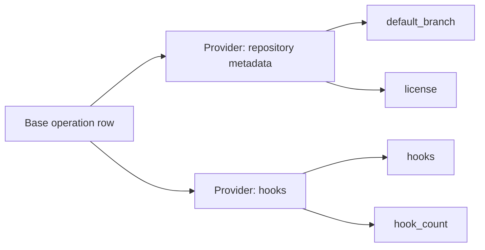

# DuckDB “Any API” Connector Specification

> Declaratively describe typed DuckDB relations backed by well-structured HTTP
> and GraphQL APIs.

**Status:** Design proposal

**Spec identifier:** `duckdb_api/draft`

**Runtime architecture:** See [ARCHITECTURE.md](ARCHITECTURE.md)

---

## 1. Overview

A connector is a directory of YAML files describing one or more **relations**
backed by remote HTTP or GraphQL operations.

The specification tells the runtime:

- which typed columns a relation exposes;
- which query inputs an API accepts;
- which remote operation should serve a scan;
- how SQL predicates map to remote inputs;
- whether each mapping preserves exact DuckDB semantics;
- how requests, responses, pagination, and enrichment work;
- which credentials and network capabilities the connector requires; and
- which rate-limit, retry, and caching policies apply.

The specification does **not** describe DuckDB execution internals. It does not
contain scan plans, residual predicate trees, vectors, replay units, optimizer
hooks, or backpressure machinery. The runtime derives those from the declared
capabilities.

### 1.1 Goals

- A connector author with no Rust knowledge can ship a useful connector.
- Inputs, output columns, remote operations, and SQL semantics remain distinct.
- REST and GraphQL share transport infrastructure without sharing a fake common
  request language.
- Every pushed predicate declares whether it is exact or requires local
  rechecking.
- Sequential pagination is safe by default; parallel execution requires an
  explicit capability declaration.
- Secrets are supplied by DuckDB or the host environment, not embedded in
  distributable connector files.
- Specs are diff-friendly, comment-friendly, schema-validatable, and suitable
  for code review.
- OpenAPI and GraphQL schema importers can bootstrap packages in the same
  format, subject to human semantic review.

### 1.2 Explicit exclusions

- Turing-complete logic in YAML.
- Write operations.
- Cross-API transactions or snapshot consistency.
- WebSocket, SSE, Kafka, or other continuous streams.
- Automatic support for every undocumented or irregular API.
- Arbitrary native code in declarative connectors.
- A required DuckDB `ATTACH` or custom catalog implementation.
- Predicate-subsumption query caching.

### 1.3 Conceptual model

```mermaid
flowchart LR
    SQL[DuckDB scan request] --> INPUTS[Resolve relation inputs]
    INPUTS --> SELECT[Select operation]
    SELECT --> PRED[Translate predicates]
    PRED --> PLAN[Derived scan plan]

    PLAN --> REMOTE[Remote request work]
    PLAN --> LOCAL[Residual DuckDB work]

    REMOTE --> HTTP[HTTP / GraphQL API]
    HTTP --> DECODE[Decode row stream]
    DECODE --> PROVIDERS[Requested column providers]
    PROVIDERS --> BATCH[Typed batches]
    BATCH --> LOCAL
    LOCAL --> RESULT[DuckDB result]
```



The core author-facing objects are:

```text
Connector
├── connection fields
├── secret requirements
├── network policy
├── transport defaults
└── Relations
    ├── columns
    ├── inputs
    ├── operations
    ├── predicate mappings
    ├── ordering/projection capabilities
    ├── pagination
    ├── column providers
    └── partitions
```

### 1.4 Repository preview evidence boundary

The repository-owned `example.items` metadata used by `duckdb_api` 0.1.0 is an
internal acceptance fixture, not an implementation of this authoring
specification. It may mirror the `duckdb_api/draft` field meanings needed to
construct one immutable `CompiledConnector`, but the preview does not parse or
validate arbitrary YAML, load connector directories, resolve caller-selected
paths, expose author tooling, or establish package compatibility.

The preview's `duckdb_api_scan(connector := 'example', relation := 'items')`
dispatcher is likewise not a general mapping from connector packages to SQL
names. Package loading, registration, reload, validation, and distribution
remain specification capabilities that require their own accepted product
contract and executable authoring evidence.

---

## 2. Terminology

### Connector

A versioned package containing shared configuration and one or more relations.
Examples: `github`, `stripe`, `slack`.

### Relation

A typed relational surface exposed to DuckDB. A relation may appear as a table
function or through an attached catalog without changing its specification.

### Column

A typed value returned by a relation.

### Input

A typed value accepted by one or more remote operations. Inputs may come from
explicit function arguments, SQL predicates, connection configuration,
partitions, or runtime pagination state.

An input is not automatically a returned column. The same logical name may be
both an input and a column, but those are separate declarations.

### Operation

A remote way to produce the base rows for a relation. Examples include
`get_by_full_name`, `list`, and `search`.

### Predicate mapping

A declaration mapping a SQL predicate on a returned column to an operation
input, including the semantic accuracy of that mapping.

### Provider

A cardinality-preserving enrichment step that supplies one or more requested
columns after a base operation has produced a row or batch of rows.

### Protocol compiler

The runtime component that compiles a protocol-specific operation declaration,
such as REST or GraphQL, into executable remote requests.

---

## 3. Canonical Package Layout

```text
connectors/
  github/
    connector.yaml
    relations/
      repository.yaml
      issue.yaml
      my_repository.yaml
    fixtures/
      repository/
        get_by_full_name__success.json
        list__page_1.json
    README.md
```

### 3.1 Rules

- `connector.yaml` is required and is the package entry point.
- The directory name is the default connector identifier.
- Relations live in `relations/<name>.yaml`.
- Each relation file declares exactly one relation.
- Tiny connectors may declare relations inline in `connector.yaml`.
- The canonical extension is `.yaml`, not `.yml`.
- Fixtures are optional but strongly encouraged.
- A connector package must not contain credential values.

### 3.2 Identifier rules

Connector, relation, column, input, operation, provider, and partition names:

- use lower-case snake case;
- begin with a letter;
- contain only `a-z`, `0-9`, and `_`;
- are unique within their containing scope.

---

## 4. Connector Manifest

### 4.1 Full example

```yaml
api_version: duckdb_api/draft
kind: connector

id: github
display_name: GitHub
description: Query GitHub repositories, issues, and pull requests.
publisher: duckdb_api_contrib
license: MIT
version: 0.1.0

base_url: $connection.base_url

connection:
  fields:
    base_url:
      type: url
      default: https://api.github.com
      description: GitHub API base URL, including GitHub Enterprise.

    default_org:
      type: string
      description: Optional default organization for organization-scoped relations.

secrets:
  provider: github
  fields:
    token:
      type: string
      required: true
      sensitive: true
      description: GitHub personal, OAuth, or installation token.

auth:
  provider: bearer
  token: $secret.token

secret_bindings:
  token:
    allowed_host_sources: [$connection.base_url]
    allowed_auth_providers: [bearer]
    allowed_headers: [Authorization]

network_policy:
  allowed_schemes: [https]
  allowed_hosts:
    - api.github.com
  host_sources: [$connection.base_url]
  redirects: same_origin
  private_ips: deny
  link_local_ips: deny
  max_response_bytes: 104857600
  max_decompressed_bytes: 524288000

http:
  timeout_s: 30
  connect_timeout_s: 10
  user_agent: duckdb-api/github/0.1.0
  headers:
    Accept: application/vnd.github+json
    X-GitHub-Api-Version: '2022-11-28'

rate_limits:
  primary:
    scope: [connection]
    fill_rate_per_second: 1.0
    bucket_size: 10
    max_concurrency: 10

retry_policies:
  default:
    on_status: [429, 502, 503, 504]
    on_error: [rate_limited, server, network]
    backoff:
      algorithm: exponential
      initial_ms: 1000
      factor: 2.0
      cap_ms: 30000
    max_attempts: 5
    max_total_wait_ms: 60000

relations:
  - repository
  - issue
  - my_repository
```

### 4.2 Manifest field reference

| Field            | Type         | Required | Description                                                                          |
| ---------------- | ------------ | -------: | ------------------------------------------------------------------------------------ |
| `api_version`    | string       |      yes | Must be `duckdb_api/draft` while the specification is a design proposal.             |
| `kind`           | string       |      yes | Must be `connector`.                                                                 |
| `id`             | identifier   |      yes | Stable connector identifier. Defaults to directory name only during authoring tools. |
| `display_name`   | string       |       no | Human-readable name.                                                                 |
| `description`    | string       |       no | Connector description.                                                               |
| `publisher`      | string       |       no | Maintainer or organization identifier.                                               |
| `license`        | string       |       no | SPDX license identifier.                                                             |
| `version`        | semver       |      yes | Connector package version.                                                           |
| `base_url`       | URL/template |       no | Default base URL for relative REST/GraphQL endpoints.                                |
| `connection`     | object       |       no | Non-secret per-connection fields.                                                    |
| `secrets`        | object       |       no | Logical secret requirements.                                                         |
| `auth`           | object       |       no | Default authentication provider and bindings.                                        |
| `secret_bindings`| map          | conditional | Required for each secret field used by auth or transmitted in a request.             |
| `network_policy` | object       |      yes | Allowed network capabilities.                                                        |
| `resource_budgets`| object      |       no | Connector ceilings that may only narrow host-enforced scan budgets.                   |
| `http`           | object       |       no | Shared HTTP defaults.                                                                |
| `rate_limits`    | map          |       no | Named reusable rate-limit policies.                                                  |
| `retry_policies` | map          |       no | Named reusable retry policies.                                                       |
| `cache`          | object       |       no | Exact HTTP/request cache and single-flight policy.                                    |
| `constants`      | map          |       no | Non-secret package constants referenced by request bindings.                          |
| `relations`      | list         |      yes | Relation file names or inline relation objects.                                      |

### 4.3 Inline relations

Tiny connectors may declare relations inline:

```yaml
api_version: duckdb_api/draft
kind: connector
id: httpbin
version: 0.1.0
base_url: https://httpbin.org
network_policy:
  allowed_schemes: [https]
  allowed_hosts: [httpbin.org]
  redirects: same_origin
  private_ips: deny
  link_local_ips: deny

auth: { provider: none }

relations:
  - api_version: duckdb_api/draft
    kind: relation
    name: get
    columns:
      args: { type: JSON, extract: .args }
      url: { type: VARCHAR, extract: .url }
      origin: { type: VARCHAR, extract: .origin }
    operations:
      list:
        fallback: true
        cardinality: many
        request:
          protocol: rest
          method: GET
          path: /get
        response:
          items: '[.]'
```

External relation files keep nontrivial connectors independently reviewable.
Inline relations are intended for compact, self-contained packages.

---

## 5. Connection Configuration

Connection fields are non-secret values supplied by the user or host when a
connector instance is opened.

```yaml
connection:
  fields:
    base_url:
      type: url
      default: https://api.github.com

    default_org:
      type: string

    include_archived:
      type: boolean
      default: false

    api_version:
      type: enum
      values: [v1, v2]
      default: v2
```

### 5.1 Supported field types

- `string`
- `integer`
- `number`
- `boolean`
- `enum`
- `duration`
- `url`

Secret values do not use connection fields. They are declared under `secrets`.

### 5.2 Referencing connection values

References use `$connection.<name>` in scalar bindings:

```yaml
request:
  base_url: $connection.base_url
  query:
    include_archived: $connection.include_archived
```

The connector-level `base_url` accepts the same scalar reference. An operation
may override it only with a destination permitted by the effective network and
secret policies.

String templates use braces:

```yaml
path: /orgs/{connection.default_org}/repos
```

### 5.3 Runtime surface

The specification is independent of the final DuckDB surface. A runtime may
accept connection values through table-function arguments, a configuration
object, or an adapter-specific `ATTACH` statement.

Illustrative table-function usage:

```sql
SELECT *
FROM github_repository(
    connection := {'default_org': 'duckdb'},
    secret := 'github_default'
);
```

Illustrative catalog usage:

```sql
ATTACH 'github' AS gh (
    TYPE httpapi,
    secret 'github_default',
    default_org 'duckdb'
);
```

Neither syntax is normative for the connector package format.

---

## 6. Secrets and Authentication

### 6.1 Secret schema

A connector declares logical credentials, never their source or value:

```yaml
secrets:
  provider: github
  fields:
    token:
      type: string
      required: true
      sensitive: true
```

The host resolves the secret from DuckDB secrets, an environment variable,
file, cloud secret manager, or another supported provider.

Secret storage, persistence, encryption, and operating-system permissions are
host responsibilities. Connector documentation must not imply that a
persistent secret is encrypted merely because it is managed by DuckDB or
another host provider.

A connector package must not contain:

- `token_env`;
- `token_file`;
- `${ENV_VAR}` interpolation;
- literal production credentials; or
- arbitrary file reads.

### 6.2 Illustrative DuckDB secret

```sql
CREATE SECRET github_default (
    TYPE api,
    PROVIDER github,
    TOKEN getenv('GITHUB_TOKEN')
);
```

The exact `CREATE SECRET` integration is a runtime concern, but connector specs
always refer to logical secret fields:

```yaml
auth:
  provider: bearer
  token: $secret.token
```

### 6.3 Built-in auth providers

| Provider                    | Required bindings                        | Behavior                             |
| --------------------------- | ---------------------------------------- | ------------------------------------ |
| `none`                      | none                                     | Anonymous requests.                  |
| `bearer`                    | `token`                                  | Sends `Authorization: Bearer …`.     |
| `basic`                     | `username`, `password`                   | HTTP Basic authentication.           |
| `api_key`                   | `key`, `location`, `name`                | Header or query API key.             |
| `oauth2_client_credentials` | token endpoint, client id, client secret | Obtains and refreshes access tokens. |
| `oauth2_refresh`            | token endpoint, client id, refresh token | Refresh-token lifecycle.             |
| `aws_sigv4`                 | access key, secret key, region, service  | Signs each request.                  |
| `github_app`                | app id, installation id, private key     | JWT to installation-token exchange.  |

Example:

```yaml
secrets:
  provider: generic_oauth
  fields:
    client_id: { type: string, required: true, sensitive: false }
    client_secret: { type: string, required: true, sensitive: true }

auth:
  provider: oauth2_client_credentials
  token_url: https://example.com/oauth/token
  client_id: $secret.client_id
  client_secret: $secret.client_secret
  scope: [read:customers]

secret_bindings:
  client_id:
    allowed_hosts: [example.com]
    allowed_auth_providers: [oauth2_client_credentials]
  client_secret:
    allowed_hosts: [example.com]
    allowed_auth_providers: [oauth2_client_credentials]
```

### 6.4 Secret host binding

A secret may only be applied within the connector network policy. A connector
can further narrow where a secret field may appear:

```yaml
secret_bindings:
  token:
    allowed_hosts: [api.github.com]
    allowed_host_sources: []
    allowed_auth_providers: [bearer]
    allowed_headers: [Authorization]
    allowed_query_parameters: []
```

This prevents a connector from redirecting or interpolating credentials into
an unrelated destination.

`allowed_host_sources` may reference a validated URL connection field for
self-hosted services:

```yaml
secret_bindings:
  token:
    allowed_host_sources: [$connection.base_url]
    allowed_auth_providers: [bearer]
    allowed_headers: [Authorization]
```

Binding fields are:

| Field | Meaning |
| --- | --- |
| `allowed_hosts` | Literal normalized destinations. |
| `allowed_host_sources` | Validated URL connection fields supplying destinations. |
| `allowed_auth_providers` | Auth providers allowed to resolve the secret. |
| `allowed_headers` | Exact request headers allowed to contain the raw or derived credential. |
| `allowed_query_parameters` | Exact query parameters allowed to contain the raw credential. |

Every referenced secret field requires at least one authorized host or host
source and either an authorized auth provider or an exact direct placement.
Auth providers have fixed credential-use rules: for example, OAuth may submit a
client secret to its bound token endpoint, while SigV4 uses a secret locally to
derive a signature. Connector YAML cannot place raw secrets in arbitrary JSON,
form, or template values.

At connection open, the runtime resolves the URL to a normalized scheme, host,
and port. The resulting destination must also be authorized by the connector
network policy and the host policy.

---

## 7. Network Policy

Every connector must declare a network policy.

```yaml
network_policy:
  allowed_schemes: [https]
  allowed_hosts:
    - api.github.com
  redirects: same_origin
  private_ips: deny
  link_local_ips: deny
  loopback_ips: deny
  max_response_bytes: 104857600
  max_decompressed_bytes: 524288000
```

### 7.1 Fields

| Field                      | Type    |         Default | Description                                    |
| -------------------------- | ------- | --------------: | ---------------------------------------------- |
| `allowed_schemes`          | list    |       `[https]` | Allowed URL schemes.                           |
| `allowed_hosts`            | list    |     conditional | Exact hosts or validated patterns.             |
| `host_sources`             | list    |     conditional | Validated URL connection fields supplying hosts. |
| `redirects`                | enum    |   `same_origin` | `none`, `same_origin`, or `allowed_hosts`.     |
| `private_ips`              | enum    |          `deny` | `deny` or `user_opt_in` for RFC1918/private destinations. |
| `link_local_ips`           | enum    |          `deny` | `deny` or `user_opt_in`; metadata-service ranges remain separately denied by host policy. |
| `loopback_ips`             | enum    |          `deny` | `deny` or `user_opt_in` for localhost destinations. |
| `max_response_bytes`       | integer | runtime-defined | Compressed response limit.                     |
| `max_decompressed_bytes`   | integer | runtime-defined | Decompressed response limit.                   |

At least one of `allowed_hosts` or `host_sources` is required. Literal hosts and
resolved host sources form the connector allowlist, which is intersected with
the host network policy.

Proxy selection and bypass rules are entirely host-owned. The connector schema
has no proxy configuration field. DNS rebinding protection is also mandatory
host behavior, not a connector setting.

### 7.2 User-configurable hosts

Connectors supporting self-hosted or enterprise deployments may derive the host
from a connection field:

```yaml
connection:
  fields:
    base_url:
      type: url
      default: https://api.github.com

network_policy:
  allowed_schemes: [https]
  host_sources:
    - $connection.base_url
  redirects: same_origin
  private_ips: user_opt_in
  link_local_ips: deny
```

`user_opt_in` means the connector cannot enable that address class itself; the
host must grant it explicitly for the connection. A host may still deny the
request.

The connector schema has no field that disables TLS verification. TLS may be
relaxed only through an explicit host-level development override outside the
package.

### 7.3 Resource budgets

The host supplies hard scan ceilings. A connector can declare lower ceilings:

```yaml
resource_budgets:
  max_requests: 1000
  max_pages: 1000
  max_rows: 1000000
  max_provider_calls: 5000
  max_wall_time_s: 300
  max_concurrency: 16
```

Omitted fields inherit host values. Connector values are intersected with host
values and can never widen them. Response and decompression byte limits are
also part of the effective resource budget even though their connector-facing
syntax lives under `network_policy`.

Budget exhaustion fails with a policy error naming the exhausted dimension and
the observed count. Pagination, partitions, providers, retries, and prefetch
all consume from the same scan budget.

---

## 8. HTTP Defaults

```yaml
http:
  timeout_s: 30
  connect_timeout_s: 10
  idle_timeout_s: 60
  user_agent: duckdb-api/github/0.1.0
  headers:
    Accept: application/vnd.github+json
    X-GitHub-Api-Version: '2022-11-28'
  compression: [gzip, br]
```

Operations and providers may override safe transport fields:

```yaml
request:
  timeout_s: 60
  headers:
    Accept: application/json
```

They may not widen the manifest network policy.

Pinned upstream API versions are part of the connector package contract and
therefore participate in its version and cache identity. `Deprecation`,
`Sunset`, and equivalent protocol signals are exposed through diagnostics and
live contract tests; the runtime does not silently switch an API version.

### 8.1 Binding values

Bindings may reference:

- `$input.<name>`
- `$column.<name>` for provider requests
- `$connection.<name>`
- `$secret.<name>` only through auth or approved secret bindings
- `$partition.<name>`
- `$pagination.<name>`
- `$constant.<name>` where a protocol block defines constants

String templates use plural namespaces for readability:

```yaml
path: /repos/{inputs.full_name|path_segments(2)}/issues
```

Scalar maps use references:

```yaml
query:
  state: $input.state
  since: $input.since
```

The canonical scalar namespace is singular (`$input.state`); template braces
use plural (`{inputs.state}`).

### 8.2 URL construction and path-template encoding

`base_url` is an API root, not an RFC-relative navigation target. It must not
contain user information, a query, or a fragment. The runtime normalizes its
optional path prefix and appends the operation `path` after removing exactly
one joining slash. Thus a base URL of `https://ghe.example/api/v3` and an
operation path of `/repos/...` produce `https://ghe.example/api/v3/repos/...`;
the leading operation slash does not discard `/api/v3`.

Base and operation paths containing `.` or `..` segments are rejected before
request planning. URL authorization is evaluated again on the fully resolved
destination.

Every path placeholder is encoded as one URL path segment by default. Values
are percent-encoded before interpolation; raw slashes, query delimiters,
fragments, backslashes, and dot segments cannot alter the request structure.

An input that intentionally represents multiple segments uses an explicit
encoder and segment count:

```yaml
path: /repos/{inputs.full_name|path_segments(2)}
```

`path_segments(2)` splits on `/`, requires exactly two non-empty segments,
rejects `.` and `..`, and percent-encodes each segment independently. Raw path
insertion is invalid. Query, header, JSON, and form bindings likewise use their
context-specific encoders.

---

## 9. Rate Limits

Named rate-limit policies are declared in the connector manifest:

```yaml
rate_limits:
  primary:
    scope: [connection]
    fill_rate_per_second: 1.0
    bucket_size: 10
    max_concurrency: 10

  search:
    scope: [connection]
    fill_rate_per_second: 0.5
    bucket_size: 2
    max_concurrency: 2
```

Relations, operations, and providers reference policies by name:

```yaml
operations:
  search:
    rate_limit: search
```

`fill_rate_per_second` is the token refill rate in requests per second.
Connector values are conservative local ceilings, not claims about an
upstream quota. The runtime may delay further in response to `Retry-After`,
remaining-quota, reset, or protocol cost signals, but it never exceeds the
connector or host ceiling merely because a server reports spare capacity.

### 9.1 Scope dimensions

| Dimension           | Resolved from                                |
| ------------------- | -------------------------------------------- |
| `connection`        | Logical connector instance.                  |
| `principal`         | Resolved credential identity when available. |
| `relation`          | Relation name.                               |
| `operation`         | Base operation name.                         |
| `provider`          | Provider name.                               |
| `partition.<name>`  | Partition value.                             |
| `connection.<name>` | Connection field value.                      |

The runtime creates one limiter instance per unique combination of scope values.
A request may be governed by multiple policies, and acquisition is atomic.

---

## 10. Retry Policies and Error Handling

Named retry policies are declared in the manifest:

```yaml
retry_policies:
  default:
    on_status: [429, 502, 503, 504]
    on_error: [rate_limited, server, network]
    backoff:
      algorithm: decorrelated_jitter
      initial_ms: 1000
      cap_ms: 30000
    max_attempts: 5
    max_total_wait_ms: 60000
```

Operations and providers reference them:

```yaml
operations:
  list:
    retry: default
```

### 10.1 Built-in error categories

- `authentication`
- `authorization`
- `not_found`
- `rate_limited`
- `client`
- `server`
- `network`
- `timeout`
- `decode`
- `schema`
- `cancelled`

### 10.2 Status handling

Operations and providers can map statuses to relational outcomes:

```yaml
errors:
  statuses:
    404: empty
    410: fail
```

Provider-specific outcomes may include `null`:

```yaml
errors:
  statuses:
    404:
      outcome: null
      semantics: absent
```

`null` is not generic recovery for every not-found response. It is valid only
when the upstream endpoint unambiguously defines that status as an absent
provider value and every affected column is nullable. Endpoints that use `404`
to conceal authorization failures must map it to `fail`; `401` and `403` can
never map to `null`. The structured `semantics: absent` assertion is required
for a `null` mapping and must be covered by connector contract fixtures.

Allowed outcomes:

- `fail`
- `empty` for base operations
- `null` for providers

### 10.3 Retry safety

The YAML format does not expose a `no_retry_after_streaming` toggle. The runtime
tracks replay units—such as one page, lookup, provider row, or provider batch—and
retries only when replay cannot duplicate already committed output.

---

## 11. Relation Definition

A canonical relation file:

```yaml
api_version: duckdb_api/draft
kind: relation

name: repository
sql_name: github_repository
description: Repositories visible to the authenticated GitHub principal.

schema:
  mode: static

columns: { ... }
inputs: { ... }
operations: { ... }
predicates: { ... }
providers: { ... }
```

### 11.1 Top-level fields

| Field         | Type        | Required | Description                                                     |
| ------------- | ----------- | -------: | --------------------------------------------------------------- |
| `api_version` | string      |      yes | Must be `duckdb_api/draft`.                                     |
| `kind`        | string      |      yes | Must be `relation`.                                             |
| `name`        | identifier  |      yes | Package-local relation name.                                    |
| `sql_name`    | identifier  |       no | Suggested generated SQL name. Defaults to `<connector>_<name>`. |
| `description` | string      |       no | Relation documentation.                                         |
| `schema`      | object      |      yes | Static or dynamic schema mode.                                  |
| `columns`     | map         | conditional | Required for static schemas; optional fixed columns for dynamic schemas. |
| `inputs`      | map         |       no | Accepted remote operation inputs.                               |
| `operations`  | map         |      yes | Base row-producing operations.                                  |
| `predicates`  | map         |       no | SQL predicate mappings.                                         |
| `ordering`    | list        |       no | Exact remote ordering capabilities.                             |
| `projection`  | object      |       no | Protocol-specific projection declaration.                       |
| `providers`   | map         |       no | Cardinality-preserving column providers.                        |
| `partitions`  | map         |       no | Static or dynamic fan-out dimensions.                           |
| `rate_limit`  | string/list |       no | Default named rate-limit policies.                              |
| `retry`       | string      |       no | Default named retry policy.                                     |

At least one operation is required.

---

## 12. Schema Modes

### 12.1 Static schema

```yaml
schema:
  mode: static
```

Columns are versioned with the connector. Remote API drift does not silently
change the relation. A connector update is required to add, remove, or change
columns.

### 12.2 Dynamic schema

```yaml
schema:
  mode: dynamic
  discovery:
    protocol: graphql_introspection
    root_type: SomeObject
```

Dynamic schema requires an adapter capability. Refresh is explicit and atomic.
Automatic network rediscovery during planning is not part of this contract.
A dynamic relation without a stored schema snapshot is unavailable for query
registration until refresh succeeds. Queries already bound to the preceding
immutable snapshot continue using it.

---

## 13. Columns

Columns are declared as a map keyed by SQL column name:

```yaml
columns:
  id:
    type: BIGINT
    nullable: false
    extract: .id
    description: Stable repository identifier.

  full_name:
    type: VARCHAR
    nullable: false
    extract: .full_name

  stars:
    type: INTEGER
    extract: .stargazers_count

  owner_login:
    type: VARCHAR
    extract: .owner.login

  topics:
    type: LIST<VARCHAR>
    extract: .topics

  raw:
    type: JSON
    extract: .
```

### 13.1 Column fields

| Field         | Type                |    Required | Description                                                   |
| ------------- | ------------------- | ----------: | ------------------------------------------------------------- |
| `type`        | DuckDB type         |         yes | Output type.                                                  |
| `description` | string              |          no | Column documentation.                                         |
| `nullable`    | bool                |          no | Defaults to `true`.                                           |
| `extract`     | JSON path/JQ subset | conditional | Extract from base row or provider value.                      |
| `extract_jq`  | JQ                  | conditional | Complex extraction.                                           |
| `provider`    | identifier          |          no | Provider supplying this column.                               |
| `default`     | literal             |          no | Value when extraction is missing.                             |
| `hidden`      | bool                |          no | Available for planning/providers but omitted from `SELECT *`. |

Exactly one of `extract` and `extract_jq` may be set.

Columns with no provider extract from the base operation item. Columns with a
provider extract from that provider’s returned value.

### 13.2 Extraction rules

Simple extraction:

```yaml
owner_login:
  type: VARCHAR
  extract: .owner.login
```

Complex extraction:

```yaml
primary_language:
  type: VARCHAR
  extract_jq: '.languages | to_entries | max_by(.value) | .key'
```

Missing values yield `default` when present. Without a default, they yield
`NULL` only for nullable columns; a missing non-nullable value is a schema
error. An explicit JSON `null` follows the same nullable constraint. Type
conversion errors are query errors.

### 13.3 Supported DuckDB types

```text
BOOLEAN
TINYINT, SMALLINT, INTEGER, BIGINT
UTINYINT, USMALLINT, UINTEGER, UBIGINT
FLOAT, DOUBLE, REAL
DECIMAL(precision, scale)
VARCHAR, TEXT
BLOB
DATE, TIME, TIMESTAMP, TIMESTAMP_NS, TIMESTAMPTZ
INTERVAL
UUID
JSON
LIST<inner>
STRUCT { field1: type1, field2: type2 }
MAP<key, value>
```

Prefer `JSON` for unstable nested shapes.

### 13.4 Conversion guarantees

JSON numbers are decoded without an intermediate binary floating-point
conversion when the destination is an integer or decimal type. Overflow,
precision loss, non-finite values, invalid timestamps, mixed-type lists, and
incompatible structured values fail conversion.

`TIMESTAMPTZ` values are normalized using DuckDB timestamp semantics. A
predicate mapping involving timestamps is `exact` only when the remote service
preserves the same precision, offset interpretation, and comparison boundary.

Extractor dialects are package-level compatibility choices. A connector
declares the JSON path and JQ-compatible dialect versions it requires; the
runtime rejects unsupported functions rather than silently changing behavior.

---

## 14. Inputs

Inputs are typed remote parameters independent of returned columns.

```yaml
inputs:
  full_name:
    type: VARCHAR
    description: Repository in owner/name form.

  visibility:
    type: VARCHAR
    values: [all, public, private]

  sort:
    type: VARCHAR
    values: [created, updated, pushed, full_name]
    default: full_name

  since:
    type: TIMESTAMPTZ
```

### 14.1 Input fields

| Field         | Type        | Required | Description                                      |
| ------------- | ----------- | -------: | ------------------------------------------------ |
| `type`        | DuckDB type |      yes | Input type.                                      |
| `description` | string      |       no | Documentation.                                   |
| `nullable`    | bool        |       no | Whether an explicit SQL `NULL` is accepted; defaults to `false`. |
| `values`      | list        |       no | Allowed enum values.                             |
| `default`     | literal     |       no | Default when not supplied.                       |
| `sensitive`   | bool        |       no | Redact from logs; not a replacement for secrets. |
| `minimum`     | literal     |       no | Inclusive lower bound for ordered scalar types.  |
| `maximum`     | literal     |       no | Inclusive upper bound for ordered scalar types.  |
| `pattern`     | regex       |       no | Anchored string validation using the runtime's bounded regex engine. |

### 14.2 Input sources

An input may be resolved from:

1. an explicit relation/table-function argument;
2. an exact or superset SQL predicate mapping;
3. a connection default;
4. a partition value;
5. a protocol-defined constant.

If multiple sources supply different values, planning fails. This specification
defines no implicit precedence or reconciliation rule.

### 14.3 Inputs and columns may share a name

```yaml
inputs:
  full_name:
    type: VARCHAR

columns:
  full_name:
    type: VARCHAR
    extract: .full_name
```

The input selects a remote resource; the column reports the canonical value
returned by the API.

---

## 15. Operations

Operations produce the base rows of a relation.

```yaml
operations:
  get_by_full_name:
    cardinality: one
    when:
      required_inputs: [full_name]
    request: { ... }
    response: { ... }

  list:
    cardinality: many
    fallback: true
    request: { ... }
    response: { ... }
```

### 15.1 Operation fields

| Field          | Type        | Required | Description                                          |
| -------------- | ----------- | -------: | ---------------------------------------------------- |
| `cardinality`  | enum        |      yes | `one` or `many`.                                     |
| `priority`     | integer     |       no | Higher value wins among equally eligible operations. |
| `when`         | object      |       no | Input requirements for eligibility.                  |
| `fallback`     | bool        |       no | Eligible when no more specific operation matches.    |
| `request`      | object      |      yes | Protocol-specific request declaration.               |
| `response`     | object      |      yes | Item stream declaration.                             |
| `pagination`   | object      |       no | Pagination configuration for `many`.                 |
| `rate_limit`   | string/list |       no | Named rate-limit policies.                           |
| `retry`        | string      |       no | Named retry policy.                                  |
| `replay_safety`| enum        |       no | `safe` or `unsafe`; defaults from the HTTP method when provable. |
| `errors`       | object      |       no | Status/error outcomes.                               |
| `capabilities` | object      |       no | Projection, ordering, or remote limit support.       |

### 15.2 Eligibility conditions

Require all listed inputs:

```yaml
when:
  required_inputs: [repository_full_name]
```

Require any one complete alternative:

```yaml
when:
  any_input_sets:
    - [id]
    - [full_name]
```

Require an input to be absent:

```yaml
when:
  absent_inputs: [query]
```

Conditions only select an operation. Predicate semantics are declared
separately under `predicates`.

### 15.3 Operation selection

Operation selection is candidate-specific because predicate mappings are scoped
to operations:

1. Resolve and validate explicit, connection, and partition inputs that do not
   depend on an operation.
2. For each non-fallback operation, translate the predicate using only mappings
   declared for that candidate. Derive candidate inputs from exact or superset
   mappings and retain every superset expression as a residual.
3. Reject a candidate when two sources bind different values to the same input,
   a required input is missing, or a forbidden input is present.
4. Rank eligible candidates by selector specificity. Specificity is
   `required_inputs.len()` plus the size of the largest satisfied
   `any_input_sets` alternative, or just `required_inputs.len()` when no such
   alternatives exist. Absent-input conditions do not add specificity. Use
   `priority` only to break a specificity tie.
5. If no non-fallback candidate is eligible, evaluate the single fallback with
   the same binding and validation rules.
6. Fail planning when no candidate is eligible or when the highest
   specificity/priority rank is shared by more than one candidate.

The selected operation's predicate translation is the only translation placed
in `ScanPlan`. Candidate evaluation is side-effect free and performs no network
I/O.

A relation may have at most one fallback operation.

### 15.4 Replay safety

`GET` and `HEAD` operations and providers default to `replay_safety: safe`.
Other methods default to `unsafe` even when they are used for read-like search
APIs. A connector may mark another method safe only when the upstream contract
makes repeating an identical request side-effect free.

An unsafe operation or provider is never automatically retried,
single-flighted, memoized, or stored in an exact request cache. Replay safety is
necessary but not sufficient for a retry: the runtime also requires an
uncommitted replay unit and a retryable error classification.

---

## 16. REST Operations

### 16.1 Basic GET

```yaml
operations:
  get_by_full_name:
    cardinality: one
    when:
      required_inputs: [full_name]

    request:
      protocol: rest
      method: GET
      path: /repos/{inputs.full_name|path_segments(2)}

    response:
      item: .
```

### 16.2 List with query parameters

```yaml
operations:
  list:
    cardinality: many
    fallback: true

    request:
      protocol: rest
      method: GET
      path: /user/repos
      query:
        visibility: $input.visibility
        sort: $input.sort

    response:
      items: .[]
```

Bindings whose source is absent are omitted unless `emit_null: true` is set.

### 16.3 Request body

JSON body maps are preferred over string templates:

```yaml
request:
  protocol: rest
  method: POST
  path: /search
  body:
    content_type: application/json
    json:
      query: $input.query
      filters:
        state: $input.state
```

For APIs that require a literal template:

```yaml
body:
  content_type: application/json
  template: |
    {
      "query": {{ inputs.query | json }},
      "state": {{ inputs.state | json }}
    }
```

Template interpolation must use explicit encoders such as `json`, `url`, or
`header`. Raw unescaped insertion is invalid.

### 16.4 Response declaration

Single item:

```yaml
response:
  item: .data
```

Multiple items:

```yaml
response:
  items: .data.customers[]
```

Metadata used for pagination or cardinality may be declared separately:

```yaml
response:
  items: .results[]
  metadata:
    total: .meta.total_count
```

The item selector must yield objects or scalar values that column extractors can
consume incrementally.

---

## 17. GraphQL Operations

GraphQL is a separate protocol compiler, not a REST body-template convention.

The specification supports two modes:

1. generated selection mode;
2. explicit document mode.

### 17.1 Generated selection mode

```yaml
operations:
  list:
    cardinality: many
    fallback: true

    request:
      protocol: graphql
      endpoint: /graphql

      root:
        path: viewer.repositories
        arguments:
          first: $pagination.page_size
          after: $pagination.cursor
          affiliations: $input.affiliations

      selection:
        id: id
        full_name: nameWithOwner
        stars: stargazerCount
        owner_login: owner.login

      connection:
        nodes: nodes
        page_info: pageInfo

    response:
      items: .data.viewer.repositories.nodes[]
```

The compiler includes only fields needed by the projected base columns and by
requested providers.

### 17.2 Explicit document mode

```yaml
request:
  protocol: graphql
  endpoint: /graphql

  document: |
    query ListRepos($pageSize: Int!, $cursor: String, $affiliations: [RepositoryAffiliation!]) {
      viewer {
        repositories(first: $pageSize, after: $cursor, affiliations: $affiliations) {
          nodes {
            id
            nameWithOwner
            stargazerCount
          }
          pageInfo {
            endCursor
            hasNextPage
          }
        }
      }
    }

  variables:
    pageSize:
      source: $pagination.page_size
      graphql_type: Int!

    cursor:
      source: $pagination.cursor
      graphql_type: String

    affiliations:
      source: $input.affiliations
      graphql_type: '[RepositoryAffiliation!]'
```

### 17.3 GraphQL field validation

In generated mode, runtime support may validate the declared root, arguments,
and selections against schema introspection.

In explicit document mode, `graphql_type` is authoring metadata unless the
runtime has a GraphQL parser enabled.

### 17.4 GraphQL projection

Generated mode naturally supports projection by omitting unrequested fields.
Explicit document mode may optionally declare conditional field groups, but
that is not required by this specification.

### 17.5 GraphQL partial data

GraphQL responses may contain both `data` and `errors`. The default disposition
is `fail`, even when some data is present. A connector may declare
`partial_data: accept_with_warning` only when every affected field is nullable,
the error path can be mapped to those fields, and returning partial rows cannot
change relation cardinality or predicate correctness. Authentication, policy,
and schema errors always fail.

```yaml
response:
  items: .data.viewer.repositories.nodes[]
  partial_data: accept_with_warning
```

Accepted partial-data errors are emitted as structured query diagnostics with
their GraphQL paths; response messages are redacted before logging.

---

## 18. Predicate Mappings

Predicate mappings translate SQL predicates on returned columns into operation
inputs.

```yaml
predicates:
  full_name:
    eq:
      input: full_name
      operations: [get_by_full_name]
      accuracy: exact

  state:
    eq:
      input: state
      operations: [list]
      accuracy: exact

  created_at:
    gte:
      input: since
      operations: [list]
      accuracy: exact
```

### 18.1 Supported SQL operators

Canonical operator names:

- `eq`
- `neq`
- `lt`
- `lte`
- `gt`
- `gte`
- `in`
- `like`
- `ilike`
- `is_null`
- `is_not_null`

### 18.2 Accuracy

Every mapping must declare one of:

#### `exact`

The remote operation preserves DuckDB semantics for the mapped predicate. No
local residual predicate is required for that expression.

#### `superset`

The remote operation may return rows that do not satisfy the DuckDB predicate.
The plan's designated residual owner must reapply it with DuckDB-equivalent
semantics.

A connector must never declare a mapping that can return a **subset** of the
correct DuckDB result.

Example:

```yaml
predicates:
  title:
    ilike:
      input: search_text
      operations: [search]
      accuracy: superset
      description: Remote search is tokenized and case-insensitive.
```

### 18.3 Composition and SQL null semantics

For a DuckDB predicate `D` and a remote predicate `R`, a pushed mapping is safe
only when `D => R`: the remote service may return extra rows but cannot discard
a row for which DuckDB returns `TRUE`. `exact` additionally requires `R => D`.

The planner uses the following composition rules:

- `AND` may conjoin the safe remote approximations that are available. The
  original subtree remains residual unless every branch and the composition are
  exact.
- `OR` may be pushed only when every branch has a safe remote approximation. An
  unsupported branch makes the remote approximation `TRUE`.
- `NOT` may be pushed only around an exact child. Negating a superset mapping is
  not safe.
- `IS NULL`, `IS NOT NULL`, `IN`, `NOT IN`, comparisons, `LIKE`, and `ILIKE`
  are exact only when null behavior, coercion, collation, escaping, and type
  conversion match DuckDB.
- `NULL` values inside `IN` and `NOT IN` preserve DuckDB three-valued logic.

If a rule cannot be proven, the whole affected subtree remains residual and its
remote approximation is `TRUE`. Connector fixture tests compare pushed-plus-
residual evaluation with DuckDB-only evaluation for `TRUE`, `FALSE`, and
`NULL` outcomes.

### 18.4 Transforming predicate values

```yaml
predicates:
  created_at:
    gte:
      input: since
      operations: [list]
      accuracy: exact
      transform:
        format_timestamp: rfc3339
```

Allowed declarative transforms include:

- timestamp formatting;
- enum mapping;
- prefix/suffix addition;
- case normalization only when semantics remain correctly declared;
- list serialization;
- protocol-specific scalar encoding.

Arbitrary computation requires Tier 3 code.

### 18.5 `IN` behavior

An `in` mapping may bind a list to one remote input:

```yaml
predicates:
  id:
    in:
      input: ids
      operations: [batch_get]
      accuracy: exact
      max_values: 100
```

Or fan out an exact single-value operation:

```yaml
predicates:
  full_name:
    in:
      fanout:
        operation: get_by_full_name
        input: full_name
      accuracy: exact
      max_values: 50
```

Fan-out concurrency remains runtime-bounded.

### 18.6 Correct limit interaction

The runtime may push a SQL limit only when doing so preserves results. In
particular, it must not push a final limit below a `superset` remote predicate
unless the runtime owns residual evaluation and continues fetching until
enough locally valid rows are produced.

The spec declares predicate accuracy; the runtime enforces the limit rule.

---

## 19. Projection, Ordering, and Limit Capabilities

### 19.1 Projection

REST field parameter:

```yaml
projection:
  mode: query_parameter
  parameter: fields
  separator: comma
  fields:
    id: id
    full_name: full_name
    stars: stargazers_count
```

GraphQL generated selection is declared by the operation’s `selection` map and
requires no additional projection block.

If projection is unsupported, the API may return extra fields; the runtime only
materializes requested DuckDB columns.

### 19.2 Ordering

Remote ordering must be declared per supported ordering shape:

```yaml
ordering:
  - columns:
      - name: stars
        directions: [asc, desc]
    operation: search
    accuracy: exact
    bindings:
      sort: stars
      direction: $order.direction
    nulls: source_has_no_nulls
    collation: binary
```

`accuracy: exact` requires compatible:

- value conversion;
- direction;
- null ordering;
- collation;
- tie semantics needed by pushed limits.

Approximate ordering is not pushed.

### 19.3 Remote limits

An operation may declare that it can stop after a requested number of remote
items:

```yaml
capabilities:
  remote_limit:
    supported: true
    binding: $pagination.rows_remaining
```

This does not guarantee that the SQL limit itself is safe to push. The runtime
combines predicate accuracy, local providers, ordering, and residual work before
using the capability.

---

## 20. Pagination

Pagination is declared per many-row operation or provider.

Sequential execution is the default. Parallel execution requires explicit
independence and consistency declarations.

### 20.1 Link header

```yaml
pagination:
  type: link_header
  request:
    page_size:
      value: 100
      query_parameter: per_page
  response:
    relation: next
  capabilities:
    dependency: sequential
    supports_total: false
    supports_resume: true
```

### 20.2 Cursor

```yaml
pagination:
  type: cursor
  request:
    cursor:
      query_parameter: cursor
    page_size:
      value: 100
      query_parameter: limit
  response:
    next_cursor: .next_cursor
  capabilities:
    dependency: sequential
    supports_total: false
    supports_resume: true
```

### 20.3 Page token

```yaml
pagination:
  type: page_token
  request:
    token:
      query_parameter: page_token
    page_size:
      value: 100
      query_parameter: limit
  response:
    next_token: .pagination.next_token
  capabilities:
    dependency: sequential
    supports_total: false
    supports_resume: true
```

### 20.4 GraphQL Relay

```yaml
pagination:
  type: relay
  request:
    page_size:
      value: 50
      variable: pageSize
    cursor:
      variable: cursor
  response:
    end_cursor: .data.viewer.repositories.pageInfo.endCursor
    has_next: .data.viewer.repositories.pageInfo.hasNextPage
  capabilities:
    dependency: sequential
    supports_total: false
    supports_resume: true
```

### 20.5 Page number

```yaml
pagination:
  type: page_number
  request:
    page:
      query_parameter: page
      start: 1
    page_size:
      value: 100
      query_parameter: per_page
  response:
    total:
      header: X-Total-Count
  capabilities:
    dependency: independent
    supports_total: true
    supports_resume: true
    consistency: stable_order
  stable_ordering:
    - column: id
      direction: asc
  concurrency:
    max_pages: 8
```

### 20.6 Offset

```yaml
pagination:
  type: offset
  request:
    offset:
      query_parameter: offset
      start: 0
    page_size:
      value: 100
      query_parameter: limit
  response:
    total: .meta.total_count
  capabilities:
    dependency: independent
    supports_total: true
    supports_resume: true
    consistency: snapshot_or_stable_order
  stable_ordering:
    - column: id
      direction: asc
  concurrency:
    max_pages: 4
```

### 20.7 Pagination capabilities

| Field             | Values                                                | Meaning                                                    |
| ----------------- | ----------------------------------------------------- | ---------------------------------------------------------- |
| `dependency`      | `sequential`, `independent`                           | Whether a page can be requested without the previous page. |
| `supports_total`  | bool                                                  | Whether total rows/pages are known.                        |
| `supports_resume` | bool                                                  | Whether a scan can safely resume from saved state.         |
| `consistency`     | `unknown`, `stable_order`, `snapshot_or_stable_order` | Mutation behavior assumed for independent page requests.   |

Cursor, token, Relay, and link pagination default to sequential. Page-number and
offset pagination also default to sequential unless independence is explicitly
declared.

### 20.8 Early exit

Every paginator must stop requesting pages when the runtime determines no more
remote rows are needed. The connector author does not manually implement this
loop.

---

## 21. Column Providers

Providers supply optional columns without changing base-row cardinality.

Providers accept the same `replay_safety` declaration and method-derived
defaults as base operations. This is especially important for batch providers
implemented with `POST`.

`execution.max_concurrency` is optional. When present it narrows the effective
host and connection ceiling; when absent the inherited ceiling still applies.



### 21.1 Per-row provider

```yaml
providers:
  repository_hooks:
    mode: per_row
    requires: [owner_login, name]
    provides: [hooks, hook_count]

    request:
      protocol: rest
      method: GET
      path: /repos/{columns.owner_login}/{columns.name}/hooks

    response:
      items: .[]
      collect: list

    pagination:
      type: page_number
      request:
        page:
          query_parameter: page
          start: 1
        page_size:
          value: 100
          query_parameter: per_page
      capabilities:
        dependency: sequential

    execution:
      max_concurrency: 5

    retry: default
    rate_limit: primary

    errors:
      statuses:
        404: fail
```

Columns reference the provider:

```yaml
columns:
  hooks:
    type: JSON
    provider: repository_hooks
    extract: .

  hook_count:
    type: INTEGER
    provider: repository_hooks
    extract_jq: length
```

The runtime calls a provider only when one of its supplied columns is requested
or required by another provider.

### 21.2 Batch provider

```yaml
providers:
  users:
    mode: batch
    missing_result: fail
    requires: [user_id]
    provides: [user_name, user_email]

    batching:
      key: user_id
      max_size: 100
      max_wait_ms: 10

    request:
      protocol: rest
      method: POST
      path: /users/batch
      body:
        content_type: application/json
        json:
          ids: $batch.user_id

    response:
      items: .users[]
      match:
        input_key: user_id
        response_key: .id
```

### 21.3 Connection-scoped provider

```yaml
providers:
  current_user:
    mode: singleton
    provides: [authenticated_login]

    request:
      protocol: rest
      method: GET
      path: /user

    response:
      value: .

    memoization:
      scope: connection
```

### 21.4 Provider dependencies

Dependencies are normally inferred from column requirements:

```yaml
providers:
  repository_metadata:
    provides: [default_branch]
    # ...

  branch_protection:
    requires: [owner_login, name, default_branch]
    provides: [default_branch_protected]
    # ...
```

Because `default_branch` is supplied by `repository_metadata`, the runtime
derives the dependency edge.

An explicit dependency is allowed only for non-data ordering constraints:

```yaml
execution:
  after: [repository_metadata]
```

Cycles are load-time errors.

### 21.5 Provider guarantees

`missing_result` controls an otherwise successful provider call that contains
no value for a parent row, including an unmatched batch-correlation key. It is
`fail` by default. `null` is valid only when every affected provided column is
nullable. HTTP and protocol failures remain governed by `errors`; they do not
silently become missing results.

A provider must:

- preserve one output row per input row;
- never introduce or remove base rows;
- declare every required input column;
- declare every provided output column;
- be bounded by runtime concurrency and rate-limit policies; and
- return `NULL` or fail according to its declared error policy.

A one-to-many API endpoint should normally produce a `LIST`, `STRUCT`, or `JSON`
column. It does not expand the relation’s row count.

### 21.6 Paginated provider aggregation

A paginated provider must declare how page results become one
cardinality-preserving provider value:

- `response.items` plus `collect: list` concatenates extracted items in page
  order into one list value.
- `response.value` is valid with pagination only when an explicit associative
  reducer is declared and supported by the runtime.
- Page metadata is never implicitly mixed into the provider value.

The loader rejects paginated providers without a collection or reduction rule.
Collection consumes the provider and scan memory budgets and may spill only
through a host-owned bounded mechanism.

---

## 22. Partitions

Partitions fan an operation out across dimensions such as regions, accounts,
organizations, or workspaces.

### 22.1 Static partition

```yaml
partitions:
  region:
    source: static
    values: [us_east_1, us_west_2, eu_west_1]
```

### 22.2 Dynamic partition

```yaml
partitions:
  organization:
    source: operation
    operation:
      request:
        protocol: rest
        method: GET
        path: /user/orgs
      response:
        items: .[]
        value: .login
    cache:
      ttl_s: 300
```

### 22.3 Using a partition

```yaml
operations:
  list_by_org:
    cardinality: many
    request:
      protocol: rest
      method: GET
      path: /orgs/{partitions.organization}/repos
```

A SQL predicate may prune partitions:

```yaml
inputs:
  organization:
    type: VARCHAR

predicates:
  organization:
    eq:
      partition: organization
      accuracy: exact
```

Partition fan-out concurrency is runtime-bounded. A partition dimension may
participate in rate-limit scope.

---

## 23. Caching and Single-Flight

The specification supports conservative caching only.

The `cache` block is declared in the connector manifest and acts as a ceiling,
not an instruction to cache every request. The runtime disables a cache use
when replay safety, response policy, or exact cache identity cannot be proven.
Provider memoization is declared separately on the provider.

### 23.1 HTTP validation cache

```yaml
cache:
  http_validation:
    enabled: true
    honor_cache_control: true
    use_etag: true
    use_last_modified: true
```

### 23.2 Exact request cache

```yaml
cache:
  exact_requests:
    enabled: true
    ttl_s: 60
```

The runtime cache key includes at least:

- connector and relation version;
- logical connection/principal identity;
- operation or provider name;
- normalized URL, method, body, and relevant headers;
- requested projection when it affects the response;
- protocol version; and
- security context.

### 23.3 Single-flight

```yaml
cache:
  single_flight: true
```

Concurrent identical in-flight requests share one remote request.

### 23.4 Provider memoization

```yaml
providers:
  current_user:
    memoization:
      scope: connection
```

Allowed scopes:

- `query`
- `connection`
- `none`

### 23.5 Explicit exclusions

The spec does not support:

- serving a narrower predicate from a broader cached query;
- arbitrary query-result cache equivalence;
- stale-while-revalidate relational semantics; or
- implicit snapshot materialization.

Users can materialize results with ordinary DuckDB SQL:

```sql
CREATE TABLE github_snapshot AS
SELECT * FROM github_repository();
```

Or export them:

```sql
COPY (
    SELECT * FROM github_repository()
) TO 'github_snapshot.parquet' (FORMAT parquet);
```

---

## 24. Complete GitHub Repository Example

### 24.1 `connector.yaml`

```yaml
api_version: duckdb_api/draft
kind: connector

id: github
display_name: GitHub
description: Query GitHub API resources as DuckDB relations.
publisher: duckdb_api_contrib
license: MIT
version: 0.1.0

base_url: $connection.base_url

connection:
  fields:
    base_url:
      type: url
      default: https://api.github.com

secrets:
  provider: github
  fields:
    token:
      type: string
      required: true
      sensitive: true

auth:
  provider: bearer
  token: $secret.token

secret_bindings:
  token:
    allowed_host_sources: [$connection.base_url]
    allowed_auth_providers: [bearer]
    allowed_headers: [Authorization]

network_policy:
  allowed_schemes: [https]
  allowed_hosts: [api.github.com]
  host_sources: [$connection.base_url]
  redirects: same_origin
  private_ips: user_opt_in
  link_local_ips: deny
  loopback_ips: deny
  max_response_bytes: 104857600
  max_decompressed_bytes: 524288000

http:
  timeout_s: 30
  connect_timeout_s: 10
  user_agent: duckdb-api/github/0.1.0
  headers:
    Accept: application/vnd.github+json
    X-GitHub-Api-Version: '2022-11-28'

rate_limits:
  primary:
    scope: [connection]
    fill_rate_per_second: 1.0
    bucket_size: 10
    max_concurrency: 10

  search:
    scope: [connection]
    fill_rate_per_second: 0.5
    bucket_size: 2
    max_concurrency: 2

retry_policies:
  default:
    on_status: [429, 502, 503, 504]
    on_error: [rate_limited, server, network]
    backoff:
      algorithm: decorrelated_jitter
      initial_ms: 1000
      cap_ms: 30000
    max_attempts: 5
    max_total_wait_ms: 60000

relations:
  - repository
  - issue
```

### 24.2 `relations/repository.yaml`

```yaml
api_version: duckdb_api/draft
kind: relation

name: repository
sql_name: github_repository
description: Repositories visible to the authenticated GitHub principal.

schema:
  mode: static

columns:
  id:
    type: BIGINT
    nullable: false
    extract: .id

  full_name:
    type: VARCHAR
    nullable: false
    extract: .full_name

  name:
    type: VARCHAR
    nullable: false
    extract: .name

  owner_login:
    type: VARCHAR
    nullable: false
    extract: .owner.login

  stars:
    type: INTEGER
    extract: .stargazers_count

  forks:
    type: INTEGER
    extract: .forks_count

  private:
    type: BOOLEAN
    extract: .private

  created_at:
    type: TIMESTAMPTZ
    extract: .created_at

  hooks:
    type: JSON
    provider: repository_hooks
    extract: .

  hook_count:
    type: INTEGER
    provider: repository_hooks
    extract_jq: length

inputs:
  full_name:
    type: VARCHAR

  visibility:
    type: VARCHAR
    values: [all, public, private]

  sort:
    type: VARCHAR
    values: [created, updated, pushed, full_name]

  affiliation:
    type: LIST<VARCHAR>

operations:
  get_by_full_name:
    cardinality: one
    priority: 100
    when:
      required_inputs: [full_name]

    request:
      protocol: rest
      method: GET
      path: /repos/{inputs.full_name|path_segments(2)}

    response:
      item: .

    retry: default
    rate_limit: primary

    errors:
      statuses:
        404: empty

  list:
    cardinality: many
    fallback: true

    request:
      protocol: rest
      method: GET
      path: /user/repos
      query:
        visibility: $input.visibility
        sort: $input.sort
        affiliation: $input.affiliation

    response:
      items: .[]

    pagination:
      type: link_header
      request:
        page_size:
          value: 100
          query_parameter: per_page
      response:
        relation: next
      capabilities:
        dependency: sequential
        supports_total: false
        supports_resume: true

    retry: default
    rate_limit: primary

predicates:
  full_name:
    eq:
      input: full_name
      operations: [get_by_full_name]
      accuracy: exact

  visibility:
    eq:
      input: visibility
      operations: [list]
      accuracy: exact

providers:
  repository_hooks:
    mode: per_row
    requires: [owner_login, name]
    provides: [hooks, hook_count]

    request:
      protocol: rest
      method: GET
      path: /repos/{columns.owner_login}/{columns.name}/hooks

    response:
      items: .[]
      collect: list

    pagination:
      type: page_number
      request:
        page:
          query_parameter: page
          start: 1
        page_size:
          value: 100
          query_parameter: per_page
      capabilities:
        dependency: sequential
        supports_total: false
        supports_resume: true

    execution:
      max_concurrency: 5

    retry: default
    rate_limit: primary

    errors:
      statuses:
        404: fail
```

---

## 25. Complete Stripe Customer Example

```yaml
api_version: duckdb_api/draft
kind: relation

name: customer
sql_name: stripe_customer
description: Stripe customers.

schema:
  mode: static

columns:
  id:
    type: VARCHAR
    nullable: false
    extract: .id

  email:
    type: VARCHAR
    extract: .email

  name:
    type: VARCHAR
    extract: .name

  created_at:
    type: TIMESTAMPTZ
    extract_jq: '.created | todateiso8601'

  metadata:
    type: JSON
    extract: .metadata

inputs:
  id:
    type: VARCHAR

  email:
    type: VARCHAR

operations:
  get_by_id:
    cardinality: one
    priority: 100
    when:
      required_inputs: [id]

    request:
      protocol: rest
      method: GET
      path: /v1/customers/{inputs.id}

    response:
      item: .

    errors:
      statuses:
        404: empty

  list:
    cardinality: many
    fallback: true

    request:
      protocol: rest
      method: GET
      path: /v1/customers
      query:
        email: $input.email

    response:
      items: .data[]

    pagination:
      type: cursor
      request:
        cursor:
          query_parameter: starting_after
        page_size:
          value: 100
          query_parameter: limit
      response:
        next_cursor: .data[-1].id
        continue_when: .has_more
      capabilities:
        dependency: sequential
        supports_total: false
        supports_resume: true

predicates:
  id:
    eq:
      input: id
      operations: [get_by_id]
      accuracy: exact

  email:
    eq:
      input: email
      operations: [list]
      accuracy: exact
```

---

## 26. Validation Rules

Loading is atomic. Any error prevents the connector from becoming available.

### 26.1 Structural validation

The loader rejects:

- unsupported `api_version` or `kind`;
- unknown fields unless explicitly allowed by the schema;
- missing required fields;
- duplicate identifiers;
- invalid DuckDB types;
- invalid URLs or templates;
- base URLs containing user information, query/fragment components, or dot
  segments;
- multiple fallback operations;
- ambiguous operation selection rules;
- relation references to undefined rate-limit or retry policies.

### 26.2 Column and provider validation

The loader rejects:

- columns with both `extract` and `extract_jq`;
- provider-backed columns referencing an undefined provider;
- providers listing undefined required or provided columns;
- `missing_result: null` when any affected provider column is non-nullable;
- a column claimed by multiple providers;
- provider dependency cycles;
- batch providers without a matching key declaration;
- paginated providers without an explicit collection or reduction rule;
- providers that attempt to change row cardinality.

### 26.3 Input and operation validation

The loader rejects:

- operation conditions referencing undefined inputs;
- request bindings referencing undefined inputs, columns, partitions, secrets,
  or connection fields;
- `cardinality: one` operations with pagination;
- many-row operations without an item selector;
- path placeholders that have no resolvable binding;
- multi-segment path values without an explicit segment count and encoder;
- retry references on operations or providers whose replay safety is `unsafe`;
- memoization on providers whose replay safety is `unsafe`;
- unsupported protocol fields.

### 26.4 Predicate validation

The loader rejects:

- predicates on undefined columns;
- predicate mappings to undefined inputs or operations;
- missing `accuracy`;
- invalid operator/type combinations;
- enum transforms incompatible with input types;
- fan-out mappings without a bound maximum;
- any declaration equivalent to subset semantics.

### 26.5 Pagination validation

The loader rejects:

- independent pagination without a stable ordering declaration where required;
- cursor, token, Relay, or link pagination declared independent;
- concurrency settings on sequential pagination;
- missing next-cursor/token selectors;
- invalid page-size or page-number values.

### 26.6 Security validation

The loader rejects:

- missing network policy;
- secret values embedded in package files;
- environment or file interpolation in distributable specs;
- secret references without a destination and authorized auth provider or
  exact placement;
- secret bindings outside allowed hosts, auth providers, headers, or query
  parameters;
- provider `null` status mappings without `semantics: absent`, nullable affected
  columns, and a contract fixture;
- status mappings that turn authentication or authorization errors into
  `null`;
- operation URLs that widen the manifest policy;
- connector budgets that widen host budgets;
- disabled TLS verification;
- unrestricted redirects;
- connector-defined proxy configuration or proxy bypass;
- link-local access without an explicit host-level capability.

### 26.7 GraphQL validation

The loader rejects:

- generated selection fields not mapped to declared columns;
- variables referencing undefined inputs or pagination values;
- Relay pagination without page-info selectors;
- simultaneous generated and explicit document modes;
- malformed GraphQL documents when parser support is enabled.

---

## 27. Style Guide

### 27.1 Formatting

- Two-space indentation.
- `.yaml` extension.
- Approximately 100-character soft line limit.
- YAML 1.2 semantics.
- Omit absent optional values rather than writing `null`.
- Prefer block mappings for objects with more than two fields.

### 27.2 Naming

- Connector IDs: nouns or product names, e.g. `github`, `stripe`.
- Relation names: singular nouns, e.g. `repository`, `customer`.
- Suggested SQL names: `<connector>_<relation>`.
- Columns and inputs: snake case.
- Operations: verbs describing access shape, e.g. `get_by_id`, `list`, `search`.
- Providers: nouns or verb-noun phrases, e.g. `repository_hooks`, `resolve_user`.
- Named policies: descriptive lower-case identifiers, e.g. `primary`, `search`.

### 27.3 Descriptions and comments

Use `description` for user-facing documentation. Use YAML comments for author
notes and implementation context.

```yaml
# GitHub search has a lower independent rate limit than core API calls.
rate_limit: search
```

### 27.4 Reuse

The specification does not define cross-file inheritance, mixins, or macros.
Prefer explicit
copy-paste until repeated patterns are demonstrated across several real
connectors.

YAML anchors may be used within one file but tooling must resolve them before
schema validation.

---

## 28. JSON Schema and Tooling

The canonical machine-readable schema should live at:

```text
schema/duckdb_api_draft.schema.json
```

Tooling should provide:

- schema validation;
- IDE completion;
- format/lint checks;
- reference resolution;
- security linting;
- generated connector documentation;
- fixture-based request and response tests;
- an explain command showing derived operation and pushdown behavior.

Illustrative commands:

```text
duckdb-api validate connectors/github
duckdb-api lint connectors/github
duckdb-api test connectors/github
duckdb-api explain github repository \
  --where "full_name = 'duckdb/duckdb'" \
  --columns full_name,stars,hooks
```

An explain result should show:

```text
relation: github.repository
operation: get_by_full_name
remote predicates:
  full_name = 'duckdb/duckdb' [exact]
residual predicates: none
base columns: full_name, stars, owner_login, name
providers:
  repository_hooks -> hooks
pagination: none
```

---

## 29. Fixture Testing

Connector tests should not require live network access in CI.

Canonical fixture layout:

```text
fixtures/
  repository/
    get_by_full_name__request.yaml
    get_by_full_name__response.json
    get_by_full_name__expected.parquet
    list__page_1.json
    list__page_2.json
```

Tests should cover:

- operation selection;
- request construction;
- exact and superset predicates;
- `AND`, `OR`, `NOT`, and `NULL` predicate composition;
- residual filtering;
- projection;
- pagination termination;
- retry classification;
- rate-limit scope;
- provider activation and deduplication;
- provider batching;
- paginated provider aggregation;
- cancellation;
- path-template encoding and traversal rejection;
- replay-safety enforcement;
- scan budget exhaustion;
- schema/type conversion;
- security policy enforcement.

Live smoke tests may run separately with explicit credentials.

---

## 30. OpenAPI Alignment

An importer can generate a draft connector from OpenAPI 3.x.

| OpenAPI concept        | Specification mapping                             |
| ---------------------- | ------------------------------------------------- |
| `servers[0].url`       | connector `base_url` and network policy candidate |
| `operationId`          | operation or relation name candidate              |
| path parameter         | relation input + request path binding             |
| query parameter        | relation input + request query binding            |
| request body schema    | REST request JSON bindings                        |
| response item schema   | relation column candidates                        |
| security scheme        | secret schema + auth provider candidate           |
| response links/cursors | pagination candidate                              |
| tags                   | relation grouping candidate                       |

The importer must **not** infer exact predicate semantics merely because an API
accepts a similarly named query parameter. Generated predicate mappings should
be marked for review.

OpenAPI usually cannot fully describe:

- pagination behavior;
- exact SQL semantics;
- stable ordering;
- rate-limit scopes;
- providers/enrichment;
- partition discovery;
- API-specific error meanings.

Generated connectors are starting points, not automatically trusted adapters.

---

## 31. GraphQL Schema Alignment

A GraphQL importer can generate:

- relation candidates from root query fields;
- inputs from field arguments;
- columns from selected object fields;
- generated selection mappings;
- Relay pagination when connection shapes are recognized;
- enum constraints from schema types.

It must still require author review for:

- relation boundaries;
- nested one-to-many fields;
- cost/depth limits;
- exact predicate semantics;
- provider versus base-field decisions;
- authentication and network policy.

---

## 32. Tiered Authoring

### Tier 1 — declarative connector

YAML relations using built-in REST or GraphQL compilers, pagination, providers,
auth, and transforms.

### Tier 2 — declarative plus transforms

JQ extraction and response shaping within the constrained transformation
surface defined by this spec.

### Tier 3 — custom connector code

Trusted Rust or sandboxed WASM implements custom protocol planning or execution
behind the same runtime relation contract.

A Tier 3 relation still publishes specification metadata for:

- columns;
- inputs;
- operation capabilities;
- predicate semantics;
- secret requirements;
- network policy;
- documentation.

Custom code is not permission to bypass host security policy.

---

## 33. Distribution

Package loading is intended to be local and explicit when this draft becomes
an implemented authoring contract. The `0.1.0` native preview embeds its single
repository-owned example and does not implement the loading behavior below.

### 33.1 Local packages

Runtimes should support connector directories from explicit paths and a default
user connector directory such as:

```text
~/.duckdb/api/connectors/github/
```

### 33.2 Registry-based distribution

This contract does not define:

- Git URL installation;
- central registry;
- lockfiles;
- connector signing;
- native extension trust;
- dependency resolution.

The `id`, `publisher`, and `version` fields allow registry-based distribution
without changing package identity.

---

## 34. Current Design Decisions

| ID    | Decision                                                  | Rationale                                                                   |
| ----- | --------------------------------------------------------- | --------------------------------------------------------------------------- |
| D-1  | The primary object is a relation, not a table definition. | Keeps the spec independent of table-function versus catalog exposure.       |
| D-2  | Inputs and columns are separate declarations.             | Endpoint controls such as sort and cursor are not returned columns.         |
| D-3  | Base row production uses named operations.                | Supports multiple lookup, list, and search paths with explicit selection.   |
| D-4  | Predicate mappings declare `exact` or `superset`.         | Makes residual filtering and limit safety derivable.                        |
| D-5  | REST and GraphQL use separate protocol compilers.         | Their request-planning models are materially different.                     |
| D-6  | Sequential pagination is the default.                     | Cursor/token/link pagination cannot generally be parallelized.              |
| D-7  | Enrichment uses cardinality-preserving column providers.  | Makes dependencies, projection, and batching explicit.                      |
| D-8  | Replay authorization is declared; commitment safety is runtime-enforced. | Connector authors declare repeatability, while the runtime owns after-output retry boundaries. |
| D-9  | Secrets contain logical requirements only.                | Credential source and value belong to DuckDB or the host.                   |
| D-10 | Every connector declares a network policy.                | Arbitrary HTTP plus credentials creates SSRF and exfiltration risk.         |
| D-11 | Caching is exact and conservative.                        | Predicate-subsumption caching is a separate optimizer problem.              |
| D-12 | Static schemas do not silently refresh.                   | Connector versions, not planning-time network calls, define static columns. |
| D-13 | `ATTACH` is not required by the spec.                     | Table functions and catalog integrations share the same connector contract. |
| D-14 | Runtime planning objects are not serialized in YAML.      | Specs declare capabilities; the runtime derives execution plans.            |
| D-15 | Predicate composition follows a conservative implication algebra. | `AND`, `OR`, `NOT`, and `NULL` cannot turn a superset optimization into lost rows. |
| D-16 | Resource budgets are host-enforced ceilings.              | Connector packages may narrow but never widen process and user protections. |
| D-17 | Replay safety is explicit when a method has no provably safe default. | Streaming commitment alone is insufficient to prove a request may be repeated. |

---

## 35. Unresolved Design Questions

- Exact DuckDB table-function invocation syntax.
- Attached-catalog syntax.
- Dynamic-schema snapshot persistence and connection/principal scoping.
- OData protocol compiler shape.
- Signed native Tier 3 connectors versus WASM-only community connectors.
- Registry metadata and trust model.
- Connector dependency/version lockfiles.
- Structured observability export format.
- Cost-based cardinality hints and persisted statistics.
- Cross-relation provider reuse.
- Spec-level curated views.
