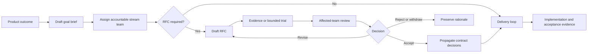

# RFC process

This document defines how the project makes durable decisions that affect
multiple teams, public behavior, shared interfaces, or difficult-to-reverse
engineering commitments.

An RFC is a decision mechanism, not a second product-planning system:

> RFCs record decisions. Contracts define behavior. Goals organize delivery.
> Tests provide proof.

An RFC cannot override `AGENTS.md` or the product and engineering contracts.
Accepted decisions are propagated into those authoritative sources through the
normal delivery workflow.

## Place in product delivery



The lead agent applies the RFC trigger after goal shaping and team assignment.
A required RFC must be accepted before implementation commits the project to a
new public or shared contract.

For non-product work, apply the same trigger before implementation changes a
durable shared interface, operating rule, or difficult-to-reverse commitment.

When a decision depends on facts that cannot be established from existing
evidence, a bounded decision-value goal may run first. The trial must avoid
establishing the disputed contract and feed its results back into the RFC.

If an RFC trigger is discovered during delivery, stop at the affected boundary,
preserve completed in-bounds work, and resolve the RFC before crossing it.

## Trigger rules

Evaluate the mandatory triggers first. If any item below applies, an RFC is
required; the diagnostic question and normal exemptions cannot override it.
These triggers concern a decision that introduces or changes a durable
commitment. A defect fix that strictly restores an existing documented contract
does not trigger an RFC merely because it touches one of these domains; if the
fix also needs a new policy, interface, compatibility choice, or other listed
decision, the trigger applies. The following changes are mandatory triggers:

- a new or changed contract for public SQL, connector-package, compatibility,
  exclusion, or diagnostic behavior;
- a shared team interface such as `CompiledConnector`, `ScanRequest`,
  `ScanPlan`, `BatchStream`, protocol interfaces, fixture execution, or plan
  explanation;
- a reusable platform capability or protocol family;
- relational correctness rules for operation selection, pushdown, residual
  ownership, projection, ordering, limits, cardinality, or conservative
  fallback;
- credentials, authentication, network policy, resource enforcement, replay,
  retry, caching, privacy, or data-loss behavior;
- FFI, concurrency, initialization, reload, cancellation, shutdown, or
  compatibility commitments;
- a decision with meaningful migration cost or one that is expensive to
  reverse;
- movement of a team interface or accountability boundary;
- an unresolved cross-team disagreement not answerable from existing contracts
  and evidence; or
- a dependency choice with durable licensing, external-cost, compatibility, or
  supply-chain consequences.

Use this diagnostic question:

> Would another team or external user need to change behavior because of this
> decision, or would reversing it require migration, a contract break, or
> disproportionate rework?

When no mandatory trigger clearly applies, a `yes` answer requires an RFC and a
`no` answer permits the normal delivery workflow.

The following exemptions apply only when no mandatory trigger applies and the
diagnostic answer is `no`. An RFC is then unnecessary for:

- a product goal or priority choice by itself;
- a defect fix that restores documented behavior;
- an internal refactor that preserves behavior and team interfaces;
- routine tests, documentation clarification, file layout, or reversible
  library choices;
- a reversible implementation decision contained inside one active charter;
- a repository-maintenance or agent-workflow improvement confined to
  Engineering Enablement; or
- a bounded experiment whose only output is decision evidence.

An urgent security or correctness containment fix may precede an RFC. If the
fix establishes new durable behavior, open the RFC afterward and either confirm
the decision or replace it through an explicit follow-up change. The
containment commit records the exception, sponsoring team, temporary scope,
exit condition, and an activated follow-up goal; it does not imply that the
durable decision has been accepted. If the temporary behavior touches a
product-manager-reserved decision, record the product manager's approval or an
explicit temporary deferral and the goal that will resolve it. Only the
containment commit may close under this exception; the underlying durable
change remains incomplete until its RFC and contract propagation are complete.

## Sponsorship and decision authority

Every RFC has one sponsoring team and one linked outcome or objective:

- A **product RFC** is sponsored by Connector Experience or Query Experience
  and names the customer outcome that needs the decision.
- A **non-product RFC** is sponsored by the topology team accountable for the
  affected operating or engineering area and names the governance,
  maintenance, risk-reduction, or other objective. It does not invent a product
  customer or stream outcome.

Platform and subsystem work framed as product delivery still follows
`docs/TEAM_TOPOLOGY.md`: it names the sponsoring or consuming stream outcome.

| Role | Responsibility |
| --- | --- |
| Sponsoring team | Owns the product outcome or stated non-product objective and its acceptance narrative |
| RFC author | Develops the proposal and incorporates evidence; need not implement it |
| Lead agent | Stewards the process and is the default technical decision owner |
| Product manager | Approves choices reserved by `AGENTS.md` before acceptance |
| Affected team | Reviews changes to its charter, interfaces, operational burden, and customer expectations |
| Relational Semantics | Supplies required semantic arguments and rejects unproven correctness shortcuts |
| Remote Runtime | Evaluates platform feasibility, service quality, and consumer experience |
| Engineering Enablement | Facilitates review and improves the process without deciding proposal content |

Each RFC names one technical decision owner. The lead agent is the default. An
active charter may explicitly delegate a contained decision class to another
named role; without that delegation, the lead agent retains authority. An RFC
containing a product-manager-reserved choice cannot be accepted until the
product manager's decision is recorded.

Required review is not unanimous consent. An objection must identify a violated
contract or invariant, an unacceptable product consequence, an operational
hazard, or missing evidence. The decision owner records the disposition of each
material objection and makes the technical decision within the authority above.

No decision owner may use the RFC process to weaken an engineering invariant.

## Topology participation

For a product RFC, the sponsoring stream team remains accountable for the
product outcome. For a non-product RFC, the sponsoring team remains accountable
for the stated objective without assuming product accountability. Every RFC
identifies all affected teams and their interaction modes.

| Decision area | Required participation |
| --- | --- |
| Connector package or author experience | Connector Experience |
| DuckDB SQL, adapter, lifecycle, or query experience | Query Experience |
| Shared execution, protocol, transport, or operational capability | Remote Runtime |
| Relational planning or correctness | Relational Semantics |
| Delivery capability or process | Engineering Enablement as facilitator |
| Team interface or accountability movement | Every affected team and the lead agent |

For collaboration, record the learning objective and exit condition. For
X-as-a-Service, identify the provider, consumers, compatibility expectation,
and evidence of low-friction use. For facilitation, identify the capability to
transfer and the evidence that the receiving team can become self-sufficient.

## RFC statuses

Use one of these statuses in the RFC metadata. That field is the sole
authoritative lifecycle status:

- **Draft:** the proposal is being formed and may change substantially.
- **In review:** the decision boundary, evidence, and required reviewers are
  known and feedback is being resolved.
- **Accepted:** the decision owner has accepted the proposal and all reserved
  product decisions are recorded.
- **Rejected:** the decision owner has declined the proposal and recorded why.
- **Withdrawn:** the sponsoring team no longer requests the decision.
- **Superseded:** a later RFC replaces this decision.

Acceptance authorizes the chosen direction. It does not mean implementation is
complete or available to users.

## Workflow

### 1. Qualify and sponsor

Apply the trigger rules. Classify the RFC as product or non-product. Identify
the sponsoring team, linked outcome or objective, technical decision owner,
affected teams, and any reserved product decision. If no stream outcome needs a
product RFC, either classify a genuine non-product objective or do not open the
RFC.

### 2. Create the draft

Copy `docs/RFC_TEMPLATE.md` to:

```text
docs/rfcs/NNNN-short-decision-name.md
```

Use the next unused four-digit number visible on `main` and a lower-case,
hyphenated name. Resolve any numbering collision before integration. Drafts may
live in the task or proposal branch; publication to `main` follows the terminal
status rules below.

State the problem and decision drivers before detailing a solution. Include the
drawbacks and plausible alternatives rather than presenting the proposal as
inevitable.

### 3. Establish evidence

Resolve agent-owned questions through repository inspection and primary-source
research. When feasibility or correctness is unproven, run the smallest
bounded trial capable of answering the question. Record commands, fixtures,
properties, results, and limitations in the RFC.

Evidence must address the failure paths and invariants implicated by the
decision, not only the successful example.

### 4. Review by affected teams

The author requests review from every team named by the topology-impact
section. Reviewers examine the proposal through their charter and the
authoritative contracts, then record evidence-backed objections or approval.
Use `$topology-consult` to select the charter-backed perspectives, preserve
fresh review context, and format the resulting dispositions. The skill
facilitates review but does not approve an RFC or replace the decision owner.

The template's review record contains one row for every required reviewer,
including the reviewer, team, approval or objection, evidence, and disposition.
The RFC cannot move to a decision while a required row is missing or a material
objection lacks a recorded disposition.

### 5. Decide

The technical decision owner records accepted or rejected, the rationale, the
evidence relied upon, and the disposition of material objections. The product
manager records any reserved product decision.

If uncertainty still prevents a responsible choice, return the RFC to Draft
with a concrete evidence requirement. Do not accept an intentionally ambiguous
shared contract.

### 6. Publish and propagate

Merge every Accepted or Rejected RFC to `main`. A Withdrawn RFC that reached In
review is also merged with its rationale; a draft abandoned before review may
be deleted or preserved when its evidence will prevent repeated work. An
accepted RFC must identify every authoritative document, charter, example,
diagnostic, and test that needs to change.

Changes to the topology or an active charter take effect only when the accepted
RFC and those operating-document updates are integrated coherently. Behavioral
contract updates may land with the RFC or with implementation, but the linked
delivery goal cannot close until every affected layer agrees.

The RFC explains why the project chose a direction. It never becomes the sole
source of truth for current behavior.

### 7. Deliver and prove

Implementation proceeds through `docs/PRODUCT_DELIVERY.md` and
`$delivery-loop`. Each product-delivery goal has one accountable stream team
and names supporting interaction modes and exit conditions. Non-product work
retains the owning topology team and stated objective without fabricating a
product goal.

The implementation author need not be the RFC author. Completion requires the
RFC's acceptance evidence, the updated authoritative contracts, independent
review, and the repository gates.

## Amendment and supersession

After acceptance, limit edits to corrections, clarifications that do not change
the decision, implementation references, and supersession metadata.

A material change requires a new RFC. The new RFC links the previous one, and
the previous RFC changes to Superseded with a link to its replacement. Preserve
the original rationale rather than rewriting history.

## What a decided RFC produces

A decided RFC leaves:

1. a discoverable decision or rejection with rationale;
2. named sponsorship, decision authority, affected teams, and objections;
3. the required contract, topology, or charter propagation;
4. executable evidence requirements and known limitations;
5. product-delivery goals with accountable stream teams, or non-product work
   with an owning team and objective, plus supporting interactions; and
6. a clear path for later supersession.

An RFC does not contain an active task list, speculative delivery dates, or a
component-by-component implementation plan.

## References

- [The Rust RFC Book](https://rust-lang.github.io/rfcs/)
- [Kubernetes enhancement proposals](https://www.kubernetes.dev/resources/keps/)
