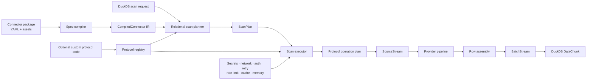
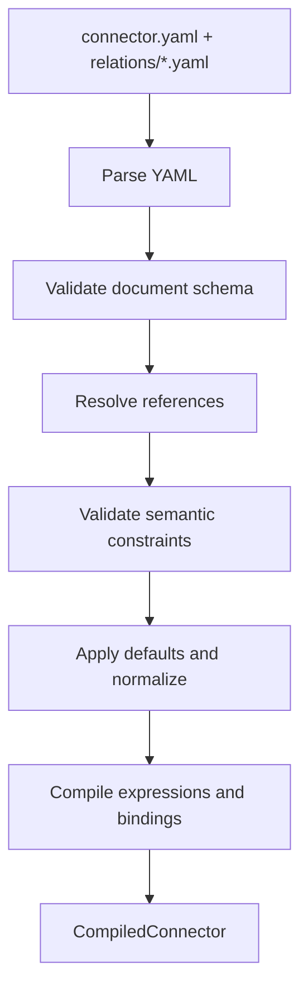
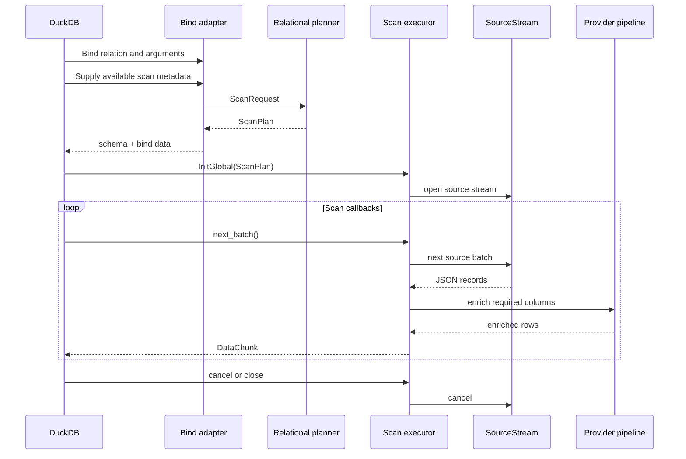
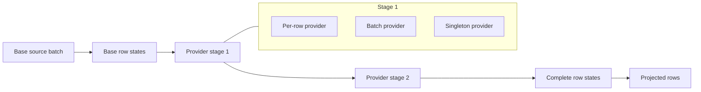
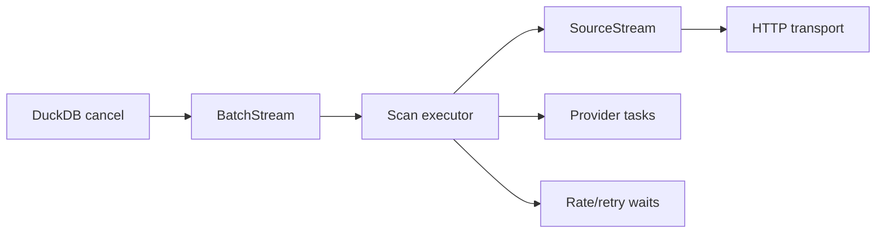

# Compiled Connector IR and Runtime Contracts

> Internal semantic contracts for compiling declarative connector packages,
> planning relational scans, executing remote operations, enriching rows, and
> producing DuckDB vectors. Rust is the intended portable implementation; the
> accepted native preview maps a strict subset into private C++ types.
>
> Companion to [ARCHITECTURE.md](ARCHITECTURE.md) and
> [CONNECTOR_SPECIFICATIONS.md](CONNECTOR_SPECIFICATIONS.md).

Status: **Design proposal**

---

## 1. Purpose and Contract

This document defines the internal runtime contracts for the DuckDB “Any API”
connector system.

It does **not** define the YAML connector language. The YAML format is specified
separately in [CONNECTOR_SPECIFICATIONS.md](CONNECTOR_SPECIFICATIONS.md).

It also does **not** define a stable public binary plugin ABI. The Rust types and
traits in this document are implementation contracts within the extension and
may evolve while the specification remains a design proposal.

The system has five major responsibilities:

1. Compile a connector package into immutable runtime metadata.
2. Translate a DuckDB scan request into a semantically explicit `ScanPlan`.
3. Compile protocol-neutral operations into REST, GraphQL, or custom remote
   operation plans.
4. Execute those plans under network, secret, retry, rate-limit, cache, and
   memory policies.
5. Produce DuckDB-compatible batches without exposing asynchronous transport
   mechanics to DuckDB.

The central contract is:

```text
ScanRequest -> ScanPlan -> BatchStream
```

A connector is not primarily a trait implementation. A connector is a package
of declarative relation metadata compiled into an intermediate representation.
Runtime behavior is supplied by shared protocol planners, protocol executors,
and provider executors.

### 1.1 Contract boundaries

The runtime contracts cover:

- Declarative REST connectors.
- Declarative GraphQL connectors.
- Static relation schemas.
- Read-only scans.
- JSON source records.
- Exact and superset predicate pushdown.
- Sequential pagination by default.
- Per-row, batch, and singleton column providers.
- DuckDB table-function integration.
- Shared runtime policy infrastructure.

The runtime contracts do not require:

- A stable external Rust plugin ABI.
- WASM connector execution.
- Dynamic schema discovery during ordinary query planning.
- Cross-source transactions.
- Write-back operations.
- A custom DuckDB storage catalog.
- Deep optimizer integration through DuckDB internal C++ APIs.
- Columnar remote-source batches.

### 1.2 Accepted native `0.4.0` mapping

RFC 0005 replaces the fixture preview with a bounded live REST subset mapped
into private native C++ types. Those types are neither a public ABI nor a
replacement for the intended portable Rust runtime.

| Semantic artifact | Native preview mapping |
|---|---|
| `CompiledConnector` | Immutable `github` version `0.4.0` snapshot with the bounded anonymous page and exactly-one authenticated-user relations, three required columns, fixed structural REST operations, logical credential policy, typed HTTPS origin, extraction paths, and connector-owned ceilings |
| `ScanRequest` | Selected relation and optional logical secret reference; full projection closure; `TRUE` predicate; empty ordering; unset limit and offset; no credential bytes, SQL text, or I/O capability |
| `ScanPlan` | One fixed anonymous search or authenticated root-object operation, typed destination and bearer obligation where required, `TRUE` remote/residual predicates, DuckDB relational ownership, disabled pagination/retry/cache/providers, and explicit hard budgets; no credential bytes |
| `BatchStream` | Synchronous one-request pull stream owning either the anonymous or opaque GitHub-user authorization alternative, bounded JSON decode, schema-aligned batches, one retained deadline, cancellation checks, and idempotent close |

The native adapter receives an immutable `ScanExecutor` from product
composition and asks it to open each `BatchStream`. The production executor
owns one fixed HTTPS transport authority; private deterministic tests link a
separate controlled-loopback composition that is absent from installed and
loadable targets. A call-scoped `ExecutionControl` supplies a non-throwing
cancellation query to executor open and stream pull. Runtime code must not
retain that view. It reports cancellation through a runtime marker that the
adapter translates to DuckDB interruption, so `ClientContext` and DuckDB
exceptions remain outside runtime interfaces.

Query registers the narrow `duckdb_api/config` secret type and resolves the
explicit name from temporary `memory` storage once per global initialization.
Only the move-only authorization capability crosses into Remote Runtime. No
connector compiler, package loader, protocol registry, general secret reader,
provider pipeline, pagination, retry, cache, async runtime, or cross-language
FFI exists in this profile. The snapshot is built from repository metadata at
extension construction; arbitrary connector syntax is not accepted.

---

## 2. System Boundaries

The runtime is divided into explicit layers.



Each layer has one primary responsibility.

| Layer | Responsibility |
|---|---|
| Spec compiler | Parse, validate, normalize, and compile connector packages. |
| Compiled IR | Immutable connector metadata optimized for planning and execution. |
| Relational planner | Choose operations and classify remote versus local semantics. |
| Protocol planner | Compile generic operation metadata into protocol-specific plans. |
| Protocol executor | Execute REST, GraphQL, or custom operations. |
| Provider pipeline | Populate projected columns not present in base source records. |
| Row assembler | Extract and convert values into the relation’s declared types. |
| Batch stream | Expose a synchronous pull interface to DuckDB. |
| Runtime services | Enforce security, resource, retry, rate, cache, and telemetry policy. |

The boundaries are deliberate:

- The spec compiler does not perform network calls.
- The relational planner does not issue remote requests.
- Protocol planning is side-effect free.
- Protocol execution does not own DuckDB logical semantics.
- Provider execution must preserve base-row cardinality.
- DuckDB does not directly consume an async stream.

---

## 3. Core Design Principles

### 3.1 Compiled data over connector objects

Declarative connectors compile into immutable data. The runtime does not invoke
a connector object to rediscover relation metadata for each query.

### 3.2 Planning before execution

Every scan is planned before remote I/O begins. The plan records:

- Which operation is selected.
- Which predicates are remote.
- Which predicates remain local.
- Which ordering and limit operations are safe remotely.
- Which providers must run.
- Which partitions survive pruning.
- Which policies apply.

### 3.3 Semantics are explicit

Remote pushdown is never represented by a simple accepted/rejected flag. Each
translation records whether it is:

- `Exact`
- `Superset`
- `Unsupported`

DuckDB remains responsible for residual semantics.

### 3.4 Pull at the DuckDB boundary

DuckDB repeatedly asks for output batches. Internally, the runtime may prefetch
asynchronously, but the connector-facing and DuckDB-facing boundary is a
bounded pull abstraction.

### 3.5 Capabilities instead of unrestricted resources

Protocol executors receive authorized capabilities:

- A scoped network capability.
- Authorized secret handles.
- Policy-aware transport.
- A memory budget.
- Cancellation and telemetry contexts.

They do not receive unrestricted environment access or arbitrary reusable
secret material.

### 3.6 Providers preserve cardinality

Base operations create rows. Providers enrich rows. A provider may fill zero or
more columns, but it may not add, remove, split, or duplicate base rows.

### 3.7 Retry safety is replay-unit scoped

Retry correctness is evaluated per page, request, lookup, provider row, or
provider batch. The system does not use a query-global “streaming has started”
flag.

### 3.8 Static schemas do not mutate during planning

A static relation schema changes only when the connector package changes.
Ordinary planning does not perform network discovery or silently refresh a
schema after `COLUMN_NOT_FOUND`.

---

## 4. Connector Package Compilation

The compiler turns parsed YAML into a normalized and validated
`CompiledConnector`.



Compilation includes:

- Resolving connector and relation defaults.
- Resolving policy inheritance.
- Validating operation routing.
- Validating input and predicate references.
- Compiling path and JQ expressions.
- Compiling request templates.
- Compiling provider dependencies.
- Constructing provider DAG stages.
- Validating network and secret bindings.
- Validating pagination capabilities.
- Rejecting unreachable operations.
- Rejecting ambiguous operation selectors.
- Assigning stable internal IDs.

The compiled IR should not preserve every syntactic detail of the YAML source.
It should preserve source locations for diagnostics.

```rust
pub struct SourceLocation {
    pub file: PathBuf,
    pub line: u32,
    pub column: u32,
}
```

---

## 5. Compiled Connector IR

### 5.1 `CompiledConnector`

```rust
pub struct CompiledConnector {
    pub id: ConnectorId,
    pub display_name: String,
    pub version: semver::Version,
    pub description: Option<String>,

    pub relations: IndexMap<RelationId, CompiledRelation>,

    pub connection_schema: ConnectionSchema,
    pub secret_requirements: SecretRequirements,
    pub secret_bindings: SecretBindingPolicySet,
    pub network_policy: NetworkPolicy,

    pub default_policies: ConnectorPolicies,
    pub source: ConnectorSourceInfo,
}
```

```rust
pub struct ConnectorSourceInfo {
    pub package_root: PathBuf,
    pub package_digest: ContentDigest,
    pub source_locations: SourceMap,
}
```

The package digest participates in cache keys and diagnostics.

`SecretBindingPolicySet` is the compiled form of manifest `secret_bindings`.
It preserves authorized destination sources, auth providers, and header/query
placements so authenticators and the transport can enforce them after URL
resolution and on every redirect.

### 5.2 Stable identifiers

Human-facing names and internal IDs are separate.

```rust
#[derive(Clone, Copy, Eq, PartialEq, Hash)]
pub struct ConnectorId(u32);

#[derive(Clone, Copy, Eq, PartialEq, Hash)]
pub struct RelationId(u32);

#[derive(Clone, Copy, Eq, PartialEq, Hash)]
pub struct ColumnId(u32);

#[derive(Clone, Copy, Eq, PartialEq, Hash)]
pub struct InputId(u32);

#[derive(Clone, Copy, Eq, PartialEq, Hash)]
pub struct OperationId(u32);

#[derive(Clone, Copy, Eq, PartialEq, Hash)]
pub struct ProviderId(u32);

#[derive(Clone, Copy, Eq, PartialEq, Hash)]
pub struct PartitionId(u32);
```

The compiled IR may store names alongside IDs for diagnostics. Execution should
prefer IDs to repeated string lookups.

### 5.3 `CompiledRelation`

```rust
pub struct CompiledRelation {
    pub id: RelationId,
    pub name: String,
    pub sql_name: String,
    pub description: Option<String>,

    pub schema_mode: SchemaMode,

    pub inputs: IndexMap<InputId, CompiledInput>,
    pub columns: IndexMap<ColumnId, CompiledColumn>,
    pub operations: IndexMap<OperationId, CompiledOperation>,
    pub predicates: PredicateCatalog,
    pub providers: IndexMap<ProviderId, CompiledProvider>,
    pub provider_graph: ProviderGraph,
    pub partitions: IndexMap<PartitionId, CompiledPartition>,

    pub default_policies: RelationPolicies,
}
```

```rust
pub enum SchemaMode {
    Static,
    DynamicExplicitRefresh {
        discovery: CompiledSchemaDiscovery,
    },
}
```

`CompiledSchemaDiscovery` is compiled from the relation's schema-discovery
block, such as GraphQL introspection metadata. It is not required to be a base
row-producing `OperationId`.

Dynamic schemas are refreshed through an explicit runtime action. They are not
refreshed implicitly during ordinary bind or planning. `CompiledRelation` is
query-registerable only after its column map has been populated from a stored
schema snapshot; atomic refresh publishes a new immutable connector snapshot,
while already-bound queries retain the prior one.

### 5.4 Inputs

Inputs represent values accepted by remote operations. They are not necessarily
returned columns.

```rust
pub struct CompiledInput {
    pub id: InputId,
    pub name: String,
    pub ty: LogicalType,
    pub nullable: bool,
    pub sensitive: bool,
    pub description: Option<String>,

    pub validation: InputValidation,
    pub default: Option<ScalarValue>,
}
```

```rust
pub struct InputValidation {
    pub allowed_values: Option<Vec<ScalarValue>>,
    pub minimum: Option<ScalarValue>,
    pub maximum: Option<ScalarValue>,
    pub pattern: Option<CompiledRegex>,
}
```

Inputs may be supplied through:

- Named table-function arguments.
- Predicate mappings.
- Connection configuration.
- Partition bindings.
- Provider parent-row bindings.
- Runtime-generated pagination bindings.

The compiled input does not itself decide which operation uses it.

### 5.5 Columns

```rust
pub struct CompiledColumn {
    pub id: ColumnId,
    pub name: String,
    pub ty: LogicalType,
    pub nullable: bool,
    pub hidden: bool,
    pub description: Option<String>,

    pub source: ColumnSource,
    pub missing_value: MissingValuePolicy,
}
```

```rust
pub enum MissingValuePolicy {
    Default(ScalarValue),
    Null,
    Fail,
}
```

`Null` is valid only for nullable columns. The compiler derives `Fail` for a
non-nullable column without a default, and explicit JSON `null` is subject to
the same nullable constraint as a missing extraction.

```rust
pub enum ColumnSource {
    Base {
        extractor: CompiledExtractor,
    },
    Provider {
        provider: ProviderId,
        extractor: CompiledExtractor,
    },
}
```

```rust
pub enum CompiledExtractor {
    Identity,
    JsonPath(CompiledJsonPath),
    Jq(CompiledJq),
    Custom(CustomExtractorId),
}
```

The row assembler owns conversion from extracted JSON values to DuckDB logical
types.

### 5.6 Operations

An operation is a candidate way to produce base rows for a relation.

```rust
pub struct CompiledOperation {
    pub id: OperationId,
    pub name: String,

    pub selector: OperationSelector,
    pub cardinality: OperationCardinality,

    pub protocol: ProtocolId,
    pub protocol_spec: ProtocolOperationSpec,

    pub pagination: Option<CompiledPagination>,
    pub projection: ProjectionCapabilities,
    pub ordering: Vec<OrderingCapability>,
    pub remote_limit: RemoteLimitCapability,
    pub replay_safety: ReplaySafety,

    pub policy_refs: OperationPolicyRefs,
}
```

```rust
pub enum OperationCardinality {
    ZeroOrOne,
    ZeroOrMany,
}
```

```rust
pub enum ReplaySafety {
    Safe,
    Unsafe,
}
```

Replay safety is compiled from the declared operation and protocol method.
Unsafe operations cannot receive automatic retries, single-flight, or exact
request caching.

```rust
pub struct OperationSelector {
    pub required_inputs: BTreeSet<InputId>,
    pub any_input_groups: Vec<BTreeSet<InputId>>,
    pub forbidden_inputs: BTreeSet<InputId>,
    pub priority: i32,
    pub fallback: bool,
}
```

Operation selection is deterministic. Compilation rejects statically provable
selector ambiguity. Query planning still detects data-dependent ties after
candidate-specific predicate bindings are resolved.

### 5.7 Predicate catalog

```rust
pub struct PredicateCatalog {
    pub mappings: HashMap<(ColumnId, SqlOperator), Vec<PredicateMapping>>,
}
```

```rust
pub struct PredicateMapping {
    pub operation: OperationId,
    pub input: InputId,
    pub translation: PredicateTranslation,
    pub accuracy: PushdownAccuracy,
}
```

```rust
pub enum PushdownAccuracy {
    Exact,
    Superset {
        reason: String,
    },
    Unsupported,
}
```

```rust
pub enum PredicateTranslation {
    Identity,
    Transform(CompiledValueTransform),
    Expand(CompiledPredicateExpansion),
    Custom(CustomPredicateTranslatorId),
}
```

A single SQL predicate may have different mappings for different operations.

### 5.8 Providers

```rust
pub struct CompiledProvider {
    pub id: ProviderId,
    pub name: String,
    pub mode: ProviderMode,

    pub required_columns: BTreeSet<ColumnId>,
    pub provided_columns: BTreeSet<ColumnId>,

    pub protocol: ProtocolId,
    pub protocol_spec: ProtocolOperationSpec,

    pub correlation: Option<CorrelationSpec>,
    pub aggregation: ProviderAggregation,
    pub missing_result: MissingProviderResult,
    pub replay_safety: ReplaySafety,
    pub max_concurrency: usize,
    pub policy_refs: ProviderPolicyRefs,
}
```

```rust
pub enum ProviderMode {
    PerRow,
    Batch {
        key_column: ColumnId,
        max_batch_size: usize,
        max_wait: Duration,
    },
    Singleton {
        memoization: MemoizationScope,
    },
}
```

```rust
pub enum MemoizationScope {
    Query,
    Connection,
}
```

```rust
pub struct CorrelationSpec {
    pub request_key: CompiledExtractor,
    pub response_key: CompiledExtractor,
}
```

```rust
pub enum MissingProviderResult {
    Null,
    Fail,
}
```

`Fail` is the default. `Null` is valid only when every affected column is
nullable and the provider contract establishes unambiguous absence semantics;
protocol, authentication, authorization, and policy failures do not become
missing results.

```rust
pub enum ProviderAggregation {
    SingleValue,
    CollectList,
    Reducer(CompiledReducer),
}
```

Paginated providers cannot use `SingleValue`. `CollectList` concatenates items
in page order; a reducer must be associative, deterministic, and explicitly
bounded. `max_concurrency` is the effective provider ceiling after intersecting
the declaration with connection and scan resource budgets.

Provider dependencies are derived primarily from required and provided columns.

### 5.9 Partitions

```rust
pub struct CompiledPartition {
    pub id: PartitionId,
    pub name: String,
    pub source: PartitionSource,
    pub binding_input: InputId,
    pub cache_policy: Option<ExactCachePolicy>,
}
```

```rust
pub enum PartitionSource {
    Static(Vec<ScalarValue>),
    Operation {
        protocol: ProtocolId,
        protocol_spec: ProtocolOperationSpec,
        extractor: CompiledExtractor,
    },
}
```

Partition discovery is distinct from schema discovery.

---

## 6. DuckDB Lifecycle Mapping

The portable integration profile uses DuckDB table functions. The exact C API
or Rust wrapper may vary, but the runtime lifecycle remains:

| DuckDB phase | Runtime action |
|---|---|
| Extension/package load | Load connector package and compile `CompiledConnector`. |
| Table-function registration | Register one function per relation or a generic dispatch function. |
| Bind | Resolve relation arguments and bind its schema. |
| Scan-metadata collection | Collect only projection, filter, ordering, limit, offset, progress, and cancellation information exposed by the adapter capability profile. |
| Scan planning | Build a conservative `ScanRequest`; invoke the shared planner to obtain `ScanPlan`. |
| Global initialization | Create a call-scoped execution-control view and ask `ScanExecutor` to open `BatchStream`. |
| Local initialization | Create local DuckDB scan state, if parallel local consumption is supported. |
| Repeated scan | Pull rows from `BatchStream` into `DataChunk`. |
| Progress hook | Read execution progress from shared scan state. |
| Cancellation | Translate the host signal through execution control, signal the scan executor, and abort authorized transport requests. |
| Completion | Flush telemetry, release capabilities, and persist safe observations. |



### 6.1 No network I/O during ordinary bind

Ordinary bind and scan planning operate only on:

- Compiled connector metadata.
- Query arguments.
- DuckDB scan metadata exposed by the active adapter capability profile.
- Cached local observations.

Network I/O begins after a `ScanPlan` has been accepted and the first stream
pull starts. The native profile validates the complete plan capability during
executor open without acquiring a socket. Its one fixed HTTPS request is
therefore distinguishable from bind, planning, prepare, copy, and stream-open
work by controlled request-count oracles.

### 6.2 Parallel DuckDB scan state

An adapter may expose a single DuckDB scan task even when remote execution is internally
concurrent. This is simpler and avoids duplicate pagination and limit handling.

Parallel DuckDB task execution is enabled only for plans that prove their
source partitions are independent and deterministic.

### 6.3 Adapter capability profile

```rust
pub struct DuckDbAdapterCapabilities {
    pub projection: bool,
    pub filters: PushdownMetadataCapability,
    pub ordering: PushdownMetadataCapability,
    pub limit: PushdownMetadataCapability,
    pub offset: PushdownMetadataCapability,
    pub progress: bool,
    pub cancellation: CancellationCapability,
    pub secret_manager: bool,
}
```

```rust
pub enum PushdownMetadataCapability {
    Unavailable,
    AdvisoryRetainedByDuckDb,
    DelegatedToRuntime,
}
```

Unavailable metadata is represented conservatively: all output columns when
projection is unavailable, `Predicate::True`, empty ordering, and no limit or
offset. Required API lookup keys must be explicit inputs when filter metadata
is unavailable. Advisory metadata remains authoritative in DuckDB even when it
guides a safe remote optimization. Delegated metadata must be executed by the
runtime when it cannot be pushed remotely. The planner never reconstructs
unavailable query structure from SQL text.

Every supported DuckDB version and adapter profile has a compatibility test
that records these capabilities. A capability is enabled only after its full
lifecycle behavior, including teardown and error paths, is verified.

The accepted native profile records projection, filters, ordering, limit,
offset, and progress as unavailable. Its secret-manager coupling is restricted
to exact-name temporary-memory resolution during global initialization and is
never exposed to planning or Runtime. Cancellation is verified. It uses one DuckDB source task, requests the full projection closure,
and leaves every row-removing, ordering, and bounding operation in DuckDB.

An adapter cannot delegate limit, offset, or ordering past an unavailable or
DuckDB-owned row-removing or ordering prerequisite. It must retain the
dependent DuckDB operator or reject the scan rather than apply it prematurely.

### 6.4 Registration, reload, and shutdown

Generated SQL names are unique across the loaded connector registry, not only
within a package. Registration fails on a collision with another connector or
existing DuckDB function unless the user supplies an explicit non-conflicting
name.

Connector reload is atomic. Existing scans retain an `Arc` to the immutable
compiled package and policy snapshot they started with; new scans observe the
new package only after successful compilation and registration.

The async runtime is owned by the DuckDB database/extension state, not by an
individual scan. Extension shutdown cancels scans, closes transports, drains
bounded queues, and joins worker threads. Panics are caught at every FFI
callback and converted to internal errors; unwinding never crosses the C ABI.

The native `0.4.0` profile has no async worker. Before any version inspection,
its process owner calls `curl_global_init(CURL_GLOBAL_DEFAULT)`, then verifies
the exact supported libcurl version, TLS-backend identity, and
`CURL_VERSION_THREADSAFE` capability. A rejected, unpublished initialization
is balanced immediately with `curl_global_cleanup()`. Accepted global state is
deliberately process-resident and left to OS process reclamation: service,
extension, DSO, and `atexit` teardown register no cleanup hook because shutdown
ordering cannot prove that every curl user has ended. Dynamic extension
unload/reload is unsupported in this profile.

---

## 7. Scan Request

The DuckDB adapter converts bound SQL state into a protocol-neutral
`ScanRequest`.

```rust
pub struct ScanRequest {
    pub connector: ConnectorId,
    pub relation: RelationId,

    pub explicit_inputs: BTreeMap<InputId, ScalarValue>,

    pub projection: Vec<ColumnId>,
    pub predicate: Predicate,
    pub ordering: Vec<Ordering>,
    pub limit: Option<u64>,
    pub offset: Option<u64>,

    pub adapter_capabilities: DuckDbAdapterCapabilities,
    pub context: QueryPlanningContext,
}
```

If an adapter capability is false, the corresponding field contains its
conservative value and cannot affect operation selection or pushdown.

```rust
pub struct QueryPlanningContext {
    pub connection: ConnectionId,
    pub principal: PrincipalId,
    pub connector_version: semver::Version,
    pub observed_stats: ObservedStatsSnapshot,
}
```

### 7.1 Predicate representation

The planner should use its own normalized predicate tree rather than expose
DuckDB internal filter objects throughout the runtime.

```rust
pub enum Predicate {
    True,
    False,
    Comparison {
        column: ColumnId,
        operator: SqlOperator,
        value: ScalarValue,
    },
    IsNull {
        column: ColumnId,
        negated: bool,
    },
    In {
        column: ColumnId,
        values: Vec<ScalarValue>,
        negated: bool,
    },
    And(Vec<Predicate>),
    Or(Vec<Predicate>),
    Not(Box<Predicate>),
    UnsupportedExpression(ExpressionDigest),
}
```

The adapter converts what DuckDB makes available. Unsupported expressions remain
local.

---

## 8. Scan Plan

`ScanPlan` is the central contract between planning and execution.

```rust
pub struct ScanPlan {
    pub connector: ConnectorId,
    pub relation: RelationId,

    pub operation: PlannedOperation,

    pub resolved_inputs: BTreeMap<InputId, ScalarValue>,

    pub remote_predicate: Predicate,
    pub residual_predicate: Predicate,
    pub residual_execution: ResidualExecution,

    pub remote_projection: RemoteProjection,
    pub output_columns: Vec<ColumnId>,

    pub remote_ordering: Vec<RemoteOrdering>,
    pub duckdb_ordering: Vec<Ordering>,

    pub remote_limit: Option<u64>,
    pub local_limit: Option<u64>,
    pub local_offset: Option<u64>,

    pub pagination: Option<PaginationPlan>,
    pub partitions: PartitionPlan,
    pub providers: ProviderExecutionPlan,

    pub cardinality: CardinalityEstimate,
    pub applied_policies: AppliedPolicies,

    pub diagnostics: PlanDiagnostics,
}
```

The plan is immutable after execution starts.

```rust
pub enum ResidualExecution {
    DuckDb,
    Runtime,
}
```

Exactly one layer owns residual evaluation. `DuckDb` is used for advisory
filter metadata only when the adapter proves that DuckDB retains the complete
residual above the scan. `Runtime` is used for delegated filters and evaluates
the normalized predicate with DuckDB-equivalent semantics. Unavailable filters
remain unseen and owned by DuckDB. A plan owned by DuckDB cannot apply a local
limit or offset before the residual filter; those operations remain in DuckDB.

### 8.1 Planned operation

```rust
pub struct PlannedOperation {
    pub operation: OperationId,
    pub protocol: ProtocolId,
    pub protocol_plan: PlannedProtocolOperation,
    pub cardinality: OperationCardinality,
}
```

### 8.2 Operation selection

The planner:

1. Resolves explicit, connection, and partition inputs that do not depend on an
   operation.
2. Evaluates every non-fallback operation as a candidate using only predicate
   mappings declared for that operation.
3. Derives candidate inputs from exact and superset mappings, validates them,
   and rejects conflicting bindings or unsatisfied selectors.
4. Ranks eligible candidates by satisfied selector specificity, then explicit
   priority. Specificity is the count of `required_inputs` plus the size of the
   largest satisfied `any_input_groups` alternative; forbidden inputs do not
   add specificity.
5. Evaluates the single fallback only when no non-fallback candidate is
   eligible.
6. Selects one unambiguous candidate or fails with diagnostics containing the
   rejected candidates and reasons.

Example:

```text
WHERE full_name = 'duckdb/duckdb'
```

may resolve input `full_name` and select `get`.

```text
WHERE visibility = 'public'
```

may resolve input `visibility` and select the fallback `list`.

A predicate mapped with `Superset` accuracy may supply a candidate input, but
the original predicate remains residual. Only the selected candidate's
bindings and translations enter `ScanPlan`.

### 8.3 Predicate classification

For each predicate node, the planner determines whether it is:

- Exactly executable remotely.
- Executable remotely only as a superset.
- Unsupported remotely.
- Invalid for the selected operation.

```rust
pub struct PredicatePlanningResult {
    pub remote: Predicate,
    pub residual: Predicate,
    pub bindings: Vec<ResolvedInputBinding>,
}
```

A superset mapping appears in both remote and residual trees.

For a DuckDB predicate `D` and remote approximation `R`, the planner requires
`D => R`. It applies the connector specification's composition rules: safe
approximations may be conjoined; a disjunction requires a safe approximation
for every branch; and negation requires an exact child. Unsupported or
unprovable subtrees use `Predicate::True` remotely and preserve the original
DuckDB expression as residual, including three-valued `NULL` behavior.

### 8.4 Projection planning

The planner computes:

- User-visible output columns.
- Base columns required for residual evaluation.
- Base columns required by providers.
- Base columns required for provider correlation.
- Provider columns required by downstream providers.
- Remote protocol fields required to produce those columns.

```rust
pub struct RemoteProjection {
    pub base_columns: BTreeSet<ColumnId>,
    pub protocol_fields: ProtocolProjection,
}
```

Projection planning may cause hidden support columns to be fetched without
returning them to DuckDB.

### 8.5 Ordering and limit safety

Remote ordering is pushed only when the selected operation declares a matching
ordering capability and semantics are exact.

The planner must consider:

- Sort direction.
- Null ordering.
- Collation.
- Remote type conversion.
- Tie behavior.
- Stability across pagination.

A limit may be pushed remotely only when doing so preserves correctness.

Examples:

- Exact remote predicate, exact ordering: limit may be pushed.
- Superset predicate with residual filtering: limit generally remains
  local.
- Provider output used in the filter or ordering: limit remains local unless the
  provider itself participates in remote selection, which this contract does not support.
- Sequential cursor pagination with no residual filter: remote stop after enough
  rows is safe.

`duckdb_ordering` records an ordering operator retained by the adapter. The
runtime does not provide a general local sort in this contract. If ordering was
delegated, planning succeeds only when the remote ordering is exact; otherwise
the adapter must retain the DuckDB operator or reject the scan.

```rust
pub enum RemoteLimitCapability {
    Unsupported,
    Exact {
        parameter: ProtocolLimitBinding,
    },
}
```

### 8.6 Cardinality estimate

```rust
pub struct CardinalityEstimate {
    pub rows: Option<u64>,
    pub confidence: EstimateConfidence,
    pub source: EstimateSource,
}
```

```rust
pub enum EstimateConfidence {
    Exact,
    High,
    Low,
    Unknown,
}
```

```rust
pub enum EstimateSource {
    OperationHint,
    PaginationTotal,
    CachedObservation,
    Unknown,
}
```

Planning does not perform a remote count call solely for cardinality.

---

## 9. Planner Contract

```rust
pub trait ScanPlanner: Send + Sync {
    fn plan(
        &self,
        connector: &CompiledConnector,
        request: ScanRequest,
        protocols: &ProtocolRegistry,
    ) -> Result<ScanPlan, PlanningError>;
}
```

The shared planner owns all relational decisions:

- Operation selection.
- Input resolution.
- Predicate exactness.
- Residual predicates and their execution owner.
- Projection dependencies.
- Ordering and limit safety.
- Provider selection.
- Provider DAG staging.
- Partition pruning.
- Cardinality estimation.
- Policy resolution.

Protocol-specific planners may report capabilities and compile requests, but
they do not choose the residual predicate or its execution owner.

---

## 10. Protocol Registry

```rust
pub struct ProtocolRegistry {
    planners: HashMap<ProtocolId, Arc<dyn ProtocolPlanner>>,
    executors: HashMap<ProtocolId, Arc<dyn ProtocolExecutor>>,
}
```

```rust
impl ProtocolRegistry {
    pub fn planner(
        &self,
        protocol: ProtocolId,
    ) -> Result<&Arc<dyn ProtocolPlanner>, RegistryError>;

    pub fn executor(
        &self,
        protocol: ProtocolId,
    ) -> Result<&Arc<dyn ProtocolExecutor>, RegistryError>;
}
```

The standard registry includes handlers for:

- REST/JSON
- GraphQL/JSON

Custom native or WASM protocol handlers use a separate, explicitly versioned
extension contract when present.

---

## 11. Protocol Planning SPI

Protocol planning converts normalized operation metadata and bindings into a
side-effect-free remote operation plan.

```rust
pub trait ProtocolPlanner: Send + Sync {
    fn protocol_id(&self) -> ProtocolId;

    fn plan_operation(
        &self,
        context: &ProtocolPlanningContext,
        operation: &CompiledOperation,
        bindings: &ResolvedBindings,
        projection: &ProjectionRequest,
    ) -> Result<PlannedProtocolOperation, PlanningError>;
}
```

```rust
pub struct ProtocolPlanningContext<'a> {
    pub connector: &'a CompiledConnector,
    pub relation: &'a CompiledRelation,
    pub network_policy: &'a NetworkPolicy,
}
```

```rust
pub struct ResolvedBindings {
    pub inputs: BTreeMap<InputId, ScalarValue>,
    pub connection: BTreeMap<String, ScalarValue>,
    pub partitions: BTreeMap<PartitionId, ScalarValue>,
    pub pagination: InitialPaginationBindings,
}
```

```rust
pub struct ProjectionRequest {
    pub columns: BTreeSet<ColumnId>,
}
```

### 11.1 Side-effect-free requirement

`plan_operation` must not:

- Perform network I/O.
- Resolve raw secrets.
- Mutate global state.
- Create OAuth tokens.
- Read environment variables.
- Populate caches with externally observed data.

It may compile templates, generate GraphQL documents, and validate host policy.

---

## 12. REST Planning

```rust
pub struct RestOperationPlan {
    pub method: HttpMethod,
    pub url: PlannedUrl,
    pub headers: PlannedHeaders,
    pub body: Option<PlannedBody>,

    pub response: RestResponsePlan,
    pub pagination: Option<PaginationPlan>,
}
```

```rust
pub struct RestResponsePlan {
    pub records: CompiledExtractor,
    pub metadata: ResponseMetadataPlan,
}
```

A planned URL separates immutable structure from runtime bindings.

```rust
pub struct PlannedUrl {
    pub base: AuthorizedBaseUrl,
    pub path: CompiledPathTemplate,
    pub query: Vec<PlannedQueryParameter>,
}
```

REST projection pushdown may produce:

- `fields=...`
- OData `$select=...`
- Vendor-specific include parameters.
- No remote projection change.

The REST planner compiles those protocol details. It does not decide which
relation columns are needed. URL construction treats the compiled base URL as
an API root: its normalized path prefix is preserved when the operation path is
appended. User information, query/fragment components, and dot segments are
rejected at compile time for literals and at connection open for resolved
connection values. The complete planned destination is checked against the
network capability before execution.

---

## 13. GraphQL Planning

GraphQL uses a distinct planner because projection determines the request
document.

```rust
pub struct GraphqlOperationPlan {
    pub endpoint: PlannedUrl,
    pub document: GraphqlDocument,
    pub variables: serde_json::Value,

    pub response: GraphqlResponsePlan,
    pub pagination: Option<PaginationPlan>,
}
```

```rust
pub struct GraphqlResponsePlan {
    pub records_path: CompiledJsonPath,
    pub errors_path: CompiledJsonPath,
    pub connection: Option<GraphqlConnectionResponsePlan>,
    pub partial_data: GraphqlPartialDataPolicy,
}
```

```rust
pub enum GraphqlPartialDataPolicy {
    Fail,
    AcceptNullableFieldsWithWarning,
}
```

The GraphQL planner supports two modes:

### 13.1 Generated document

The connector declares:

- Root field.
- Arguments.
- Column-to-field mappings.
- Connection structure.

The planner generates a minimal selection set from the remote projection.

### 13.2 Prewritten document

The connector supplies a query document and variable bindings. Projection
pushdown is limited to capabilities explicitly declared by the connector.

GraphQL errors returned in a successful HTTP response are normalized into
`RemoteError` or `DecodeError` depending on the failure. Responses containing
both `data` and `errors` fail unless the connector's validated partial-data
policy explicitly permits nullable field-level recovery. Accepted errors are
recorded as structured, redacted query diagnostics with their GraphQL paths.

---

## 14. Planned Protocol Operation

Built-in protocol plans use a closed enum at the registry boundary.

```rust
pub struct PlannedProtocolOperation {
    pub protocol: ProtocolId,
    pub plan: BuiltinProtocolPlan,
    pub digest: ContentDigest,
}
```

```rust
pub enum BuiltinProtocolPlan {
    Rest(RestOperationPlan),
    Graphql(GraphqlOperationPlan),
}
```

Custom protocol plans, if enabled, use a separately versioned envelope and do
not downcast arbitrary `Any` payloads through this built-in contract.

---

## 15. Remote Call Plan

Base operations and providers share a lower-level execution structure.

```rust
pub struct RemoteCallPlan {
    pub protocol_operation: PlannedProtocolOperation,
    pub pagination: Option<PaginationPlan>,

    pub retry: AppliedRetryPolicy,
    pub rate_limits: Vec<AppliedRateLimit>,
    pub cache: AppliedCachePolicy,

    pub replay_safety: ReplaySafety,
    pub replay_unit: ReplayUnit,
}
```

This is the common point between:

- A list operation.
- A lookup operation.
- A per-row provider.
- A batch provider.
- A singleton provider.

They do not share a `FetchType` or one unified high-level fetch trait.

---

## 16. Protocol Execution SPI

```rust
pub trait ProtocolExecutor: Send + Sync {
    fn protocol_id(&self) -> ProtocolId;

    fn open(
        &self,
        context: ExecutionContext,
        operation: PlannedProtocolOperation,
    ) -> Result<Box<dyn SourceStream>, ExecutionError>;
}
```

`open` performs no blocking wait for the complete result. It creates a stream
that yields bounded source batches.

```rust
#[async_trait::async_trait]
pub trait SourceStream: Send {
    async fn next_source_batch(
        &mut self,
    ) -> Result<Option<SourceBatch>, ExecutionError>;

    async fn cancel(&mut self);
}
```

```rust
pub struct SourceBatch {
    pub records: Vec<LosslessJsonValue>,
    pub metadata: BatchMetadata,
}
```

```rust
pub struct BatchMetadata {
    pub request_count: u64,
    pub page: Option<PageMetadata>,
    pub total_rows: Option<u64>,
    pub bytes_received: u64,
    pub source_digest: Option<ContentDigest>,
}
```

### 16.1 JSON source-batch contract

Declarative path and JQ extraction already assume JSON. HTTP and GraphQL APIs
usually return JSON, and network latency dominates conversion cost in the
target workloads.

`LosslessJsonValue` is the runtime's JSON representation that preserves integer
and decimal lexical forms until conversion to the declared DuckDB type. It
must not route integer or decimal columns through `f64`. Extractors are
classified as streaming or buffering at compile time; buffering extractors
consume explicit response and memory budgets.

Columnar source batches require a separately versioned source-batch sum type.
They are not interchangeable with JSON batches under this contract.

---

## 17. Scan Executor

The scan executor coordinates the complete plan.

```rust
pub trait ScanExecutor: Send + Sync {
    fn open_scan(
        &self,
        plan: ScanPlan,
        context: ExecutionContext,
    ) -> Result<Box<dyn BatchStream>, ExecutionError>;
}
```

The native preview maps this service to an immutable C++ `ScanExecutor` whose
`OpenWithAuthorization` method accepts the immutable `ScanPlan`, one closed
anonymous-or-GitHub-bearer capability envelope, and a call-scoped
`ExecutionControl`, then returns one independently owned `BatchStream`. The
live implementation validates the fixed request, typed origin, network
capability, schema, disabled features, and hard budgets before transport work.
Its closed construction profile carries an executable decoded-record ceiling;
production fixes that authority at three, private tests may only narrow it, and
zero or above-three profiles fail during executor construction. A plan above
the profile ceiling fails before I/O. Runtime may reject work it cannot perform,
but it does not recompute residual ownership, ordering, limit safety, or any
other relational decision.

The executor:

1. Opens the base operation source stream.
2. Decodes source records into base-row state.
3. Applies providers required by the plan.
4. Evaluates residual predicates exactly when
   `plan.residual_execution == ResidualExecution::Runtime`.
5. Assembles projected values.
6. Enforces local offset and limit when the plan assigns them to the runtime.
7. Produces bounded DuckDB-compatible batches.
8. Updates progress and telemetry.
9. Cancels unused work after early completion.

When `ResidualExecution::DuckDb` is selected, the adapter is responsible for
proving that DuckDB retains the complete residual and for supplying every
support column DuckDB needs. Tests assert that each row-removing expression is
owned by exactly one layer and that limits are applied after that layer. In
this mode, `local_offset` and `local_limit` are unset and remain in DuckDB.

---

## 18. DuckDB Batch Stream

The DuckDB-facing interface is synchronous and pull-oriented.

```rust
pub trait BatchStream: Send {
    fn next_batch(
        &mut self,
        output: &mut DuckdbBatchWriter<'_>,
    ) -> Result<BatchStatus, ExecutionError>;

    fn progress(&self) -> Option<f64>;

    fn cancel(&mut self);

    fn close(&mut self);
}
```

```rust
pub enum BatchStatus {
    Produced { rows: usize },
    Finished,
}
```

`DuckdbBatchWriter` abstracts over `DataChunk` mutation and logical type
conversion.

`close` is idempotent. Success, failure, cancellation, early consumer close,
connection destruction, and extension shutdown all reach the same close path.
The native preview implements this interface synchronously without a worker,
queue, or async runtime and uses RAII destruction as a final close guarantee.

For the native preview, `BatchStream::Next` accepts a non-owning
`ExecutionControl` instead of a DuckDB host object. The control view is valid
only for that open or pull call and must not be stored by a stream, source, or
decoder. Runtime checkpoints combine the view with their own deadline and
idempotent canceled state. The first execution work initializes one deadline
that transport, decoding, batch construction, and every later pull share; a
consumer pause cannot reset it. A runtime-owned cancellation marker crosses to
the adapter, which converts it once to DuckDB interruption. The installed curl
transport remains behind `ScanExecutor`; controlled transport and loopback curl
composition are private test-support objects and cannot enter production
source inventories.

Native `Cancel`, `Close`, and runtime interface destructors are non-throwing.
Stream-owned easy handles, sockets, buffers, and decoded rows use bounded RAII
cleanup that preserves the original failure. Failures from interruption and
close paths are contained; they cannot mask `ExecutionCancelled`, a structured
execution error, or the unknown error that the adapter will redact. Accepted
process-global curl state is governed separately by Section 6.4 and is never
cleaned by stream or service teardown.

### 18.1 Async bridge

The implementation may run async execution on a shared Tokio runtime and use a
bounded channel between async production and synchronous consumption.

That channel is private to the runtime.

```text
SourceStream -> provider pipeline -> row batches -> bounded channel -> BatchStream
```

The queue should be bounded by bytes or vectors, not only row count.

### 18.2 Runtime ownership

The extension owns one Tokio runtime or runtime handle. Protocol executors and
providers must not construct nested runtimes.

---

## 19. Provider Planning

Only providers required by the query are included in the plan.

A provider is needed when:

- One of its columns is projected.
- One of its columns is needed by a residual predicate.
- One of its columns is needed by ordering.
- One of its columns is required by another selected provider.

```rust
pub struct ProviderExecutionPlan {
    pub stages: Vec<ProviderStage>,
}
```

```rust
pub struct ProviderStage {
    pub providers: Vec<PlannedProvider>,
}
```

Providers in one stage may run concurrently because their required columns are
available before the stage begins.

```rust
pub struct PlannedProvider {
    pub provider: ProviderId,
    pub mode: ProviderMode,

    pub required_columns: BTreeSet<ColumnId>,
    pub provided_columns: BTreeSet<ColumnId>,

    pub call: RemoteCallPlan,
    pub correlation: Option<CorrelationPlan>,
    pub aggregation: ProviderAggregation,
    pub missing_result: MissingProviderResult,
    pub max_concurrency: usize,
}
```

```rust
pub struct CorrelationPlan {
    pub request_key_column: ColumnId,
    pub response_key: CompiledExtractor,
}
```

---

## 20. Provider Execution



### 20.1 Per-row provider

A per-row provider receives bindings derived from one row and returns one
enrichment value set.

The runtime guarantees:

- At most one committed enrichment result per base row.
- Bounded concurrency.
- Retry scoped to that provider row.
- Missing results follow `Null` or `Fail`.
- The provider cannot emit additional rows.

### 20.2 Batch provider

A batch provider collects keys across rows and sends one remote request.

The runtime must:

1. Build a batch of unique request keys.
2. Execute the provider call.
3. Extract a response correlation key.
4. Match each response object to one or more parent rows.
5. Fill provider columns.
6. Apply missing-result behavior for unmatched parent rows.

Duplicate input keys may share one remote lookup but still populate multiple
rows.

### 20.3 Singleton provider

A singleton provider produces a value once per query or logical connection and
reuses it for all applicable rows.

Examples:

- Current authenticated user.
- Account metadata.
- Tenant ID.
- API version metadata.

### 20.4 Provider cardinality invariant

For an input batch with `N` base rows, the provider pipeline produces exactly
`N` row states or fails the scan.

This invariant is checked by the runtime, not trusted to connector code.

---

## 21. Pagination Plan

```rust
pub struct PaginationPlan {
    pub strategy: PaginationStrategy,
    pub capabilities: PaginationCapabilities,
    pub page_size: Option<u64>,
    pub stop_condition: StopCondition,
}
```

```rust
pub enum PaginationStrategy {
    LinkHeader(LinkHeaderPlan),
    PageNumber(PageNumberPlan),
    Offset(OffsetPlan),
    Cursor(CursorPlan),
    PageToken(PageTokenPlan),
    GraphqlRelay(GraphqlRelayPlan),
    Custom(CustomPaginationId),
}
```

```rust
pub struct PaginationCapabilities {
    pub dependency: PageDependency,
    pub consistency: PageConsistency,
    pub supports_total: bool,
    pub supports_resume: bool,
}
```

```rust
pub enum PageDependency {
    Sequential,
    Independent,
}
```

```rust
pub enum PageConsistency {
    Unknown,
    StableSnapshot,
    StableOrdering,
    Mutable,
}
```

### 21.1 Defaults

The compiler applies conservative defaults:

| Strategy | Default dependency |
|---|---|
| Link header | Sequential |
| Cursor | Sequential |
| Page token | Sequential |
| GraphQL Relay | Sequential |
| Page number | Sequential |
| Offset | Sequential |

Independent pagination must be explicitly declared and semantically valid.

### 21.2 Page state machine

```rust
pub trait PageStateMachine: Send {
    fn first(
        &mut self,
    ) -> Result<PageRequestPatch, PaginationError>;

    fn next(
        &mut self,
        response: &NormalizedResponse,
    ) -> Result<Option<PageRequestPatch>, PaginationError>;
}
```

```rust
pub struct PageRequestPatch {
    pub query: Vec<(String, ScalarValue)>,
    pub headers: Vec<(String, String)>,
    pub variables: BTreeMap<String, serde_json::Value>,
}
```

The state machine consumes normalized response metadata rather than a raw
`reqwest::Response`.

### 21.3 Parallel pagination

Parallel pagination is permitted only when:

- `dependency == Independent`
- The source declares stable ordering or snapshot consistency.
- Page requests are independently addressable.
- The plan has no unsafe residual that interacts with an early remote limit.
- The applied rate and memory budgets allow concurrency.

Parallelism is an execution optimization, not a connector-author guarantee.

### 21.4 Early stopping

The executor stops requesting pages when:

- The remote source ends.
- The local limit has been satisfied safely.
- DuckDB cancels.
- A terminal error occurs.
- The provider pipeline or output consumer closes.

---

## 22. Partition Planning and Execution

```rust
pub enum PartitionPlan {
    None,
    Resolved {
        partitions: Vec<ResolvedPartition>,
        execution: PartitionExecution,
    },
    Discover {
        call: RemoteCallPlan,
        extractor: CompiledExtractor,
        cache: Option<ExactCachePolicy>,
        execution: PartitionExecution,
    },
}
```

```rust
pub enum PartitionExecution {
    Sequential,
    Concurrent {
        max_concurrency: usize,
    },
}
```

The planner prunes partitions using exact predicate mappings.

A partition predicate that is only a superset may reduce the partition set
remotely, but the original predicate remains residual.

Dynamic partition discovery remains an unresolved `Discover` plan until
execution. It runs once per scan or is served from an exact cache, after which
the executor materializes a bounded set of `ResolvedPartition` values. It does
not mutate the immutable `ScanPlan` or relation metadata; resolved execution
state is owned by the scan executor.

---

## 23. Execution Context

```rust
pub struct ExecutionContext {
    pub cancellation: CancellationToken,

    pub principal: PrincipalContext,
    pub connection: ConnectionContext,

    pub secrets: AuthorizedSecrets,
    pub network: NetworkCapability,

    pub policies: RuntimePolicies,
    pub telemetry: TelemetryContext,
    pub memory: MemoryBudget,
    pub resources: ResourceBudget,
}
```

The context is capability-oriented. It provides only what the plan is allowed to
use.

### 23.1 Principal and connection

```rust
pub struct PrincipalContext {
    pub id: PrincipalId,
}

pub struct ConnectionContext {
    pub id: ConnectionId,
    pub values: BTreeMap<String, ScalarValue>,
}
```

### 23.2 Authorized secrets

```rust
pub struct AuthorizedSecrets {
    handles: HashMap<SecretFieldId, SecretHandle>,
}
```

A `SecretHandle` is resolved only by an authorized authenticator or request
builder. It should avoid exposing a cloneable plaintext string broadly.

In the native `0.4.0` profile, Query resolves only an exact logical name in
DuckDB's temporary `memory` storage. Persistent-only and alternate-storage
entries are not candidates, and a same-name persistent entry cannot make the
selection ambiguous. Query destroys DuckDB secret objects before moving one
opaque token snapshot into Runtime's fixed GitHub bearer capability. Runtime
cannot use it for another authenticator, placement, host, or operation.

Persistence, at-rest encryption, and filesystem permissions belong to the host
secret provider. Runtime diagnostics report the storage provider without
claiming stronger protection than that provider guarantees.

### 23.3 Network capability

```rust
pub struct NetworkCapability {
    pub allowed_hosts: HostPolicy,
    pub allowed_schemes: BTreeSet<Scheme>,
    pub redirect_policy: RedirectPolicy,
    pub address_policy: AddressPolicy,
    pub proxy_policy: HostProxyPolicy,
    pub response_limits: ResponseLimits,
}
```

The network layer validates:

- Original destination.
- Redirect destination.
- DNS resolution.
- Private, loopback, link-local, and metadata addresses.
- Secret-to-host binding.
- Host-owned proxy selection and bypass rules.
- Response and decompression limits.

Connector network and resource policies are intersected with host policy. They
can remove capabilities or lower limits but cannot widen either.

### 23.4 Resource budget

```rust
pub struct ResourceBudget {
    pub max_requests: u64,
    pub max_pages: u64,
    pub max_rows: u64,
    pub max_response_bytes: u64,
    pub max_decompressed_bytes: u64,
    pub max_provider_calls: u64,
    pub max_wall_time: Duration,
    pub max_concurrency: usize,
}
```

All retries, partitions, pages, provider calls, and prefetch work debit the same
scan budget. Budget exhaustion is a non-retryable policy error.

---

## 24. HTTP Transport

Protocol executors use a policy-aware transport instead of direct unrestricted
`reqwest` access.

```rust
#[async_trait::async_trait]
pub trait HttpTransport: Send + Sync {
    async fn execute(
        &self,
        request: AuthorizedRequest,
        context: &RequestContext,
    ) -> Result<AuthorizedResponse, TransportError>;
}
```

```rust
pub struct RequestContext {
    pub cancellation: CancellationToken,
    pub replay: ReplayContext,
    pub rate_limits: Vec<AppliedRateLimit>,
    pub retry: AppliedRetryPolicy,
    pub telemetry: TelemetryContext,
}
```

The transport is responsible for:

- Request cancellation.
- Network-policy checks.
- Redirect revalidation.
- Connection pooling.
- TLS policy.
- Request and response byte limits.
- Rate-limit acquisition.
- Retry coordination.
- Transport telemetry.

Protocol executors remain responsible for protocol-level response decoding.

---

## 25. Authentication

Authentication is runtime infrastructure, not a method on a connector object.

```rust
#[async_trait::async_trait]
pub trait RequestAuthenticator: Send + Sync {
    async fn authenticate(
        &self,
        request: &mut AuthorizedRequest,
        context: &AuthContext,
    ) -> Result<(), AuthError>;
}
```

```rust
pub struct AuthContext<'a> {
    pub secrets: &'a AuthorizedSecrets,
    pub connection: &'a ConnectionContext,
    pub destination: &'a AuthorizedDestination,
    pub cancellation: CancellationToken,
}
```

Built-in authenticators may include:

- Bearer token.
- Basic authentication.
- Header or query API key.
- OAuth client credentials.
- OAuth refresh-token flow.
- GitHub App installation token.
- AWS SigV4.

Authentication may maintain runtime state, such as cached expiring tokens, but
that state is keyed by logical connection and secret identity.

Before transmission, the runtime verifies that each secret is authorized for
the final request host and placement.

---

## 26. Rate Limiting

```rust
pub struct AppliedRateLimit {
    pub definition: RateLimitDefinitionId,
    pub key: RateLimitKey,
}
```

A call may be governed by multiple rate-limit definitions.

Token-bucket fill rates are expressed in requests per second. Connector and
host definitions are ceilings. Server-provided retry, remaining-quota, reset,
or protocol-cost signals may impose additional delay but do not authorize the
runtime to exceed those ceilings.

Acquisition must be all-or-nothing:

1. Resolve every limiter key.
2. Compute the required delay for all limiters.
3. Wait for the maximum delay.
4. Acquire all concurrency permits.
5. Execute.
6. Release permits.

Rate-limit keys may include:

- Principal.
- Connection.
- Connector.
- Relation.
- Operation.
- Provider.
- Account partition.
- Region partition.
- Service.

The planner resolves static policy references. The executor resolves dynamic
scope values.

---

## 27. Retry and Replay Correctness

### 27.1 Replay units

```rust
pub enum ReplayUnit {
    Request,
    Page,
    Lookup,
    ProviderRow,
    ProviderBatch,
    PartitionDiscovery,
}
```

```rust
pub struct ReplayContext {
    pub unit: ReplayUnit,
    pub identity: ReplayIdentity,
    pub attempt: u32,
}
```

```rust
pub struct ReplayState {
    pub committed: bool,
}
```

### 27.2 Commitment rule

A replay unit may be retried only while it has not committed externally visible
output and the remote operation is `ReplaySafety::Safe`.

Commitment boundaries:

| Unit | Committed when |
|---|---|
| Request | Its decoded result is accepted by the caller. |
| Page | Any row from that page is committed downstream. |
| Lookup | Its base row is committed downstream. |
| Provider row | Provider output for that row is committed. |
| Provider batch | Any correlated output from that batch is committed. |
| Partition discovery | The discovered partition set is accepted into the plan execution. |

A subsequent provider row may retry even when preceding rows have already been emitted.

### 27.3 Retry controller

```rust
pub trait RetryController: Send + Sync {
    fn disposition(
        &self,
        error: &RuntimeError,
        replay: &ReplayState,
        attempt: u32,
    ) -> RetryDisposition;
}
```

```rust
pub enum RetryDisposition {
    RetryAfter(Duration),
    Fail,
}
```

The retry controller never converts errors into empty or null results. That is
handled by stage-specific error policy.

---

## 28. Error Model

Errors are classified by stage.

```rust
pub enum RuntimeError {
    Planning(PlanningError),
    Policy(PolicyError),
    Authentication(AuthError),
    Transport(TransportError),
    Remote(RemoteError),
    Pagination(PaginationError),
    Decode(DecodeError),
    Extraction(ExtractionError),
    Provider(ProviderError),
    Schema(SchemaError),
    Canceled,
}
```

### 28.1 Remote errors

```rust
pub struct RemoteError {
    pub status: Option<u16>,
    pub category: RemoteErrorCategory,
    pub retry_after: Option<Duration>,
    pub body_excerpt: Option<String>,
    pub request_id: Option<String>,
}
```

```rust
pub enum RemoteErrorCategory {
    Unauthorized,
    Forbidden,
    NotFound,
    RateLimited,
    Client,
    Server,
    Protocol,
}
```

### 28.2 Error disposition

```rust
pub enum ErrorDisposition {
    Retry,
    Empty,
    Null,
    Fail,
}
```

Constraints:

- `Empty` is valid only for a base operation that can semantically produce zero
  rows.
- `Null` is valid only for provider output.
- `Null` additionally requires nullable affected columns and an upstream status
  compiled with an explicit proven-absence assertion; unauthorized, forbidden,
  and policy errors fail.
- `Retry` is valid only when the replay state is uncommitted.
- Policy and security errors always fail.
- Schema conversion failures fail.

### 28.3 Diagnostics

Errors should include:

- Connector and relation.
- Selected operation or provider.
- Source location in the connector package.
- Request host and path, with secrets redacted.
- Remote status and request ID.
- Retry count.
- Relevant input and predicate names.
- Suggested corrective action when possible.

For the native preview, HTTP `401` maps to `authentication`, HTTP `403` maps to
`authorization`, and malformed JSON maps to public category `decode`.
Missing extraction, forbidden nulls, duplicate required fields, and strict
declared-type conversion failures map to `schema`. The DuckDB boundary performs
that mapping once. It may expose the category, `github`,
`duckdb_login_search_page`, `items`, and a known schema field, but never the
rejected scalar, credential, `Authorization` value, response body, or
unrestricted path. Unknown
native exceptions become a redacted `internal` error; interruption remains
DuckDB cancellation.

---

## 29. Caching and Single-Flight

Caching is exact and conservative.

```rust
pub struct AppliedCachePolicy {
    pub exact_request_cache: Option<ExactCachePolicy>,
    pub http_validation: bool,
    pub single_flight: bool,
}
```

```rust
pub struct ExactCachePolicy {
    pub ttl: Duration,
    pub scope: CacheScope,
}
```

```rust
pub enum CacheScope {
    Query,
    Connection,
    Principal,
}
```

Cache keys include:

- Connector package digest.
- Connector version.
- Relation and operation/provider ID.
- Protocol-plan digest.
- Canonical resolved bindings.
- Principal and connection scope.
- Relevant request headers.
- API version headers.
- Secret identity, never secret plaintext.
- Pagination request state.
- Projection when the remote response depends on it.

This contract does not support predicate-subsumption cache reuse.

Single-flight deduplicates identical in-flight calls without requiring a
persisted cache entry.

---

## 30. Memory and Backpressure

```rust
pub struct MemoryBudget {
    pub max_inflight_bytes: usize,
    pub max_source_batch_bytes: usize,
    pub max_provider_buffer_bytes: usize,
    pub max_output_queue_bytes: usize,
}
```

Backpressure applies across:

- HTTP body streaming.
- JSON record decoding.
- Page prefetch.
- Partition concurrency.
- Provider concurrency.
- Provider batching.
- Output queueing.

The runtime should avoid buffering an entire remote result.

For array responses that require parsing the complete JSON document, the
response-size policy remains the hard bound. Streaming JSON decoders should be
used when the response structure permits incremental record extraction.

---

## 31. Cancellation

When the adapter exposes a cancellation signal, it is propagated from DuckDB
through every execution layer. Every profile also cancels on scan teardown and
enforces request and wall-time deadlines; it does not claim interactive
DuckDB cancellation unless the capability is verified.

The native preview represents the host signal with a call-scoped,
protocol-neutral `ExecutionControl`. Executor open checks it before creating a
stream, and curl transfer, JSON decoding, conversion, and batch emission
checkpoint it during synchronous pull. The control view is not an owned future
cancellation token and cannot outlive the adapter callback.
The stream's `Cancel` and `Close` operations remain idempotent and runtime
owned, and both are non-throwing. Host interruption is never reported as a
retryable or public project error. Once runtime observes cancellation, a
transport or close failure cannot replace the cancellation marker translated
by the adapter.



Cancellation must interrupt:

- Active HTTP requests.
- Retry sleep.
- Rate-limit waiting.
- Page prefetch.
- Partition discovery.
- Provider calls.
- Provider batch collection.
- Output channel waits.

The target is responsive interactive cancellation, not a strict numeric SLA in
the trait contract.

---

## 32. Progress and Observability

```rust
pub struct ScanProgress {
    pub phase: ScanPhase,
    pub rows_received: u64,
    pub rows_emitted: u64,
    pub pages_completed: u64,
    pub pages_total: Option<u64>,
    pub providers_completed: u64,
    pub providers_total: Option<u64>,
}
```

```rust
pub enum ScanPhase {
    Starting,
    DiscoveringPartitions,
    FetchingBaseRows,
    EnrichingRows,
    DrainingOutput,
    Finished,
}
```

Progress is approximate when the source does not expose totals.

Telemetry should capture:

- Remote request latency.
- Retry counts and wait time.
- Rate-limit wait time.
- Bytes received.
- Pages fetched.
- Rows decoded.
- Rows emitted.
- Provider fan-out and batch sizes.
- Cache and single-flight hits.
- Cancellation point.
- Memory high-water marks.

Secrets, auth headers, and sensitive connection values must be redacted.

---

## 33. End-to-End Trace: Exact Lookup

Query:

```sql
SELECT stars
FROM github_repository(full_name := 'duckdb/duckdb');
```

Planning:

1. Resolve explicit input `full_name`.
2. Select `get` operation.
3. Project `stars`.
4. Determine base extractor requires `stargazers_count`.
5. Compile REST plan for `GET /repos/duckdb/duckdb`.
6. No pagination.
7. No providers.
8. No residual predicate.
9. Cardinality estimate is `0..1`.

Execution:

1. Resolve authorized GitHub secret.
2. Authenticate the request.
3. Validate destination host.
4. Execute with retry and rate-limit policy.
5. Decode one JSON object.
6. Extract `stargazers_count`.
7. Convert to DuckDB `INTEGER`.
8. Emit one row.
9. Return `Finished`.

---

## 34. End-to-End Trace: Superset Predicate

Query:

```sql
SELECT full_name, stars
FROM github_search_repository
WHERE full_name ILIKE '%duck%'
LIMIT 10;
```

Assume GitHub search accepts a text query but does not guarantee DuckDB `ILIKE`
semantics.

Planning:

1. Map the predicate to remote search input with `Superset` accuracy.
2. Select search operation.
3. Place the search predicate in both remote and residual trees.
4. Fetch `full_name` for residual evaluation and output.
5. Fetch `stars` for output.
6. Do not push `LIMIT 10` as a hard remote limit.
7. Allow pagination to stop only after ten rows pass the runtime-owned residual
   filter.
8. Record diagnostic: remote search is approximate relative to `ILIKE`.

Execution:

1. Request search pages sequentially.
2. Decode each page.
3. Apply DuckDB-equivalent `ILIKE` locally.
4. Emit passing rows.
5. Stop after ten rows.
6. Cancel unused page work.

This trace demonstrates why pushdown exactness must be represented explicitly.

---

## 35. End-to-End Trace: Batch Provider

Query:

```sql
SELECT charge_id, customer_email
FROM stripe_charge
LIMIT 200;
```

Assume the base charge response includes `customer_id` but not email, and the
provider can retrieve many customers in one request.

Planning:

1. Select the list-charges operation.
2. Project `charge_id` and `customer_email`.
3. Add hidden base column `customer_id`.
4. Select `customer_details` batch provider.
5. Build provider stage:
   - requires `customer_id`
   - provides `customer_email`
   - max batch size `100`
6. Keep limit local if base pagination and provider completion must remain
   coordinated.

Execution:

1. Fetch charge records.
2. Accumulate up to 100 unique customer IDs.
3. Execute one provider batch call.
4. Correlate returned customers by ID.
5. Populate `customer_email` for every parent row.
6. Apply null/fail policy to missing customers.
7. Emit completed rows.
8. Repeat until 200 rows are emitted.
9. Cancel remaining source work.

---

## 36. Async and Object-Safety Strategy

### 36.1 Object-safe boundaries

The expected trait-object boundaries are:

- `dyn ScanPlanner`
- `dyn ProtocolPlanner`
- `dyn ProtocolExecutor`
- `dyn SourceStream`
- `dyn BatchStream`
- `dyn HttpTransport`
- `dyn RequestAuthenticator`
- `dyn RetryController`

The compiled connector IR is concrete immutable data.

### 36.2 Async traits

Async execution traits may use `async_trait`. The boxed-future overhead is
insignificant relative to network I/O.

The synchronous DuckDB-facing `BatchStream` blocks only while waiting for the
bounded async pipeline to produce the next batch or terminate.

### 36.3 FFI boundary

For a C++ shell that provides custom catalog or optimizer integration, the
FFI boundary should expose coarse operations:

- Compile or load connector metadata.
- Plan a scan.
- Open a scan.
- Pull the next batch.
- Cancel and close.

Do not expose Rust trait objects directly across C++ FFI.

---

## 37. Testing Contracts

Testing should follow the layer boundaries.

### 37.1 Compiler tests

Golden tests:

```text
connector package -> CompiledConnector snapshot
```

Cover:

- Defaults.
- Source diagnostics.
- Operation ambiguity.
- Provider DAG cycles.
- Invalid predicate mappings.
- Invalid secret bindings.
- Invalid network policy.
- Budget widening and invalid proxy policy.
- Unsafe retry/cache declarations.
- Multi-segment path encoding.
- Pagination capability contradictions.
- Paginated providers without aggregation.

### 37.2 Planner tests

Golden tests:

```text
CompiledConnector + ScanRequest -> ScanPlan snapshot
```

Cover:

- Operation routing.
- Exact predicate pushdown.
- Superset residuals.
- `AND`, `OR`, `NOT`, and three-valued `NULL` composition.
- Unsupported expressions.
- Hidden projection dependencies.
- Provider selection.
- Safe and unsafe remote limit.
- DuckDB-versus-runtime residual ownership.
- Conservative plans for every adapter capability profile.
- Partition pruning.
- Cardinality hints.

### 37.3 Protocol planner tests

Cover:

- REST URL and query compilation.
- Body and header bindings.
- Generated GraphQL documents.
- Prewritten GraphQL variable binding.
- Projection pushdown.
- Host-policy validation.

### 37.4 Pagination tests

State-machine tests:

```text
response sequence -> request patch sequence
```

Cover:

- Link headers.
- Cursor termination.
- Empty cursor behavior.
- Relay `hasNextPage`.
- Page totals.
- Cancellation.
- Malformed metadata.

### 37.5 Replay tests

Cover:

- Failure before page commitment retries.
- Failure after page commitment does not replay.
- Provider row retry after earlier rows emitted.
- Provider batch partial commitment failure.
- Retry wait cancellation.

### 37.6 Provider tests

Cover:

- Per-row concurrency.
- Batch deduplication.
- Correlation.
- Duplicate parent keys.
- Missing response keys.
- Dependency stages.
- Cardinality invariant.

### 37.7 Security tests

Cover:

- Redirect to unapproved host.
- Redirect to private IP.
- DNS rebinding simulation.
- Secret sent to disallowed host.
- Oversized compressed response.
- Request, page, row, provider, wall-time, and concurrency budget exhaustion.
- Header redaction.
- Proxy policy.

### 37.8 Integration tests

Use recorded fixtures by default.

Live tests are opt-in and validate:

- GitHub REST lookup and pagination.
- Stripe cursor pagination.
- GitHub GraphQL generated projection.
- Provider enrichment.
- DuckDB cancellation.
- DuckDB adapter capability matrices across supported versions.
- Registration collision, atomic reload, and extension shutdown.
- Exact local snapshot materialization.

---

## 38. Current Design Decisions

| ID | Decision | Rationale |
|---|---|---|
| R1 | There is no singular connector trait. | Declarative connectors compile to data; behavior belongs to shared protocol and runtime services. |
| R2 | `ScanPlan` is the central runtime contract. | It makes operation choice, residual semantics, providers, policies, and limits explicit before execution. |
| R3 | The compiled connector IR is immutable. | Planning and execution become deterministic and thread-safe. |
| R4 | REST and GraphQL use separate protocol planners. | Request compilation and projection semantics differ fundamentally. |
| R5 | The DuckDB boundary is synchronous and pull-oriented. | It matches table-function scan behavior and hides async transport details. |
| R6 | Source batches are JSON. | Declarative extraction already assumes JSON and network cost dominates. |
| R7 | Providers are distinct from base operations. | Providers preserve cardinality and support batch correlation. |
| R8 | Batch providers are first-class. | Cross-row batching materially affects the provider model and must be explicit. |
| R9 | Retry safety is replay-unit scoped. | Query-global streaming state is too conservative and sometimes incorrect. |
| R10 | Connector code receives capabilities, not unrestricted clients and secrets. | Security policy must be enforceable by the runtime. |
| R11 | Static schemas do not auto-refresh during planning. | Query planning remains deterministic and side-effect free. |
| R12 | Pagination is sequential by default. | Parallel pagination requires explicit independence and consistency guarantees. |
| R13 | Caching is exact-only. | Subsumption caching requires a separate semantic optimizer. |
| R14 | Planning does not perform network I/O. | Query behavior remains predictable and testable. |
| R15 | A single DuckDB scan task may drive internally concurrent execution. | Simplifies limit, pagination, cancellation, and duplicate prevention. |
| R16 | DuckDB integration is capability-profiled. | The planner cannot depend on metadata or lifecycle signals an adapter does not expose. |
| R17 | Residual evaluation has exactly one owner. | Prevents double filtering and premature limit or offset enforcement. |
| R18 | Resource budgets are mandatory execution capabilities. | Network access is unsafe without host-enforced request, byte, time, and concurrency ceilings. |

---

## 39. Unresolved Design Questions

### 39.1 Tier 3 native handlers

Should the runtime expose native Rust registration for custom protocol planners,
executors, extractors, and pagination state machines?

The internal architecture supports it, but publishing the API creates a trait
stability and compatibility commitment.

### 39.2 WASM ABI

A WASM connector model requires decisions about:

- Host-call capabilities.
- Streaming.
- JSON and binary data exchange.
- Memory limits.
- Async suspension.
- Secret access.
- Versioning.

It requires an independently versioned contract and does not share native
runtime traits implicitly.

### 39.3 Columnar source batches

Arrow or DuckDB vectors may reduce JSON extraction cost for specialized sources.
Adopting them requires profile data and a separately versioned `SourceBatch`
contract.

### 39.4 Dynamic schema discovery

The generic contract fixes explicit refresh, atomic publication, and immutable
snapshots. Each adapter capability profile still needs to define:

- The concrete refresh command or API.
- Snapshot persistence and locking.
- Connection and principal scoping.
- Catalog invalidation behavior.

This is separate from ordinary scan planning.

### 39.5 Stable external plugin ABI

A stable ABI may need process isolation, WASM, or a C-compatible
descriptor format rather than Rust traits.

### 39.6 Custom pagination ABI

The custom pagination API requires concrete connector examples that cannot be
represented by the built-in state machines.

### 39.7 Deep DuckDB integration

An optional C++ shell may add:

- Attached catalogs.
- Optimizer hooks.
- Richer cardinality integration.
- Scan-order reporting.
- Custom storage behavior.

The C++ shell and portable table-function adapter share the Rust connector core
but expose independent DuckDB capability profiles.

---

## 40. Summary

The implementation is organized around four durable artifacts:

```text
CompiledConnector
ScanRequest
ScanPlan
BatchStream
```

Shared protocol handlers and runtime services execute the plan.

The design intentionally avoids a single connector trait because connector
packages primarily describe data and capabilities. The runtime owns relational
semantics, transport behavior, provider scheduling, and DuckDB integration.

That separation gives the system a stable center:

> Compile connector metadata once, plan every scan explicitly, execute through
> authorized protocol capabilities, and expose only bounded pull-based batches
> to DuckDB.
