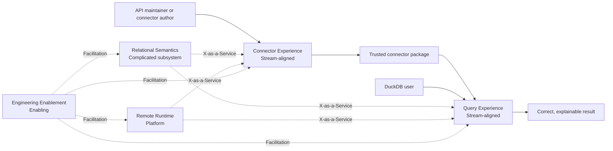

# Team topology

This document defines the initial team-of-teams operating model for the
agent-led project. It describes value flow, team types, accountability, and
interaction rules. It is not a reporting hierarchy, component ownership map,
or substitute for the product and engineering contracts.

The topology is a current organizational design. Change it when evidence shows
that different boundaries would improve flow or reduce cognitive load, not
merely because the implementation has acquired more components.

## Operating principles

- Organize long-lived teams around value flow and clear customer outcomes.
- Give every product goal exactly one accountable stream-aligned team.
- Treat platform capabilities as internal products with named consumers.
- Isolate a complicated subsystem only when specialist cognitive load would
  otherwise impede the stream teams.
- Use enabling teams to transfer capability, never to create a permanent
  approval queue.
- Make collaboration temporary and give it a learning objective and exit
  condition.
- Prefer low-coupling service interactions after a boundary is proven.
- Keep durable product and runtime behavior in the architecture, connector, and
  runtime contracts. Team documents cannot weaken those contracts.

## Value streams

### API definition to trusted connector package

The customer is a connector author or maintainer. The flow begins with a
well-structured API and ends with a connector package that can be validated,
tested against deterministic fixtures, explained, and distributed without
embedded credentials or required Rust code.

The value is author confidence and a shorter path from API knowledge to a
usable, reviewable relational definition.

### SQL question to trustworthy remote result

The customer is a DuckDB user. The flow begins with installation, connection
configuration, and a SQL question. It ends with a correct, explainable, bounded
result or an actionable diagnostic.

The value is the ability to use remote API data as ordinary analytical data
without sacrificing DuckDB semantics, security, or operational control.

### Repeated capability need to reusable runtime service

The customers are the stream-aligned teams. The flow begins when a named stream
outcome needs a reusable remote-access capability and ends when that capability
is available through a documented, tested, low-friction platform interface.

The value is implementing transport and operational complexity once rather
than rebuilding it inside each user-facing outcome. A platform capability is
not justified without a named stream consumer and acceptance evidence.

Relational Semantics and Engineering Enablement support these flows. They are
not additional product value streams.

## Initial shape



| Team | Type | Primary customer | Accountable outcome boundary |
| --- | --- | --- | --- |
| Connector Experience | Stream-aligned | Connector authors and maintainers | A trusted connector package and authoring experience |
| Query Experience | Stream-aligned | DuckDB users | A correct, explainable query experience |
| Remote Runtime | Platform | Stream-aligned teams | Reusable bounded remote-execution capabilities |
| Relational Semantics | Complicated subsystem | Connector and Query Experience | Remote optimization that preserves DuckDB meaning |
| Engineering Enablement | Enabling | All delivery teams | Teams become self-sufficient in the required engineering capability |

These are stable accountability contexts, not a requirement to run five agent
swarms for every goal. Activate only the teams and interaction modes needed by
the current outcome.

## Team interfaces

The architecture already supplies the main technical seams. Team charters must
make the human and agent interaction around those seams explicit.

| Producer | Consumer | Durable interface |
| --- | --- | --- |
| Connector Experience | Query Experience, Relational Semantics, and Remote Runtime | Validated package and immutable `CompiledConnector` |
| Query Experience | Relational Semantics | DuckDB capability profile and relational `ScanRequest` |
| Relational Semantics | Connector Experience, Remote Runtime, and Query Experience | Semantically explicit, immutable `ScanPlan` with an explainable classification |
| Remote Runtime | Connector Experience and Query Experience | Deterministic fixture execution, bounded `BatchStream`, and structured diagnostics |
| Engineering Enablement | Every team | Reusable skills, gates, fixtures, and transferred practices |

An interface does not prohibit contributions across a team boundary. It makes
the accountable producer, consumer expectation, compatibility rule, and review
path visible.

## Interaction model

Use only three interaction modes:

- **Collaboration** for a defined learning objective where an interface or
  capability is not yet proven. End it when the agreed executable contract and
  oracle exist.
- **X-as-a-Service** for a documented interface that another team can consume
  with low coordination. This is the normal mode for established platform and
  subsystem capabilities.
- **Facilitation** when Engineering Enablement helps another team acquire a
  missing capability. End it when the receiving team can work independently
  and the reusable guidance or tooling has been captured.

Typical interactions are:

| Need | Participants | Mode | Exit condition |
| --- | --- | --- | --- |
| Prove a new end-to-end boundary | Accountable stream team with affected platform or subsystem teams | Collaboration | The boundary has an executable contract and deterministic oracle |
| Add a protocol family | Connector Experience, Relational Semantics, and Remote Runtime | Collaboration, then X-as-a-Service | Author declarations compile through a deterministic `ScanRequest → ScanPlan` semantic oracle with conservative fallback, and the runtime protocol interface works independently |
| Expose a new DuckDB capability | Query Experience and Relational Semantics | Collaboration, then X-as-a-Service | The capability profile and conservative fallback are proven |
| Adopt a delivery, testing, or safety practice | Engineering Enablement and the receiving team | Facilitation | The receiving team can apply and maintain the practice without assistance |

Permanent collaboration is evidence of a missing or misplaced boundary. A
service interaction that repeatedly requires bespoke coordination is not yet a
successful service.

## Goal accountability

Every product goal follows `docs/PRODUCT_DELIVERY.md` and has one accountable
stream-aligned team:

1. Choose Connector Experience when the primary acceptance narrative ends with
   a connector author creating, validating, testing, explaining, or maintaining
   a package.
2. Choose Query Experience when the primary acceptance narrative ends with a
   DuckDB user querying, inspecting, or diagnosing remote data.
3. Record Remote Runtime, Relational Semantics, or Engineering Enablement as a
   supporting team with an explicit interaction mode and exit condition.
4. Work centered on a platform or subsystem becomes a goal only when it
   delivers decision evidence for a named sponsoring stream outcome or directly
   enables a named stream outcome. The sponsoring or consuming stream team
   remains accountable.
5. Engineering Enablement never assumes product accountability or quality
   ownership from a delivery team.

The lead agent owns orchestration across the participating teams. Supporting
teams do not create joint accountability for the outcome.

## Charter ownership

Individual team charters use `docs/teams/`. A charter becomes active when its
file is committed on `main` and this overview links to it as the team's charter.
Until then, this overview is authoritative for that team's accountability and
interactions. Once active, each team owns one charter covering its:

- mission and customers;
- responsibilities and explicit non-responsibilities;
- team API, service expectations, and decision rights;
- success evidence and cognitive-load limits; and
- supported interaction modes and their exit conditions.

When created, charters use these paths:

```text
docs/teams/CONNECTOR_EXPERIENCE.md
docs/teams/QUERY_EXPERIENCE.md
docs/teams/REMOTE_RUNTIME.md
docs/teams/RELATIONAL_SEMANTICS.md
docs/teams/ENGINEERING_ENABLEMENT.md
```

This overview owns the cross-team model. Once active, a charter owns the
detailed operation of its team and must remain consistent with this overview,
`AGENTS.md`, and the product and engineering contracts. If a charter conflicts
with this overview, the overview governs until the inconsistency is resolved.
`AGENTS.md` and the product and engineering contracts retain authority in their
documented domains. Active goals, task lists, dates, and delivery plans do not
belong in charters.

A change to one charter is owned by that team. A change that moves an interface
or accountability boundary requires review from every affected team and an
update to this overview in the same commit.

## Evolution signals

Revisit the topology when evidence shows one or more of these conditions:

- a stream team carries persistent cognitive load outside its customer
  outcome;
- work repeatedly queues at the same team boundary;
- temporary collaboration cannot reach a low-coupling interaction;
- a capability has multiple real consumers and a stable service interface;
- an enabling interaction has become permanent; or
- a distinct customer and acceptance narrative reveal a new value stream.

Do not form teams around REST, GraphQL, authentication, pagination, retries,
caching, compiler stages, or FFI merely because those areas are technically
important. They remain capabilities or subsystems until value-flow evidence
supports a different boundary.

## References

- [Team Topologies key concepts](https://teamtopologies.com/key-concepts)
- [Team interaction modeling](https://teamtopologies.com/key-concepts-content/team-interaction-modeling-with-team-topologies)
- [Thinnest Viable Platform](https://teamtopologies.com/key-concepts-content/what-is-a-thinnest-viable-platform-tvp)
